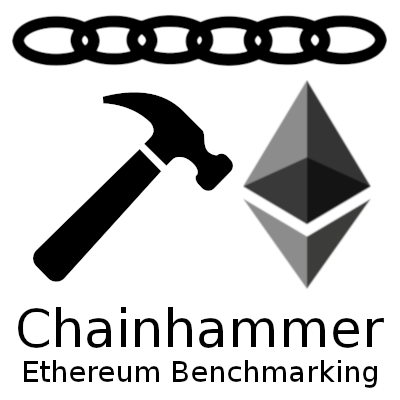

---

news 2018-Dec-15:

## refactored!
Everything is in a different place now, sorry. But it urgently needed cleanup.  
Please open an issue (or fork & pull request) if you find a broken link, thanks.

---



---

# chainhammer v42
TPS measurements of parity aura, geth clique, quorum, tobalaba, etc. 
It should work with any Ethereum type chain; we focused on PoA consensus.

## instructions
* `chainhammer` - submits many transactions to blockchain - see chapter 'chronology'
* `chainreader` - reads in the whole chain, and visualizes TPS, blocktime, gas, bytes - see [chainreader/README.md](chainreader/README.md)

### chronology
See the [results/](results/) folder:

1. [log.md](results/log.md): initial steps; also tried *Quorum's private transactions*
1. [quorum.md](results/quorum.md): raft consensus, quorum is a geth fork
1. [tobalaba.md](results/tobalaba.md): parity fork of  EnergyWebFoundation
1. [quorum-IBFT.md](results/quorum-IBFT.md): IstanbulBFT, 2nd consensus algo in quorum
1. [geth.md](results/geth.md): geth clique PoA algorithm
1. [parity.md](results/parity.md): parity aura PoA algorithm, many attempts to accelerate
1. [eos.md](results/eos.md): not begun yet
1. [substrate.md](results/substrate.md): not begun yet

## results summary

| hardware  	| node type 	    | #nodes 	| config 	| peak TPS_av 	| final TPS_av 	|
|-----------	|-----------	    |--------	|--------	|-------------	|--------------	|
| t2.micro 	    | parity aura   	| 4      	| (D)    	| 45.5        	|  44.3        |
| t2.large 	    | parity aura   	| 4      	| (D)    	| 53.5        	|  52.9        |
| t2.xlarge 	| parity aura   	| 4      	| (J)    	| 57.1        	|  56.4        |
| t2.2xlarge 	| parity aura   	| 4      	| (D)    	| 57.6        	|  57.6        |
|               |                   |           |        	|         	    |              |
| t2.micro 	    | parity instantseal | 1      	| (G)    	| 42.3        	|  42.3        |
| t2.xlarge	    | parity instantseal | 1      	| (J)    	| 48.1        	|  48.1        |
|               |                   |           |        	|         	    |              |
| t2.2xlarge 	| geth clique     	| 3+1 +2    | (B)    	| 421.6       	| 400.0        |
| t2.xlarge 	| geth clique     	| 3+1 +2    | (B)    	| 386.1       	| 321.5        |
| t2.xlarge 	| geth clique     	| 3+1       | (K)    	| 372.6       	| 325.3        |
| t2.large 	    | geth clique     	| 3+1 +2    | (B)    	| 170.7       	| 169.4        |
| t2.small 	    | geth clique     	| 3+1 +2    | (B)    	|  96.8       	|  96.5        |
| t2.micro 	    | geth clique     	| 3+1       | (H)    	| 124.3       	| 122.4        |
|               |                   |           |        	|         	    |              |
| t2.micro SWAP | quorum crux IBFT 	| 4    	    | (I) SWAP! |  98.1         |  98.1   	   |
|               |                   |           |        	|         	    |              |
| t2.micro 	    | quorum crux IBFT 	| 4    	    | (F)     	| lack of RAM   |         	   |
| t2.large 	    | quorum crux IBFT 	| 4    	    | (F)    	| 207.7      	| 199.9        |
| t2.xlarge 	| quorum crux IBFT 	| 4    	    | (F)    	| 439.5      	| 395.7        |
| t2.xlarge 	| quorum crux IBFT 	| 4    	    | (L)    	| 389.1      	| 338.9        |
| t2.2xlarge 	| quorum crux IBFT 	| 4    	    | (F)    	| 435.4      	| 423.1        |
| c5.4xlarge 	| quorum crux IBFT 	| 4    	    | (F)    	| 536.4      	| 524.3        |

[Reproduce](docs/reproduce.md) these results easily; for the `config` column see there.
Or even quicker with my [Amazon AMI readymade image](docs/reproduce.md#readymade-amazon-ami).

And see [parity.md](results/parity.md) and [geth.md](results/geth.md) 
and [quorum-IBFT.md](results/quorum-IBFT.md) for additional details.

## faster wider more
* logbook [log.md](results/log.md) for how I initially got this faster *on Quorum*, step by step. 
* some ideas what to try next: [TODO.md](docs/TODO.md) = e.g. vary transaction size, automate more, etc.

### you
See [other-projects.md](docs/other-projects.md) using chainhammer, or projects which are similar to this. 

*Please report back when you have done other / new measurements.*

#### Suggestions please: how can I speed this up further? 

* parity [PE#9393](https://github.com/paritytech/parity-ethereum/issues/9393) 60 TPS ? (parity aura v1.11.11)
* parity [SE#58521](https://ethereum.stackexchange.com/questions/58521/parity-tps-optimization-please-help) parity TPS optimization - please help - stackexchange.com
* geth [GE#17447](https://github.com/ethereum/go-ethereum/issues/17447) Sudden drop in TPS after total 14k transactions.
* quorum [Q#479](https://github.com/jpmorganchase/quorum/issues/479#issuecomment-413603316)  Sudden drop in TPS around 14k transactions (Quorum IBFT)

## run
For more details see [reproduce.md](docs/reproduce.md). 
Assuming a node is already running on port 8545, this focuses on chainhammer itself:

### dependencies
```
sudo apt install python3-pip libssl-dev expect-dev
sudo pip3 install virtualenv 

virtualenv -p python3 env
source env/bin/activate

python3 -m pip install --upgrade pip==18.0
pip3 install --upgrade py-solc==3.1.0 web3==4.7.2 web3[tester]==4.7.2 rlp==0.6.0 eth-testrpc==1.3.5 requests==2.19.1 pandas==0.23.4 matplotlib==3.0.0 pytest pytest-cov

# for chainreader notebooks:
pip3 install --upgrade jupyter ipykernel 
ipython kernel install --user --name="Python.3.py3eth"
```

all python scripts & jupyer notebooks must be run within that virtualenv, e.g.:
```
source env/bin/activate
```

Before first ever start: 
```
cd chainhammer
touch account-passphrase.txt
deploy.py andtests
```
It tests whether communication with the ethereum node is working, 
**and initially creates local files about the compiled and deployed contract**. 
If there are connection problems, check the ports in [config.py](chainhammer/config.py) --> 
`RPCaddress, RPCaddress2`.

### quickstart
Remember, in each new terminal virtualenv: `source env/bin/activate; cd chainhammer`

first terminal:
```
./tps.py
```
second terminal:
```
./deploy.py; ./send.py threaded2 23
```

Then, after all (e.g. 20,001) transactions have been seen, 
extract the whole chain into `parity_run7.db` (example);
and create the diagrams

```
cd ../chainreader
rm parity_run7.db
./blocksDB_create.py parity_run7.db
./blocksDB_diagramming.py parity_run7.db parity-run-7
```

## unittests
```
./pytest.sh
```
enables the virtualenv, 
then starts a `testrpc-py` Ethereum simulator on http://localhost:8545 in the background, 
logging into `tests/logs/`; 
then runs `./deploy.py andtests`; 
and finally runs all the unittests, also logging into `tests/logs/`.  

(Instead of testrpc-py) if you want to run tests with another node, 
just start that; and run `pytest` manually:
```
source env/py3eth/bin/activate
./deploy.py andtests
py.test -v --cov
```

December 4th, there were 64 tests, all 64 PASSED
(see this [logfile](tests/logs/tests-with_testrpc-py.log.ansi)  --> 
`cat tests/logs/*.ansi` because colors) on these different Ethereum providers:  

* testrpc instantseal (`testrpc-py`)  9 seconds 
* geth Clique (`geth-dev`) 54 seconds
* quorum IBFT (`blk-io/crux`) 31 seconds
* parity instantseal (`parity-deploy`) 8 seconds
* parity aura (`parity-deploy`) 74 seconds

## credits

Please credit this as:

> benchmarking scripts "chainhammer"  
> initially developed at Electron.org.uk London 2018
> current maintainer: Dr Andreas Krueger (c) 2018  
> https://github.com/drandreaskrueger/chainhammer    

Consider to submit your improvements & [usage](docs/other-projects.md) as pull request. Thanks.

### short summary

> The open source tools 'chainhammer' submits a high load of 
> smart contract transactions to an Ethereum based blockchain, 
> then 'chainreader' reads the whole chain, and 
> produces diagrams of TPS, blocktime, gasUsed and gasLimit, and the blocksize.
> https://github.com/drandreaskrueger/chainhammer    

---

---

---

## chainhammer --> chainreader -->  diagrammer
examples:

### geth clique on AWS t2.xlarge 
[geth.md](geth.md) = geth (go ethereum client), "Clique" consensus.

50,000 transactions to an Amazon t2.xlarge machine.

Interesting artifact that after ~14k transactions, the speed drops considerably - but recovers again. [Reported](https://github.com/ethereum/go-ethereum/issues/17447#issuecomment-431629285).

  
chainreader/img/geth-clique-50kTx_t2xlarge_tps-bt-bs-gas_blks12-98.png

### quorum IBFT on AWS t2.xlarge 

[quorum-IBFT.md](quorum-IBFT.md) = Quorum (geth fork), IBFT consensus, 20 millions gasLimit, 1 second istanbul.blockperiod; 20000 transactions multi-threaded with 23 workers. Initial average >400 TPS then drops to below 300 TPS, see [quorum issue](https://github.com/jpmorganchase/quorum/issues/479#issuecomment-413603316))


### quorum raft
OLD RUN on a desktop machine.  

[quorum.md](quorum.md) = Quorum (geth fork), raft consensus, 1000 transactions multi-threaded with 23 workers, average TPS around 160 TPS, and 20 raft blocks per second)


### tobalaba
OLD RUN on a desktop machine.

[tobalaba.md](tobalaba.md) = Public "Tobalaba" chain of the EnergyWebFoundation (parity fork), PoA; 20k transactions; > 150 TPS if client is well-connected.


### parity aura v1.11.11 on AWS t2.xlarge 
[parity.md#run-18](parity.md#run-18) = using [parity-deploy.sh](https://github.com/paritytech/parity-deploy) dockerized network of 4 local nodes with increased gasLimit, and 5 seconds blocktime; 20k transactions; ~ 60 TPS on an Amazon t2.xlarge machine.

N.B.: Could not work with parity v2 yet because of bugs [PD#76](https://github.com/paritytech/parity-deploy/issues/76) and [PE#9582](https://github.com/paritytech/parity-ethereum/issues/9582) --> everything still on parity v1.11.11

  
parity-v1.11.11-aura_t2xlarge_tps-bt-bs-gas_blks5-85.png


Calling all parity experts: How to improve these too slow TPS results?    See issue [PE#9393](https://github.com/paritytech/parity-ethereum/issues/9393), and the [detailed log of what I've tried already](parity.md), and the 2 shortest routes to reproducing the results: [reproduce.md](reproduce.md).    

Thanks.
