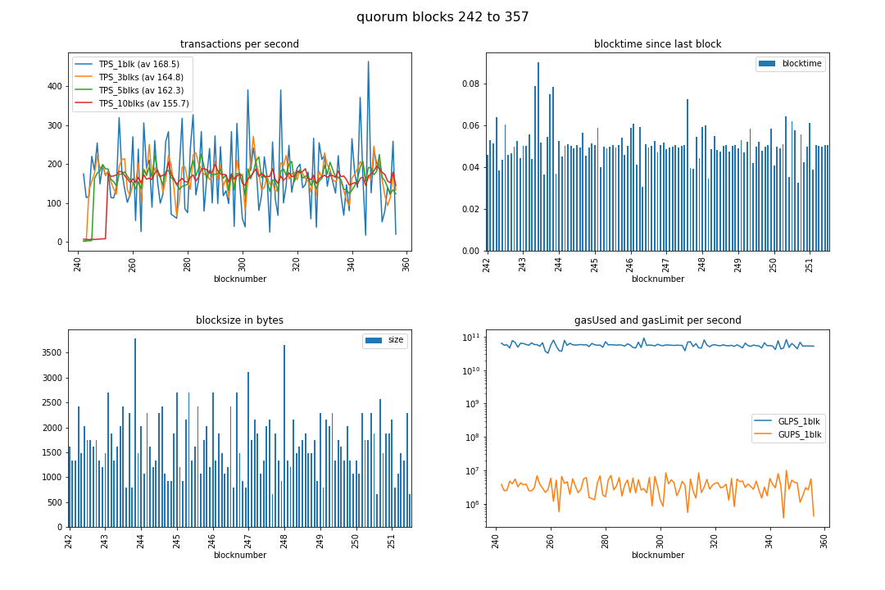
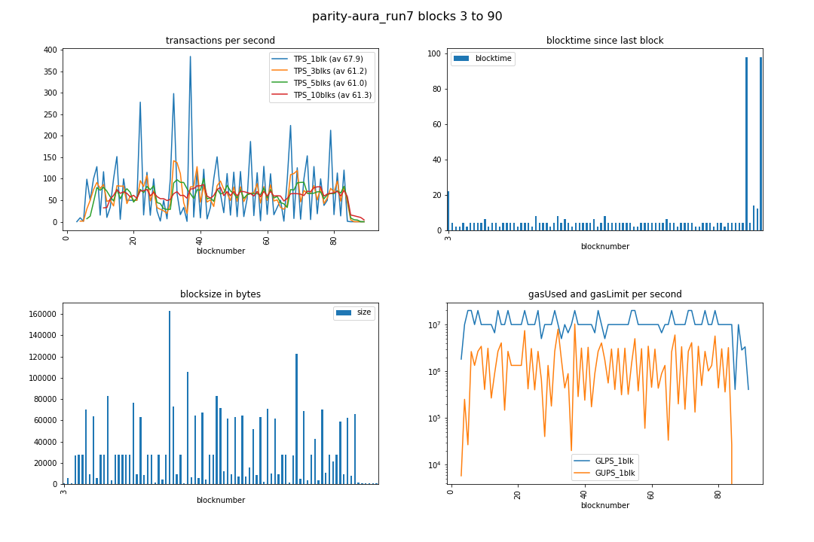

---

news 2018-Oct-01

## New Maintainer:

* github --> drandreaskrueger --> [chainhammer](https://github.com/drandreaskrueger/chainhammer)
* `git clone https://github.com/drandreaskrueger/chainhammer drandreaskrueger_chainhammer`
* Funding needed! Contact me please.

---

# chainhammer v36
TPS measurements of Quorum, EnergyWebFoundation, geth clique, parity aura, etc. It should work with any Ethereum type chain; we focused on PoA consensus.

## instructions
* `chainhammer` - submits many transactions to blockchain - see next chapter 'chronology'
* `chainreader` - reads in the whole chain, and visualizes TPS, blocktime, gas, bytes - see [chainreader/README.md](chainreader/README.md)

### chronology

1. [log.md](log.md): initial steps; also tried *Quorum's private transactions*
1. [quorum.md](quorum.md): raft consensus, geth fork
1. [tobalaba.md](tobalaba.md): parity fork
1. [quorum-IBFT.md](quorum-IBFT.md): other consensus algo in quorum
1. [geth.md](geth.md): geth clique PoA algorithm
1. [parity.md](parity.md): now out of ideas. Still 5 times slower than geth.
1. [eos.md](eos.md): not begun

## results

| hardware  	| node type 	    | #nodes 	| config 	| peak TPS_av 	| final TPS_av 	|
|-----------	|-----------	    |--------	|--------	|-------------	|--------------	|
| t2.micro 	    | parity aura   	| 4      	| (D)    	| 45.5        	|  44.3        |
| t2.large 	    | parity aura   	| 4      	| (D)    	| 53.5        	|  52.9        |
| t2.xlarge 	| parity aura   	| 4      	| (A)    	| 56.5        	|  56.1        |
| t2.2xlarge 	| parity aura   	| 4      	| (D)    	| 57.6        	|  57.6        |
|               |                   |           |        	|         	    |              |
| t2.micro 	    | parity instantseal | 1      	| (G)    	| 42.3        	|  42.3        |
|               |                   |           |        	|         	    |              |
| t2.2xlarge 	| geth clique     	| 3+1 +2    | (B)    	| 421.6       	| 400.0        |
| t2.xlarge 	| geth clique     	| 3+1 +2    | (B)    	| 386.1       	| 321.5        |
| t2.large 	    | geth clique     	| 3+1 +2    | (B)    	| 170.7       	| 169.4        |
| t2.small 	    | geth clique     	| 3+1 +2    | (B)    	|  96.8       	|  96.5        |
| t2.micro 	    | geth clique     	| 3+1       | (H)    	| 124.3       	| 122.4        |
|               |                   |           |        	|         	    |              |
| t2.micro SWAP | quorum crux IBFT 	| 4    	    | (I) SWAP! |  98.1         |  98.1   	   |
|               |                   |           |        	|         	    |              |
| t2.micro 	    | quorum crux IBFT 	| 4    	    | (F)     	| lack of RAM   |         	   |
| t2.large 	    | quorum crux IBFT 	| 4    	    | (F)    	| 207.7      	| 199.9        |
| t2.xlarge 	| quorum crux IBFT 	| 4    	    | (F)    	| 439.5      	| 395.7        |
| t2.2xlarge 	| quorum crux IBFT 	| 4    	    | (F)    	| 435.4      	| 423.1        |
| c5.4xlarge 	| quorum crux IBFT 	| 4    	    | (F)    	| 536.4      	| 524.3        |

You can [reproduce](reproduce.md) these results easily. Or even quicker when you use my [Amazon AMI readymade image](reproduce.md#readymade-amazon-ami) - for the `config` column see there. And see [parity.md](parity.md) and [geth.md](geth.md) and [quorum-IBFT.md](quorum-IBFT.md) for additional details.

## faster wider more

See 

* logbook [log.md](log.md) for what I had done initially to get this faster *on Quorum*, step by step. 
* some ideas what to try next: [TODO.md](TODO.md) = e.g. geth/parity PoA, vary transaction size, run on host machine (not docker/vagrant), etc.

### you
See [other-projects.md](other-projects.md) using this, or projects which are similar to this. 

*Please report back when you have done other / new measurements.*

#### Suggestions please: how can I speed this up further? 

* parity [PE#9393](https://github.com/paritytech/parity-ethereum/issues/9393) 60 TPS ? (parity aura v1.11.11)
* parity [SE#58521](https://ethereum.stackexchange.com/questions/58521/parity-tps-optimization-please-help) parity TPS optimization - please help - stackexchange.com
* geth [GE#17447](https://github.com/ethereum/go-ethereum/issues/17447) Sudden drop in TPS after total 14k transactions.
* quorum [Q#479](https://github.com/jpmorganchase/quorum/issues/479#issuecomment-413603316)  Sudden drop in TPS around 14k transactions (Quorum IBFT)


## run

For more details e.g. how to run a network of parity nodes, see [reproduce.md](reproduce.md). This assumes it's already running. The focus here is on chainhammer itself:
### dependencies
```
sudo apt install python3-pip libssl-dev
sudo pip3 install virtualenv 
virtualenv -p python3 py3eth
source py3eth/bin/activate

python3 -m pip install --upgrade pip==18.0
pip3 install --upgrade py-solc==2.1.0 web3==4.3.0 web3[tester]==4.3.0 rlp==0.6.0 eth-testrpc==1.3.4 requests pandas jupyter ipykernel matplotlib
ipython kernel install --user --name="Python.3.py3eth"
```
all python scripts & jupyer notebooks must be run within that virtualenv, e.g.:

```
source py3eth/bin/activate

touch account-passphrase.txt
./deploy.py 
```
Always use this first. It tests whether communication with the ethereum node is working, **and initially creates local files about the compiled and deployed contract**. If there are connection problems, check the ports in [config.py](config.py) --> `RPCaddress, RPCaddress2`.

### quickstart


first terminal:
```
./tps.py
```
second terminal:
```
./deploy.py notest; ./send.py threaded2 23
```

Then, after all (e.g. 20,001) transactions have been seen, extract the whole chain into `allblocks-parity_run7.db` (example)
```
cd chainreader
./blocksDB_create.py allblocks-parity_run7.db
```
and examine it with a jupyter notebook, to make the diagrams
```
jupyter notebook blocksDB_analyze_parity-aura_run7.ipynb
```
by menu --> Kernel --> Restart & Run All. 


## credits

Please credit this as:

> benchmarking scripts "chainhammer"  
> https://gitlab.com/electronDLT/chainhammer    
> by Dr Andreas Krueger, Electron.org.uk, London 2018  

Consider to submit your improvements & [usage](other-projects.md) as pull request. Thanks.

### short summary

> Electron created the open source tools chainhammer which submits a high load of smart contract transactions to an Ethereum based blockchain, and chainreader which reads in the whole chain, and produces diagrams of TPS, blocktime, gasUsed and gasLimit, and the blocksize.
> https://gitlab.com/electronDLT/chainhammer

---

---

---

## chainhammer --> chainreader -->  diagrammer

### quorum raft
[quorum.md](quorum.md) = Quorum (geth fork), raft consensus, 1000 transactions multi-threaded with 23 workers, average TPS around 160 TPS, and 20 raft blocks per second)


### quorum IBFT
[quorum-IBFT.md](quorum-IBFT.md) = Quorum (geth fork), IBFT consensus, 20 millions gasLimit, 1 second istanbul.blockperiod; 20000 transactions multi-threaded with 13 workers. Initial average >450 TPS then drops to ~270 TPS, see [quorum issue](https://github.com/jpmorganchase/quorum/issues/479#issuecomment-413603316))


### tobalaba
[tobalaba.md](tobalaba.md) = Public "Tobalaba" chain of the EnergyWebFoundation (parity fork), PoA; 20k transactions; > 150 TPS if client is well-connected.


### parity aura v1.11.8
[parity.md](parity.md) = using [parity-deploy.sh](https://github.com/paritytech/parity-deploy) dockerized network of 4 local nodes with 40 million gasLimit, and 4-8 seconds blocktime; 20k transactions; ~ 65 TPS. 



Calling all parity experts: How to improve these too slow TPS results?    See issue [PE#9393](https://github.com/paritytech/parity-ethereum/issues/9393), and the [detailed log of what I've tried already](parity.md), and the 2 shortest routes to reproducing the results: [reproduce.md](reproduce.md).    

Thanks.
