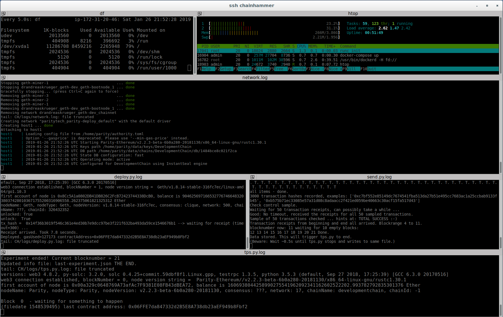

# cloud

older AWS instructions, possibly outdated, but better than no manuals, right?
Before you do anything below, read 
the [../scripts/](../scripts/)`install*.sh` *executable bash scripts* - 
because they are likely up-to-date. It would actually be a nice task 
to automate also this creating-of-an-AMI, using `awscli` - 
perhaps when you are reading this, that TODO is done already? 
Anyway, this text tells you how to utilize Amazon AWS, and 
hopefuly soon also GoogleCloud, and Azure - Contact me if you are 
an expert in that, and might want to help, thanks.

## TOC

* AWS deployment
  * how I created the AMI
* [readymade Amazon AMI](cloud.md#readymade-amazon-ami) 
  * start HERE if you have little time:
  * **how to clone your own AWS machine from that image**

TODO: Update TOC after installation instructions moved into install.sh 

## AWS deployment

This first part here you can safely ignore, it just logs what I have done to create the AMI.

For quickstart, jump forward to chapter "readymade Amazon AMI"

### how I created the AMI
* [Launch instance Wizard](https://eu-west-2.console.aws.amazon.com/ec2/v2/home?region=eu-west-2#LaunchInstanceWizard:) in  `eu-west-2` (London)
* click "Community AMIs", tick boxes "Operating System: Debian" , "Architecture: 64-bit", then search term: "Debian-stretch 2019"
* newest is `debian-stretch-hvm-x86_64-gp2-2019-02-19-26620`
  * (ami-0ef10a4062f24d89d)
  * FAI Debian image
  * Root device type: ebs 
  * Virtualization type: hvm
  * press select
* choose type `t2.micro`
  * because that micro machine is in the "free tier"
  * OR `t2.medium` if you don't want loose Quorum performance by Swap 
* Next ... Step 3: Configure Instance Details
  * Network: Default
  * Subnet: Default in eu-west-2a
  * auto assign public IP: enable
* Next ... Step4: Add Storage
  * 11 GiB 
    * (the default 8GiB would be enough IF only *small* swap (700MB not 2000M) and for SINGLE experiments of ONE client at a time (e.g. only parity) - but it cannot hold all docker images of the different Ethereum clients in parallel)
* Next ... Step 5: Add Tags
  * Name: chainhammer
  * Environment: dev
  * Project: benchmarking
  * Owner: Andreas Krueger
* Next ... Configure Security Group
  * create new security group
  * name it; allow **ssh** access
  * source: MyIP (I simply use the same specific VPN server to always get the same IP again)
    * or you must open SSH for "Anywhere" (if you have a dynamic IP each time you connect)
* Review and Launch ... Launch
* (make a new one or) choose an existing ssh keypair, example `AndreasKeypairAWS.pem` 
* Launch Instances
* Click on 
  * "Your instances are now launching ... The following instance launches have been initiated: [i-xxxxxxxxxxxxxxxxx](https://eu-west-2.console.aws.amazon.com/ec2/v2/home?region=eu-west-2#Instances)" to open the Console for this specific Instance
  * Copy the "Public DNS (IPv4)", in our example here `ec2-35-176-53-99.eu-west-2.compute.amazonaws.com` to clipboard

Now simplify `ssh` access, by adding this block to your local machine's

```
nano ~/.ssh/config
```

```
Host chainhammer
  Hostname ec2-35-176-53-99.eu-west-2.compute.amazonaws.com
  StrictHostKeyChecking no
  User admin
  IdentityFile ~/.ssh/AndreasKeypairAWS.pem
```
now it becomes this simple to connect:
```
ssh chainhammer
```
(perhaps after enabling your VPN with the correct IP address)

you should then see something like this:

```
Warning: Permanently added 'ec2-35-176-53-99.eu-west-2.compute.amazonaws.com,35.176.53.99' (ECDSA) to the list of known hosts.
Linux ip-172-31-20-65 4.9.0-8-amd64 #1 SMP Debian 4.9.130-2 (2018-10-27) x86_64

The programs included with the Debian GNU/Linux system are free software;
the exact distribution terms for each program are described in the
individual files in /usr/share/doc/*/copyright.

Debian GNU/Linux comes with ABSOLUTELY NO WARRANTY, to the extent
permitted by applicable law.
admin@ip-172-31-20-65:~$ 
```
then you are logged into your new and shiny cloud machine.

#### VPS machine 
now that you are ssh-logged into that machine:

##### swap
A swap file is helpful to protect against lack of memory in very small (low RAM) machines
```
SWAPFILE=/swapfile && free -m && sudo swapoff -a && sudo dd if=/dev/zero of=$SWAPFILE bs=1M count=2000 && sudo chmod 600 $SWAPFILE && sudo mkswap $SWAPFILE && echo $SWAPFILE none swap defaults 0 0 | sudo tee -a /etc/fstab && sudo swapon -a && free -m
```
The `bs=1M count=2000` means 2000 Megabytes of swap (note that this will allocate a big chunk of the harddisk).

##### git
```
sudo apt update && sudo apt -y upgrade && sudo apt install -y git
```

##### chainhammer main repo and dependencies install
git clone, softlink for easier access, then changedir ... and INSTALL a lot of things:
```
git clone https://github.com/drandreaskrueger/chainhammer.git drandreaskrueger_chainhammer
ln -s drandreaskrueger_chainhammer CH
cd ~/CH

scripts/install.sh
```

The script stops before each step. Please report any errors as an issue on github, thanks. Yes, compiling `geth` takes long - please help us with [this idea](reproduce_outdated.md#geth-dockerized-please-help) to avoid that, thanks. 

**Important:** Now LOGOUT and reconnect, so that docker daemon starts working for this user:

    exit
    ssh chainhammer
    cd CH

##### testing: unittests and integration tests

    ./pytest.sh
    
    CH_MACHINE=t2.micro ./run-all_small.sh    

If the machine has enough RAM, also include the Quorum-crux experiment, with the switch `$CH_QUORUM`

    CH_QUORUM=true CH_MACHINE=t2.medium ./run-all_small.sh

but keep an eye on RAM with 

    ssh -t chainhammer "watch -n 5 'free -m'"

In any case, you want to keep another terminal open with

    ssh -t chainhammer "tail -n 10 -f CH/logs/network.log"

to notice any Ethereum client problems live.

##### N.B.: before creating image from instance to make a new AMI

Update chainhammer repo to newest commit, and remove all docker containers & images (to save space)
```
cd ~/drandreaskrueger_chainhammer; git pull
scripts/remove-all-docker.sh
```

And for privacy, important: [remove-ssh-host-key-pairs](https://docs.aws.amazon.com/AWSEC2/latest/UserGuide/building-shared-amis.html?icmpid=docs_ec2_console#remove-ssh-host-key-pairs), then power down:
```
sudo shred -u /etc/ssh/*_key /etc/ssh/*_key.pub
sudo shutdown now
```

Once the instance has shutdown, and I created an AMI from it, and made it public.

On [AWS console #Instances](https://eu-west-2.console.aws.amazon.com/ec2/v2/home?region=eu-west-2#Instances) ... actions ... create image.

On [AWS console #Images](https://eu-west-2.console.aws.amazon.com/ec2/v2/home?region=eu-west-2#Images) ... right click ... Modify Image Permissions ... public. And tag it, like above.

--> AMI ID `ami-0a73e3d94545308d5`

By now that AMI probably superseded. Use the "search for public AMIs --> chainhammer" instead, next chapter:

## readymade Amazon AMI 

This will much accelerate your own benchmarking experiments. In my ready-made Amazon AWS image I have done all of the above 
(Plus some unlogged updates, of the toolchain & chainhammer).

Use my AMI:

* In the Public Images, [search for "chainhammer"](https://eu-west-2.console.aws.amazon.com/ec2/v2/home?region=eu-west-2#Images:visibility=public-images;search=chainhammer;sort=name) in `eu-west-2` (London).
* Right click ... Launch
* Step 2: Choose an Instance Type --> at least `t2.small` ! otherwise you probably run out of memory
* Step 4: Add Storage --> `12 GB` !
* security group, choose an existing ssh keypair e.g. `AndreasKeypairAWS.pem` (obviously, your keypair instead)
* launch, wait

simplify the `ssh` access, by adding this (with *your* IP, obviously) to your local machine's
```
nano ~/.ssh/config
```
```
Host chainhammer
  Hostname ec2-35-178-181-232.eu-west-2.compute.amazonaws.com
  StrictHostKeyChecking no
  User admin
  IdentityFile ~/.ssh/AndreasKeypairAWS.pem
```
now it becomes this simple to connect:
```
ssh chainhammer
```


## multiple info viewer with terminator

I want to see all of these outputs at a glance:

* df - whether the harddisk is full
* htop - to have an eye on RAM and CPU
* network.log - whether the Ethereum node shows problems
* deploy.py.log - if the smart contract deploy worked
* send.py.log - interesting towards the end of an experiment
* (tps.py.log - shown by main scripts anyways)

For that purpose "Terminator - Multiple GNOME terminals in one window" is ideal. Start it with:

    scripts/terminator-ssh-chainhammer.sh

Added very recently, please improve, or give feedback 
if it does not work, thanks.

It looks like this:


[terminator-screenshot.png](terminator-screenshot.png)


