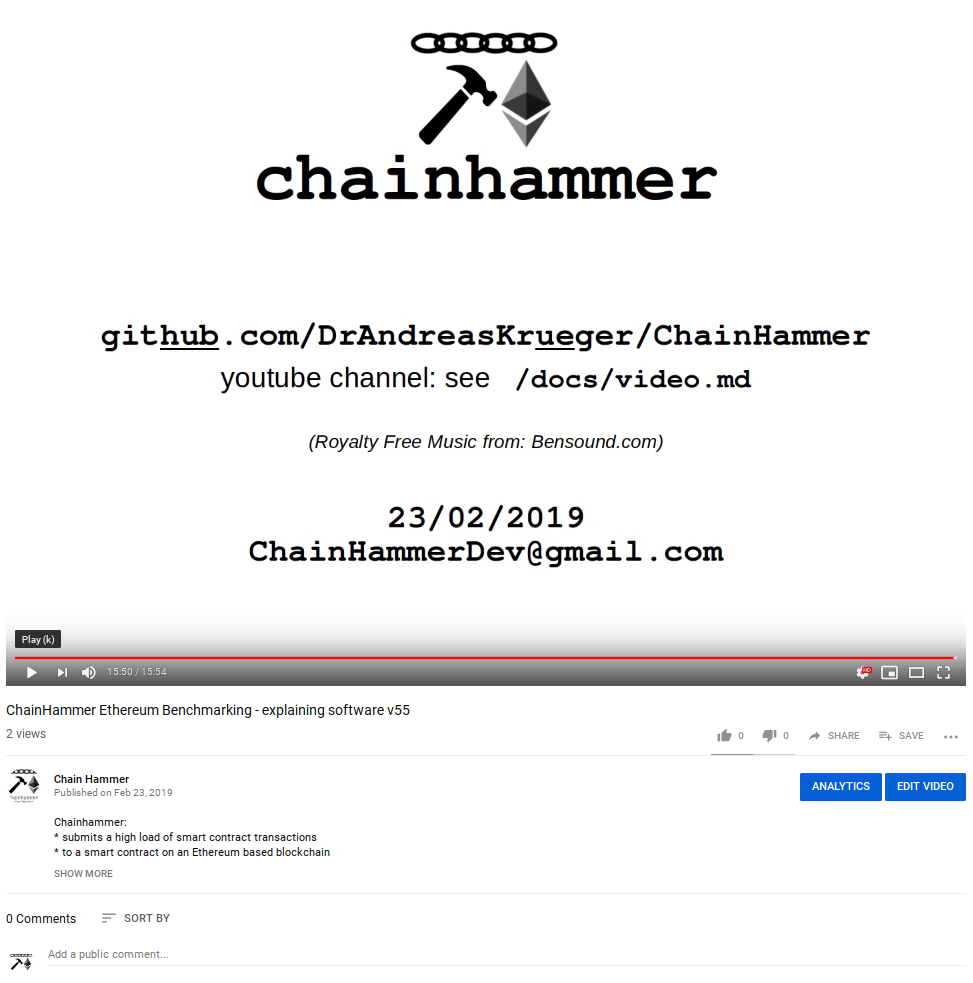
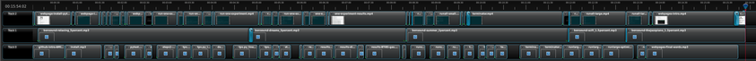

# Chainhammer Video
> A video could be nice actually.  
> That could be a neat way to see it in action.  
> Edward  

## Released video
https://www.youtube.com/watch?v=xTYnsfs5U7I



https://www.youtube.com/watch?v=xTYnsfs5U7I

## Making of = Software Suggestions & Tricks

Some software was initially not working as expected. May this list here help you to directly go for the solutions:

* `ssh` logs into the ready-made cloud machine on AWS
* `terminator` opens several such ssh-terminals, each with a different log file
  * changed the aspect ratio to a more standard 1440x1080 pixels
  * when working with *own* [terminator.config](../scripts/terminator.config) files, prevent strange problems with `rm ~/.config/terminator/config` (default file)
* `xwininfo` helps to understand the coordinates of the screen windows 
* **Screen recording** with [SimpleScreenRecorder](https://www.maartenbaert.be/simplescreenrecorder/)
  * (First I had tried `kazam`, but that kept on recording the wrong windows; perhaps due to the 4K screen?).
  * as the to be recorded windows had slightly different sizes, which could later cause problems or quality loss in the video editor, I decided to not record specific windows but a fixed rectangle; the reference was the size of the terminator window with 1440x1080 pixels
  * recorded as MP4 with codec H.264, and preset "fast"
* **Title slides** done with [LibreOffice Impress](https://www.libreoffice.org/discover/impress/) 
  * correct aspect ratio with: Menu --> Slide --> Slide Properties --> Page --> Width 14.40 cm, Height 10.80 cm
  * into images with: Menu --> File --> Export --> PNG --> 1440x1080 pixels, no transparency.
* **Audio Recordings** with [audacity](https://www.audacityteam.org/)
  * but for simplicity via `apt install audacity` --> older version 2.1.2 but works
  * (tried `apt install gnome-sound-recorder` but mp3 quality could not be selected)
  * audacity useful:
    * *Shift-R* to append a recording at the end of the current one
    * Menu ... Effect ... *Noise Reduction* does a good job
* **Video editing** with [OpenShot 2.4.3](https://www.openshot.org/) 
  * (first I had tried `Pitivi`, and then `ShotCut`; but they do not seem to provide what I need, e.g. to speed up video snippets.)
  * (the `apt install openshot` version v1.4.3 turned out *very unstable*; finally I uninstalled it, and instead used the [AppImage from their website](https://www.openshot.org/download/#), which works alright)
  * I wanted a *custom profile* with 1440x1080 pixels, and and aspect ratio of 4:3, and frame rate 15 --> instructions [here](https://www.openshot.org/static/files/user-guide/profiles.html#custom-profile).
  * Then after 10+ hours in OpenShot, the shock was big when it refused to render the accelerated (2x, 4x, 16x) video snippets. OpenShot's github issues are full of similar findings of other users. I feared that I have to give it all up, and restart in yet another video editing suite - but then found out, that when using a different export profile, the problem actually disappears. What a relief.
  * In general OpenShot is quite alright, but it crashes every now and then, so I reduced the autosaving time; and towards the end, with 42 video and 35 audio snippets, it became rather slow. For larger projects it probably makes sense to create one new file per chapter. 
* **Music**: 
  * Royalty free music by Bensound: [relaxing](https://www.bensound.com/royalty-free-music/track/relaxing), [dreams](https://www.bensound.com/royalty-free-music/track/dreams-chill-out), [summer](https://www.bensound.com/royalty-free-music/track/summer-chill-relaxed-tropical), [sci-fi](https://www.bensound.com/royalty-free-music/track/sci-fi), [the jazz piano](https://www.bensound.com/royalty-free-music/track/the-jazz-piano).
  * `ffmpeg -i bensound-relaxing.mp3 -filter:a "volume=0.05" bensound-relaxing_5percent.mp3` reduced the volume - now it hides the irregularities and noise of my voiceover, but without distracting by being overly loud.
* **Youtube**:
  * The uploaded 15:54 video was too long, *sigh*. Fortunately, there is a way to unlock a feature: [verify](https://www.youtube.com/verify_phone_number), then ["Longer videos"](https://www.youtube.com/features) gets enabled. But:
  * "Video unavailable. This video was removed because it was too long", so:
  * uploading it *again*, lol. Fortunately, I had saved the description, see below:


#### OpenShot Timeline
42 video and 35 audio snippets, 5 songs:  

 

#### youtube video description
* title: ChainHammer Ethereum Benchmarking - explaining software v55
* tags: chainhammer, ethereum, TPS, benchmarking, geth, parity, quorum, smartcontract, blockchain, cryptocurrencies, opensource, Python
* advanced settings: Category Science & Technology; Video language: English; allow contribute subtitles; recording date: February 23, 2019; license: creative commons attribution
* desciption:

```
Chainhammer:
* submits a high load of smart contract transactions
* to a smart contract on an Ethereum based blockchain
* then reads the whole chain, and produces diagrams of 
* TPS, blocktime, gasUsed and gasLimit, and the blocksize
* fully automated, start a whole lab with a one-liner.
* open source, Python and bash
* https://github.com/drandreaskrueger/chainhammer

about video production:

* for the "making of" of this video & software tips and tricks, see: 
* https://github.com/drandreaskrueger/chainhammer/blob/master/docs/video.md
* e.g. royalty free music by Bensound
* chainhammer-video-1440x1080-v06.mov movie file
* rendered from chainhammer-video-1440x1080_v06.osp 
* produced on 20th-23rd of February 2019
* my first ever released video, so please be gentle, but:
* put your comments below please, thanks!
```
