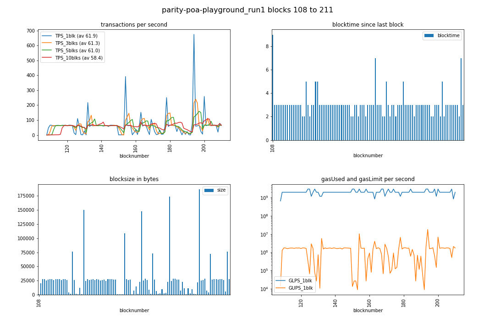

# parity PoA benchmarking

## parity docker
Following informative wiki page https://github.com/paritytech/wiki/blob/master/Docker.md

Initial -brutal- cleaning of my machine:
```
docker rm $(docker ps -a -q); docker rmi $(docker images -q)
```

### dockerized paritytech/parity-ethereum v1.11.8 

The newest stable [release](https://github.com/paritytech/parity-ethereum/releases) v1.11.8 does exist as a docker image on dockerhub:

```
curl -sS 'https://registry.hub.docker.com/v2/repositories/parity/parity/tags/'  | jq '."results"[]["name"]' | sort

"beta"
"gitlab-next"
"latest"
"nightly"
"stable"
"v1.11.8"
"v2.0.0"
"v2.0.1"
"v2.1.0-rc1"
"v2.1.0-rc2"
```

run

    docker run -ti parity/parity:v1.11.8


#### configure

    docker run -ti parity/parity:v1.11.8 --help


run with open ports

    docker run -ti -p 8180:8180 -p 8545:8545 -p 8546:8546 -p 30303:30303 -p 30303:30303/udp parity/parity:v1.11.8 --ui-interface all --jsonrpc-interface all

perhaps useful: [Parity Config Generator](https://paritytech.github.io/parity-config-generator/)

then 

    docker run -ti -v ~/.local/share/io.parity.ethereum/docker/:/root/.local/share/io.parity.ethereum/ parity/parity:v1.11.8 --config /root/.local/share/io.parity.ethereum/config.toml

### parity-deploy = docker-compose generator tool

https://github.com/paritytech/parity-deploy

example

    ./parity-deploy.sh --config aura --name parity_my-aura --nodes 4 --ethstats
    docker-compose up


that tool looks really promising. But it results in a non-functioning `docker-compose.yml` - see [PD#51](https://github.com/paritytech/parity-deploy/issues/51)

aborting this for now.

### orbita-center/parity-poa-playground
> Parity PoA network with 3 authorities and 3 members.

```
git clone https://github.com/orbita-center/parity-poa-playground orbita-center_parity-poa-playground
cd orbita-center_parity-poa-playground
docker-compose up
```
#### good first impression:
* http://localhost:3001/ comes up, with 3 authorities, and 3 members
* port 8545 is answering:

```
curl -X POST --data '{"jsonrpc":"2.0","method":"net_version","params":[],"id":67}' -H "Content-Type: application/json" localhost:8545
{"jsonrpc":"2.0","result":"8995","id":67}
```

#### modify 

only 1 change needed: Add geth compatibility mode (needed e.g. for timed unlocking of accounts)

    --geth

before line 13 in https://github.com/orbita-center/parity-poa-playground/blob/master/docker-compose.yml#L12-L13


## benchmarking

### chainhammer settings 

#### config.py

    RPCaddress, RPCaddress2 = 'http://localhost:8545', 'http://localhost:8545' 
    RAFT = False
    ROUTE = "RPC"  

#### account-passphrase.txt

empty file


### initial run, unoptimized

Before [PPP#14](https://github.com/orbita-center/parity-poa-playground/issues/14) was answered, with "out of the box" chain.json settings, and no tweaks ... we see mediocre results initially:

#### log of run 1

```
./tps.py 

versions: web3 4.3.0, py-solc: 2.1.0, solc 0.4.23+commit.124ca40d.Linux.gpp, testrpc 1.3.4, python 3.5.3 (default, Jan 19 2017, 14:11:04) [GCC 6.3.0 20170118]
web3 connection established, blockNumber = 106, node version string =  Parity//v1.11.8-stable-92776e4-20180728/x86_64-linux-gnu/rustc1.27.2
first account of node is 0x000a3702732843418D83A03E65A3d9f7aDd58864, balance is 10000000000 Ether
nodeName: Parity, nodeType: Parity, consensus: ???, chainName: parity-poa-playground

Block  106  - waiting for something to happen
(filedate 1534862035) last contract address: 0xBD45194215D595444c07A591A9D6E5a1fA53f169
(filedate 1534863468) new contract address: 0x02615cCb36C65E120C3598aba61eB455Cf18A578

starting timer, at block 108 which has  1  transactions; at timecode 24644.527843475
block 108 | new #TX 144 / 3000 ms =  48.0 TPS_current | total: #TX  145 /  2.8 s =  51.9 TPS_average
block 109 | new #TX 198 / 3000 ms =  66.0 TPS_current | total: #TX  343 /  5.8 s =  58.7 TPS_average
block 110 | new #TX 194 / 3000 ms =  64.7 TPS_current | total: #TX  537 /  8.9 s =  60.4 TPS_average
block 111 | new #TX 179 / 3000 ms =  59.7 TPS_current | total: #TX  716 / 11.9 s =  60.0 TPS_average
block 112 | new #TX 189 / 3000 ms =  63.0 TPS_current | total: #TX  905 / 14.7 s =  61.6 TPS_average
block 113 | new #TX 194 / 3000 ms =  64.7 TPS_current | total: #TX 1099 / 17.8 s =  61.9 TPS_average
block 114 | new #TX 194 / 3000 ms =  64.7 TPS_current | total: #TX 1293 / 20.8 s =  62.1 TPS_average
block 115 | new #TX 186 / 3000 ms =  62.0 TPS_current | total: #TX 1479 / 23.9 s =  62.0 TPS_average
block 116 | new #TX 196 / 3000 ms =  65.3 TPS_current | total: #TX 1675 / 26.9 s =  62.2 TPS_average
block 117 | new #TX 193 / 3000 ms =  64.3 TPS_current | total: #TX 1868 / 30.0 s =  62.3 TPS_average
block 118 | new #TX 196 / 3000 ms =  65.3 TPS_current | total: #TX 2064 / 33.0 s =  62.5 TPS_average
block 119 | new #TX 183 / 3000 ms =  61.0 TPS_current | total: #TX 2247 / 35.8 s =  62.8 TPS_average
block 120 | new #TX 198 / 3000 ms =  66.0 TPS_current | total: #TX 2445 / 38.8 s =  63.0 TPS_average
block 121 | new #TX 196 / 3000 ms =  65.3 TPS_current | total: #TX 2641 / 41.9 s =  63.0 TPS_average
block 122 | new #TX 184 / 3000 ms =  61.3 TPS_current | total: #TX 2825 / 45.0 s =  62.8 TPS_average
block 123 | new #TX  26 / 2000 ms =  13.0 TPS_current | total: #TX 2851 / 46.8 s =  60.9 TPS_average
block 124 | new #TX   5 / 2000 ms =   2.5 TPS_current | total: #TX 2856 / 48.9 s =  58.4 TPS_average
block 125 | new #TX 550 / 5000 ms = 110.0 TPS_current | total: #TX 3406 / 53.8 s =  63.3 TPS_average
block 126 | new #TX 184 / 3000 ms =  61.3 TPS_current | total: #TX 3590 / 56.9 s =  63.1 TPS_average
block 127 | new #TX   6 / 2000 ms =   3.0 TPS_current | total: #TX 3596 / 59.0 s =  60.9 TPS_average
block 128 | new #TX   3 / 3000 ms =   1.0 TPS_current | total: #TX 3599 / 62.0 s =  58.0 TPS_average
block 129 | new #TX  83 / 3000 ms =  27.7 TPS_current | total: #TX 3682 / 65.1 s =  56.6 TPS_average
block 130 | new #TX   2 / 5000 ms =   0.4 TPS_current | total: #TX 3684 / 69.9 s =  52.7 TPS_average
block 131 | new #TX 1086 / 5000 ms = 217.2 TPS_current | total: #TX 4770 / 75.1 s =  63.5 TPS_average
block 132 | new #TX 171 / 3000 ms =  57.0 TPS_current | total: #TX 4941 / 77.9 s =  63.4 TPS_average
block 133 | new #TX 197 / 3000 ms =  65.7 TPS_current | total: #TX 5138 / 81.0 s =  63.5 TPS_average
block 134 | new #TX 183 / 3000 ms =  61.0 TPS_current | total: #TX 5321 / 83.7 s =  63.6 TPS_average
block 135 | new #TX 191 / 3000 ms =  63.7 TPS_current | total: #TX 5512 / 86.8 s =  63.5 TPS_average
block 136 | new #TX 194 / 3000 ms =  64.7 TPS_current | total: #TX 5706 / 89.8 s =  63.5 TPS_average
block 137 | new #TX 184 / 3000 ms =  61.3 TPS_current | total: #TX 5890 / 92.9 s =  63.4 TPS_average
block 138 | new #TX 197 / 3000 ms =  65.7 TPS_current | total: #TX 6087 / 95.9 s =  63.4 TPS_average
block 139 | new #TX 191 / 3000 ms =  63.7 TPS_current | total: #TX 6278 / 99.0 s =  63.4 TPS_average
block 140 | new #TX 179 / 3000 ms =  59.7 TPS_current | total: #TX 6457 / 101.8 s =  63.5 TPS_average
block 141 | new #TX 186 / 3000 ms =  62.0 TPS_current | total: #TX 6643 / 104.8 s =  63.4 TPS_average
block 142 | new #TX 192 / 3000 ms =  64.0 TPS_current | total: #TX 6835 / 107.9 s =  63.3 TPS_average
block 143 | new #TX 171 / 3000 ms =  57.0 TPS_current | total: #TX 7006 / 110.9 s =  63.1 TPS_average
block 144 | new #TX 197 / 3000 ms =  65.7 TPS_current | total: #TX 7203 / 114.0 s =  63.2 TPS_average
block 145 | new #TX 197 / 3000 ms =  65.7 TPS_current | total: #TX 7400 / 117.0 s =  63.2 TPS_average
block 146 | new #TX 194 / 3000 ms =  64.7 TPS_current | total: #TX 7594 / 120.1 s =  63.2 TPS_average
block 147 | new #TX 191 / 3000 ms =  63.7 TPS_current | total: #TX 7785 / 122.9 s =  63.4 TPS_average
block 148 | new #TX 189 / 3000 ms =  63.0 TPS_current | total: #TX 7974 / 125.9 s =  63.3 TPS_average
block 149 | new #TX   1 / 2000 ms =   0.5 TPS_current | total: #TX 7975 / 128.1 s =  62.3 TPS_average
block 150 | new #TX   2 / 2000 ms =   1.0 TPS_current | total: #TX 7977 / 129.9 s =  61.4 TPS_average
block 151 | new #TX   3 / 3000 ms =   1.0 TPS_current | total: #TX 7980 / 132.9 s =  60.0 TPS_average
block 152 | new #TX   1 / 3000 ms =   0.3 TPS_current | total: #TX 7981 / 135.7 s =  58.8 TPS_average
block 153 | new #TX 784 / 2000 ms = 392.0 TPS_current | total: #TX 8765 / 137.9 s =  63.6 TPS_average
block 154 | new #TX 193 / 3000 ms =  64.3 TPS_current | total: #TX 8958 / 140.9 s =  63.6 TPS_average
block 155 | new #TX 186 / 3000 ms =  62.0 TPS_current | total: #TX 9144 / 144.0 s =  63.5 TPS_average
block 156 | new #TX 192 / 3000 ms =  64.0 TPS_current | total: #TX 9336 / 146.7 s =  63.6 TPS_average
block 157 | new #TX   2 / 2000 ms =   1.0 TPS_current | total: #TX 9338 / 148.8 s =  62.7 TPS_average
block 158 | new #TX  51 / 3000 ms =  17.0 TPS_current | total: #TX 9389 / 151.9 s =  61.8 TPS_average
block 159 | new #TX 103 / 3000 ms =  34.3 TPS_current | total: #TX 9492 / 154.9 s =  61.3 TPS_average
block 160 | new #TX   9 / 3000 ms =   3.0 TPS_current | total: #TX 9501 / 158.0 s =  60.1 TPS_average
block 161 | new #TX 163 / 3000 ms =  54.3 TPS_current | total: #TX 9664 / 161.0 s =  60.0 TPS_average
block 162 | new #TX 1064 / 7000 ms = 152.0 TPS_current | total: #TX 10728 / 168.0 s =  63.9 TPS_average
block 163 | new #TX 179 / 3000 ms =  59.7 TPS_current | total: #TX 10907 / 171.1 s =  63.8 TPS_average
block 164 | new #TX 201 / 3000 ms =  67.0 TPS_current | total: #TX 11108 / 174.1 s =  63.8 TPS_average
block 165 | new #TX 184 / 3000 ms =  61.3 TPS_current | total: #TX 11292 / 176.8 s =  63.9 TPS_average
block 166 | new #TX  60 / 2000 ms =  30.0 TPS_current | total: #TX 11352 / 179.0 s =  63.4 TPS_average
block 167 | new #TX   5 / 2000 ms =   2.5 TPS_current | total: #TX 11357 / 181.1 s =  62.7 TPS_average
block 168 | new #TX 524 / 5000 ms = 104.8 TPS_current | total: #TX 11881 / 186.0 s =  63.9 TPS_average
block 169 | new #TX 189 / 3000 ms =  63.0 TPS_current | total: #TX 12070 / 188.8 s =  63.9 TPS_average
block 170 | new #TX  45 / 2000 ms =  22.5 TPS_current | total: #TX 12115 / 190.9 s =  63.5 TPS_average
block 171 | new #TX   8 / 3000 ms =   2.7 TPS_current | total: #TX 12123 / 193.9 s =  62.5 TPS_average
block 172 | new #TX  12 / 3000 ms =   4.0 TPS_current | total: #TX 12135 / 197.0 s =  61.6 TPS_average
block 173 | new #TX  69 / 2000 ms =  34.5 TPS_current | total: #TX 12204 / 199.1 s =  61.3 TPS_average
block 174 | new #TX  14 / 3000 ms =   4.7 TPS_current | total: #TX 12218 / 202.1 s =  60.5 TPS_average
block 175 | new #TX  17 / 3000 ms =   5.7 TPS_current | total: #TX 12235 / 204.9 s =  59.7 TPS_average
block 176 | new #TX 163 / 3000 ms =  54.3 TPS_current | total: #TX 12398 / 207.9 s =  59.6 TPS_average
block 177 | new #TX 1253 / 5000 ms = 250.6 TPS_current | total: #TX 13651 / 213.1 s =  64.1 TPS_average
block 178 | new #TX 171 / 3000 ms =  57.0 TPS_current | total: #TX 13822 / 215.9 s =  64.0 TPS_average
block 179 | new #TX 200 / 3000 ms =  66.7 TPS_current | total: #TX 14022 / 218.9 s =  64.0 TPS_average
block 180 | new #TX 200 / 3000 ms =  66.7 TPS_current | total: #TX 14222 / 222.0 s =  64.1 TPS_average
block 181 | new #TX 189 / 3000 ms =  63.0 TPS_current | total: #TX 14411 / 225.0 s =  64.0 TPS_average
block 182 | new #TX 192 / 3000 ms =  64.0 TPS_current | total: #TX 14603 / 227.8 s =  64.1 TPS_average
block 183 | new #TX  46 / 2000 ms =  23.0 TPS_current | total: #TX 14649 / 229.9 s =  63.7 TPS_average
block 184 | new #TX 163 / 3000 ms =  54.3 TPS_current | total: #TX 14812 / 233.0 s =  63.6 TPS_average
block 185 | new #TX  81 / 3000 ms =  27.0 TPS_current | total: #TX 14893 / 236.0 s =  63.1 TPS_average
block 186 | new #TX   3 / 3000 ms =   1.0 TPS_current | total: #TX 14896 / 239.0 s =  62.3 TPS_average
block 187 | new #TX  78 / 3000 ms =  26.0 TPS_current | total: #TX 14974 / 241.8 s =  61.9 TPS_average
block 188 | new #TX  13 / 3000 ms =   4.3 TPS_current | total: #TX 14987 / 244.8 s =  61.2 TPS_average
block 189 | new #TX  69 / 3000 ms =  23.0 TPS_current | total: #TX 15056 / 247.9 s =  60.7 TPS_average
block 190 | new #TX   7 / 3000 ms =   2.3 TPS_current | total: #TX 15063 / 250.9 s =  60.0 TPS_average
block 191 | new #TX   1 / 3000 ms =   0.3 TPS_current | total: #TX 15064 / 253.9 s =  59.3 TPS_average
block 192 | new #TX 155 / 2000 ms =  77.5 TPS_current | total: #TX 15219 / 256.1 s =  59.4 TPS_average
block 193 | new #TX 1349 / 2000 ms = 674.5 TPS_current | total: #TX 16568 / 258.0 s =  64.2 TPS_average
block 194 | new #TX 177 / 3000 ms =  59.0 TPS_current | total: #TX 16745 / 261.1 s =  64.1 TPS_average
block 195 | new #TX 184 / 3000 ms =  61.3 TPS_current | total: #TX 16929 / 263.8 s =  64.2 TPS_average
block 196 | new #TX 201 / 3000 ms =  67.0 TPS_current | total: #TX 17130 / 266.9 s =  64.2 TPS_average
block 197 | new #TX  48 / 2000 ms =  24.0 TPS_current | total: #TX 17178 / 269.0 s =  63.9 TPS_average
block 198 | new #TX  28 / 5000 ms =   5.6 TPS_current | total: #TX 17206 / 273.8 s =  62.8 TPS_average
block 199 | new #TX 517 / 2000 ms = 258.5 TPS_current | total: #TX 17723 / 276.0 s =  64.2 TPS_average
block 200 | new #TX 187 / 3000 ms =  62.3 TPS_current | total: #TX 17910 / 279.1 s =  64.2 TPS_average
block 201 | new #TX 198 / 3000 ms =  66.0 TPS_current | total: #TX 18108 / 282.1 s =  64.2 TPS_average
block 202 | new #TX 196 / 3000 ms =  65.3 TPS_current | total: #TX 18304 / 284.9 s =  64.2 TPS_average
block 203 | new #TX 188 / 3000 ms =  62.7 TPS_current | total: #TX 18492 / 288.0 s =  64.2 TPS_average
block 204 | new #TX 197 / 3000 ms =  65.7 TPS_current | total: #TX 18689 / 291.0 s =  64.2 TPS_average
block 205 | new #TX 197 / 3000 ms =  65.7 TPS_current | total: #TX 18886 / 294.1 s =  64.2 TPS_average
block 206 | new #TX 183 / 3000 ms =  61.0 TPS_current | total: #TX 19069 / 296.8 s =  64.2 TPS_average
block 207 | new #TX  39 / 2000 ms =  19.5 TPS_current | total: #TX 19108 / 298.9 s =  63.9 TPS_average
block 208 | new #TX 549 / 7000 ms =  78.4 TPS_current | total: #TX 19657 / 305.9 s =  64.3 TPS_average
block 209 | new #TX 196 / 3000 ms =  65.3 TPS_current | total: #TX 19853 / 309.0 s =  64.3 TPS_average
block 210 | new #TX  11 / 2000 ms =   5.5 TPS_current | total: #TX 19864 / 311.1 s =  63.8 TPS_average
block 211 | new #TX 137 / 6000 ms =  22.8 TPS_current | total: #TX 20001 / 317.0 s =  63.1 TPS_average
block 212 | new #TX   0 / 77000 ms =   0.0 TPS_current | total: #TX 20001 / 393.9 s =  50.8 TPS_average
block 213 | new #TX   0 / 38000 ms =   0.0 TPS_current | total: #TX 20001 / 431.9 s =  46.3 TPS_average
block 214 | new #TX   0 / 11000 ms =   0.0 TPS_current | total: #TX 20001 / 442.9 s =  45.2 TPS_average
block 215 | new #TX   0 / 74000 ms =   0.0 TPS_current | total: #TX 20001 / 517.1 s =  38.7 TPS_average
```

#### result initial run1: > 60 TPS




### run2
With [these altered settings](https://github.com/drandreaskrueger/parity-poa-playground/commit/d4c1aa3fc504e940a5a2f56de62f8a62734b2f8d)

```
      --jsonrpc-server-threads 8
      --tx-queue-size 16536
      --scale-verifiers
```
it's worse:

```
./tps.py 
versions: web3 4.3.0, py-solc: 2.1.0, solc 0.4.23+commit.124ca40d.Linux.gpp, testrpc 1.3.4, python 3.5.3 (default, Jan 19 2017, 14:11:04) [GCC 6.3.0 20170118]
web3 connection established, blockNumber = 0, node version string =  Parity//v1.11.8-stable-92776e4-20180728/x86_64-linux-gnu/rustc1.27.2
first account of node is 0x000a3702732843418D83A03E65A3d9f7aDd58864, balance is 10000000000 Ether
nodeName: Parity, nodeType: Parity, consensus: ???, network: 8995, chainName: parity-poa-playground, chainId: 8995

Block  0  - waiting for something to happen
(filedate 1535544939) last contract address: 0x536A0b91265dE1Ce1Ba541e54874AC21eC0E63e6
(filedate 1535545118) new contract address: 0x536A0b91265dE1Ce1Ba541e54874AC21eC0E63e6

starting timer, at block 1 which has  1  transactions; at timecode 45801.661595177
block 1 | new #TX  12 / 3000 ms =   4.0 TPS_current | total: #TX   13 /  2.7 s =   4.7 TPS_average
block 2 | new #TX 385 / 4000 ms =  96.2 TPS_current | total: #TX  398 /  7.0 s =  56.9 TPS_average
block 3 | new #TX 182 / 3000 ms =  60.7 TPS_current | total: #TX  580 / 10.1 s =  57.7 TPS_average
block 4 | new #TX 192 / 3000 ms =  64.0 TPS_current | total: #TX  772 / 13.1 s =  58.9 TPS_average
block 5 | new #TX 186 / 3000 ms =  62.0 TPS_current | total: #TX  958 / 15.9 s =  60.4 TPS_average
block 6 | new #TX 187 / 3000 ms =  62.3 TPS_current | total: #TX 1145 / 18.9 s =  60.5 TPS_average
block 7 | new #TX 195 / 3000 ms =  65.0 TPS_current | total: #TX 1340 / 22.0 s =  61.0 TPS_average
block 8 | new #TX 181 / 3000 ms =  60.3 TPS_current | total: #TX 1521 / 24.7 s =  61.6 TPS_average
block 9 | new #TX  50 / 2000 ms =  25.0 TPS_current | total: #TX 1571 / 26.8 s =  58.5 TPS_average
block 10 | new #TX  86 / 3000 ms =  28.7 TPS_current | total: #TX 1657 / 29.9 s =  55.5 TPS_average
block 11 | new #TX   8 / 3000 ms =   2.7 TPS_current | total: #TX 1665 / 32.9 s =  50.6 TPS_average
block 12 | new #TX  73 / 2000 ms =  36.5 TPS_current | total: #TX 1738 / 35.1 s =  49.6 TPS_average
block 13 | new #TX 163 / 7000 ms =  23.3 TPS_current | total: #TX 1901 / 42.1 s =  45.2 TPS_average
block 14 | new #TX  81 / 3000 ms =  27.0 TPS_current | total: #TX 1982 / 44.8 s =  44.2 TPS_average
block 15 | new #TX  81 / 8000 ms =  10.1 TPS_current | total: #TX 2063 / 53.0 s =  38.9 TPS_average
block 16 | new #TX 1779 / 8000 ms = 222.4 TPS_current | total: #TX 3842 / 61.0 s =  63.0 TPS_average
block 17 | new #TX 163 / 3000 ms =  54.3 TPS_current | total: #TX 4005 / 63.8 s =  62.8 TPS_average
block 18 | new #TX 192 / 3000 ms =  64.0 TPS_current | total: #TX 4197 / 66.9 s =  62.8 TPS_average
block 19 | new #TX 183 / 3000 ms =  61.0 TPS_current | total: #TX 4380 / 69.9 s =  62.7 TPS_average
block 20 | new #TX 183 / 3000 ms =  61.0 TPS_current | total: #TX 4563 / 73.0 s =  62.5 TPS_average
block 21 | new #TX 182 / 3000 ms =  60.7 TPS_current | total: #TX 4745 / 75.7 s =  62.6 TPS_average
block 22 | new #TX 187 / 3000 ms =  62.3 TPS_current | total: #TX 4932 / 78.8 s =  62.6 TPS_average
block 23 | new #TX 192 / 3000 ms =  64.0 TPS_current | total: #TX 5124 / 81.9 s =  62.6 TPS_average
block 24 | new #TX 184 / 3000 ms =  61.3 TPS_current | total: #TX 5308 / 84.9 s =  62.5 TPS_average
block 25 | new #TX 180 / 3000 ms =  60.0 TPS_current | total: #TX 5488 / 87.7 s =  62.6 TPS_average
block 26 | new #TX  12 / 2000 ms =   6.0 TPS_current | total: #TX 5500 / 89.9 s =  61.2 TPS_average
block 27 | new #TX   4 / 3000 ms =   1.3 TPS_current | total: #TX 5504 / 92.9 s =  59.2 TPS_average
block 28 | new #TX 163 / 3000 ms =  54.3 TPS_current | total: #TX 5667 / 95.9 s =  59.1 TPS_average
block 29 | new #TX   3 / 3000 ms =   1.0 TPS_current | total: #TX 5670 / 98.7 s =  57.5 TPS_average
block 30 | new #TX 144 / 3000 ms =  48.0 TPS_current | total: #TX 5814 / 102.0 s =  57.0 TPS_average
block 31 | new #TX   0 / 74000 ms =   0.0 TPS_current | total: #TX 5814 / 175.6 s =  33.1 TPS_average
block 32 | new #TX   0 / 32000 ms =   0.0 TPS_current | total: #TX 5814 / 207.9 s =  28.0 TPS_average
block 33 | new #TX   0 / 17000 ms =   0.0 TPS_current | total: #TX 5814 / 224.9 s =  25.9 TPS_average
block 34 | new #TX   0 / 71000 ms =   0.0 TPS_current | total: #TX 5814 / 295.8 s =  19.7 TPS_average
block 35 | new #TX   0 / 35000 ms =   0.0 TPS_current | total: #TX 5814 / 331.1 s =  17.6 TPS_average
block 36 | new #TX   0 / 20000 ms =   0.0 TPS_current | total: #TX 5814 / 350.9 s =  16.6 TPS_average
block 37 | new #TX   0 / 68000 ms =   0.0 TPS_current | total: #TX 5814 / 418.7 s =  13.9 TPS_average
block 38 | new #TX   0 / 38000 ms =   0.0 TPS_current | total: #TX 5814 / 456.9 s =  12.7 TPS_average
block 39 | new #TX   0 / 17000 ms =   0.0 TPS_current | total: #TX 5814 / 474.0 s =  12.3 TPS_average
```
Speed is not higher, but over 14000 transactions are lost !!

### run3
When [omitting the](https://github.com/drandreaskrueger/parity-poa-playground/commit/788eba40acbbeb71c459bc4237b3004d3c4ff2a7)

          --scale-verifiers
          
it looks better.

Not fast - but at least not losing transactions anymore:

```
./tps.py 
versions: web3 4.3.0, py-solc: 2.1.0, solc 0.4.23+commit.124ca40d.Linux.gpp, testrpc 1.3.4, python 3.5.3 (default, Jan 19 2017, 14:11:04) [GCC 6.3.0 20170118]
web3 connection established, blockNumber = 0, node version string =  Parity//v1.11.8-stable-92776e4-20180728/x86_64-linux-gnu/rustc1.27.2
first account of node is 0x000a3702732843418D83A03E65A3d9f7aDd58864, balance is 10000000000 Ether
nodeName: Parity, nodeType: Parity, consensus: ???, network: 8995, chainName: parity-poa-playground, chainId: 8995

Block  0  - waiting for something to happen
(filedate 1535545118) last contract address: 0x536A0b91265dE1Ce1Ba541e54874AC21eC0E63e6
(filedate 1535545811) new contract address: 0x536A0b91265dE1Ce1Ba541e54874AC21eC0E63e6

starting timer, at block 1 which has  1  transactions; at timecode 46494.51728895
block 1 | new #TX  56 / 3000 ms =  18.7 TPS_current | total: #TX   57 /  3.1 s =  18.6 TPS_average
block 2 | new #TX  34 / 5000 ms =   6.8 TPS_current | total: #TX   91 /  7.9 s =  11.5 TPS_average
block 3 | new #TX 513 / 2000 ms = 256.5 TPS_current | total: #TX  604 / 10.1 s =  60.0 TPS_average
block 4 | new #TX 179 / 3000 ms =  59.7 TPS_current | total: #TX  783 / 12.8 s =  61.0 TPS_average
block 5 | new #TX 196 / 3000 ms =  65.3 TPS_current | total: #TX  979 / 15.9 s =  61.6 TPS_average
block 6 | new #TX 189 / 3000 ms =  63.0 TPS_current | total: #TX 1168 / 19.0 s =  61.6 TPS_average
block 7 | new #TX 197 / 3000 ms =  65.7 TPS_current | total: #TX 1365 / 22.0 s =  62.0 TPS_average
block 8 | new #TX 186 / 3000 ms =  62.0 TPS_current | total: #TX 1551 / 25.0 s =  61.9 TPS_average
block 9 | new #TX 194 / 3000 ms =  64.7 TPS_current | total: #TX 1745 / 28.1 s =  62.1 TPS_average
block 10 | new #TX 185 / 3000 ms =  61.7 TPS_current | total: #TX 1930 / 31.1 s =  62.0 TPS_average
block 11 | new #TX 195 / 3000 ms =  65.0 TPS_current | total: #TX 2125 / 33.9 s =  62.7 TPS_average
block 12 | new #TX 187 / 3000 ms =  62.3 TPS_current | total: #TX 2312 / 37.0 s =  62.5 TPS_average
block 13 | new #TX  59 / 2000 ms =  29.5 TPS_current | total: #TX 2371 / 39.1 s =  60.6 TPS_average
...
block 91 | new #TX 645 / 5000 ms = 129.0 TPS_current | total: #TX 18696 / 301.1 s =  62.1 TPS_average
block 92 | new #TX 172 / 3000 ms =  57.3 TPS_current | total: #TX 18868 / 304.1 s =  62.0 TPS_average
block 93 | new #TX  31 / 2000 ms =  15.5 TPS_current | total: #TX 18899 / 306.0 s =  61.8 TPS_average
block 94 | new #TX  81 / 3000 ms =  27.0 TPS_current | total: #TX 18980 / 309.0 s =  61.4 TPS_average
block 95 | new #TX   3 / 3000 ms =   1.0 TPS_current | total: #TX 18983 / 312.1 s =  60.8 TPS_average
block 96 | new #TX 160 / 2000 ms =  80.0 TPS_current | total: #TX 19143 / 314.2 s =  60.9 TPS_average
block 97 | new #TX 163 / 3000 ms =  54.3 TPS_current | total: #TX 19306 / 317.0 s =  60.9 TPS_average
block 98 | new #TX 470 / 2000 ms = 235.0 TPS_current | total: #TX 19776 / 319.1 s =  62.0 TPS_average
block 99 | new #TX 169 / 3000 ms =  56.3 TPS_current | total: #TX 19945 / 321.9 s =  62.0 TPS_average
block 100 | new #TX  56 / 3000 ms =  18.7 TPS_current | total: #TX 20001 / 325.0 s =  61.5 TPS_average
block 101 | new #TX   0 / 110000 ms =   0.0 TPS_current | total: #TX 20001 / 435.2 s =  46.0 TPS_average
block 102 | new #TX   0 / 5000 ms =   0.0 TPS_current | total: #TX 20001 / 440.1 s =  45.4 TPS_average
```

# run4

more  jsonrpc-server-threads

      --jsonrpc-server-threads 20

not better:

```
./tps.py 
...
starting timer, at block 1 which has  1  transactions; at timecode 47560.479835239
block 1 | new #TX 161 / 3000 ms =  53.7 TPS_current | total: #TX  162 /  3.1 s =  53.1 TPS_average
block 2 | new #TX 189 / 3000 ms =  63.0 TPS_current | total: #TX  351 /  6.1 s =  57.6 TPS_average
...
block 107 | new #TX 175 / 3000 ms =  58.3 TPS_current | total: #TX 19960 / 327.2 s =  61.0 TPS_average
block 108 | new #TX  41 / 3000 ms =  13.7 TPS_current | total: #TX 20001 / 330.3 s =  60.6 TPS_average
```

and the CPU was only between 50% and 70%.


# run5
switching off 4 of the machines (member1, member2, monitor, dashboard), to see whether that accelerates.

```
./tps.py 
...
starting timer, at block 9 which has  1  transactions; at timecode 48112.603595221
block 9 | new #TX 154 / 3000 ms =  51.3 TPS_current | total: #TX  155 /  3.1 s =  50.8 TPS_average
block 10 | new #TX 192 / 3000 ms =  64.0 TPS_current | total: #TX  347 /  6.1 s =  56.9 TPS_average
block 11 | new #TX 198 / 3000 ms =  66.0 TPS_current | total: #TX  545 /  9.1 s =  59.6 TPS_average
...
block 111 | new #TX 195 / 3000 ms =  65.0 TPS_current | total: #TX 19990 / 311.9 s =  64.1 TPS_average
block 112 | new #TX  11 / 3000 ms =   3.7 TPS_current | total: #TX 20001 / 315.0 s =  63.5 TPS_average

```

--> 2-3 TPS faster.

We need new ideas how to accelerate parity.


## Please you help

Compared to e.g. the >400 TPS of [quorum-IBFT](quorum-IBFT.md#result-400-tps-but-only-for-the-first-14k-tx), and the >300 TPS of [geth-Clique](https://gitlab.com/electronDLT/chainhammer/blob/master/geth.md#results-approx-350-tps-but-only-for-first-14k-transactions), this is slow. 

-->

Calling all parity experts: How to improve this? See issue [PE#9393](https://github.com/paritytech/parity-ethereum/issues/9393). Thanks.


## issues
* [PD#51](https://github.com/paritytech/parity-deploy/issues/51) libstdc++.so.6: version `GLIBCXX_3.4.22' not found
* [PE#9390](https://github.com/paritytech/parity-ethereum/issues/9390) (dockerized parity) libstdc++.so.6: version `GLIBCXX_3.4.22' not found
* [PD#52](https://github.com/paritytech/parity-deploy/issues/52) Invalid node address format given for a boot node
* [PPP#14](https://github.com/orbita-center/parity-poa-playground/issues/14) block interval?
* [PPP#15](https://github.com/orbita-center/parity-poa-playground/issues/15) (FR) script which only deletes the blockchains from all nodes
* [PE#9393](https://github.com/paritytech/parity-ethereum/issues/9393) 60 TPS ? (parity aura v1.11.8)
* [PE#9432](https://github.com/paritytech/parity-ethereum/issues/9432) (FR) new standardized RPC query with standardized answer


