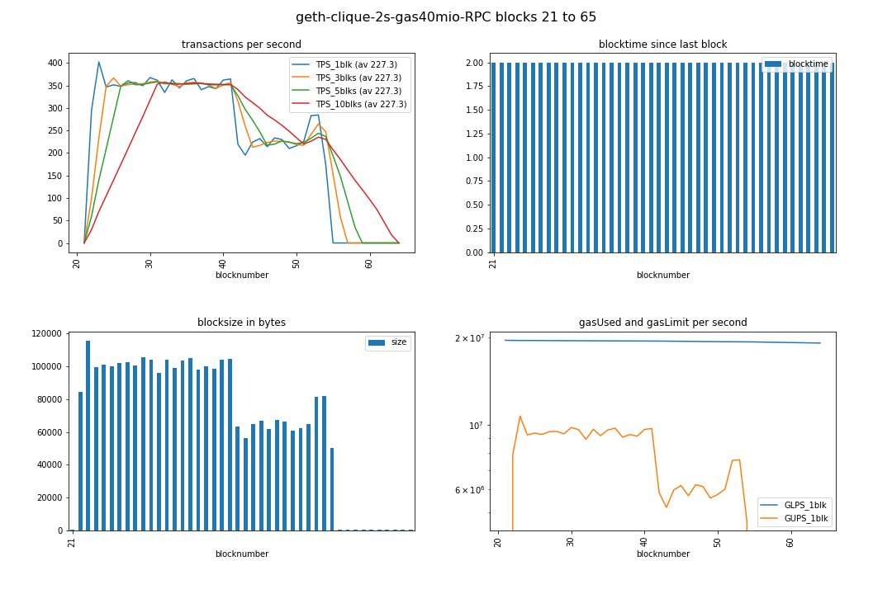
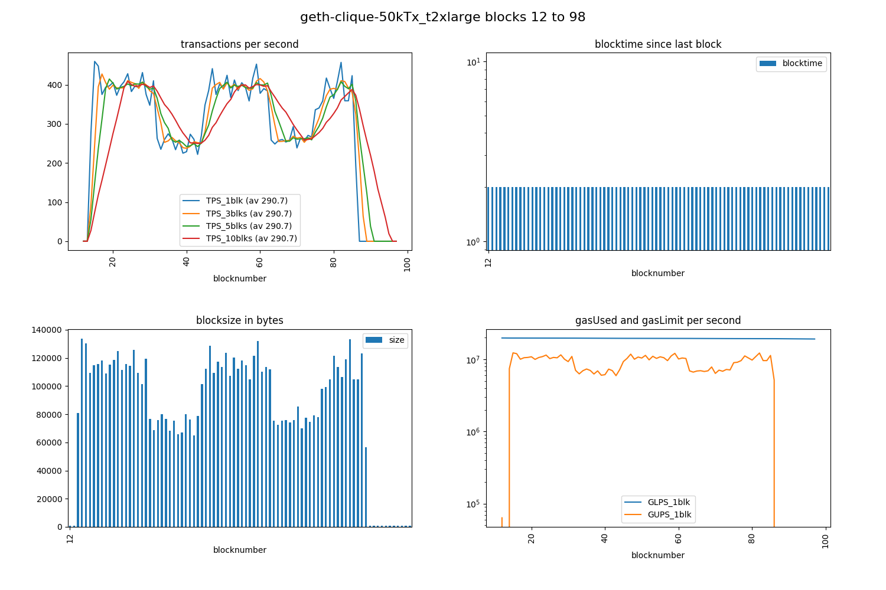

# geth Clique PoA benchmarking
To have a nodes setup comparable to the 
quorum [7nodes example](https://github.com/jpmorganchase/quorum-examples/tree/master/examples/7nodes) 
or the blk.io [crux-quorum-4nodes-docker-compose](https://github.com/blk-io/crux/blob/master/docker/quorum-crux/docker-compose.yaml), 
I am looking for a ready dockerized or vagrant virtualbox solution. 
Please tell me if you know a good one. For now I have chosen `javahippie/geth-dev`

## TOC
1. javahippie/geth-dev; docker stuff; 
1. run1
1. run 2 - purpose: new diagrams
1. [issues](#issues)

## javahippie/geth-dev

```
git clone https://github.com/javahippie/geth-dev javahippie_geth-dev
cd javahippie_geth-dev
```

edit *both* duplicates of the genesis block

```
nano node/genesis.json 
nano miner/genesis.json 
```

and change to these values (faster & larger blocks):

```
    "clique": {
      "period": 2,
    }
  },
...
  "gasLimit": "0x2625A00",
```

(unfortunately, 1 second period, and 20million (0x1312D00) gasLimit (like in my quorum IBFT benchmarks) seems to not work properly here (chain stuck) - so I chose twice the interval and blocksize)

then start with
```
docker-compose up
```

At http://localhost:3000/ you can see an ethstats overview of the three nodes.

### docker stuff

If any changes in those ^ files are not reflected after restarting - try:

    docker-compose build

N.B.: It can take quite some time after restarting, until a new block is created. Before starting a benchmarking, I suggest to always open a JSRE console, and check that the blocknumber is increasing:

    geth attach http://localhost:8545
    eth.blockNumber

To delete the blockchain and start new

    docker-compose down
    docker-compose up

Also see [this issue](https://github.com/javahippie/geth-dev/issues/15).

## results
log of run 1
```
./tps.py 
versions: web3 4.3.0, py-solc: 2.1.0, solc 0.4.23+commit.124ca40d.Linux.gpp, testrpc 1.3.4, python 3.5.3 (default, Jan 19 2017, 14:11:04) [GCC 6.3.0 20170118]
web3 connection established, blockNumber = 13, node version string =  Geth/v1.8.13-stable-225171a4/linux-amd64/go1.10.3
first account of node is 0x3590ACA93338b0721966a8d0C96EbF2C4c87c544, balance is 904625697166532776746648320380374280103671755200316906558.262375061821325312 Ether
nodeName: Geth, nodeType: Geth, consensus: ???, chainName: 500

Block  13  - waiting for something to happen
(filedate 1534775774) last contract address: 0x06FFE7da847332d2B5E8A738db23aEF949b8Fbf2
(filedate 1534777534) new contract address: 0x06FFE7da847332d2B5E8A738db23aEF949b8Fbf2

starting timer, at block 20 which has  1  transactions; at timecode 25953.459564793
block 20 | new #TX   0 / 2000 ms =   0.0 TPS_current | total: #TX    1 /  2.1 s =   0.5 TPS_average
block 21 | new #TX 589 / 2000 ms = 294.5 TPS_current | total: #TX  590 /  4.0 s = 146.2 TPS_average
block 22 | new #TX 805 / 2000 ms = 402.5 TPS_current | total: #TX 1395 /  6.6 s = 213.0 TPS_average
block 23 | new #TX 693 / 2000 ms = 346.5 TPS_current | total: #TX 2088 /  8.1 s = 256.8 TPS_average
block 24 | new #TX 703 / 2000 ms = 351.5 TPS_current | total: #TX 2791 / 10.3 s = 270.4 TPS_average
block 25 | new #TX 696 / 2000 ms = 348.0 TPS_current | total: #TX 3487 / 12.2 s = 285.1 TPS_average
block 26 | new #TX 711 / 2000 ms = 355.5 TPS_current | total: #TX 4198 / 14.4 s = 291.3 TPS_average
block 27 | new #TX 713 / 2000 ms = 356.5 TPS_current | total: #TX 4911 / 16.0 s = 306.8 TPS_average
block 28 | new #TX 699 / 2000 ms = 349.5 TPS_current | total: #TX 5610 / 18.5 s = 302.8 TPS_average
block 29 | new #TX 735 / 2000 ms = 367.5 TPS_current | total: #TX 6345 / 20.2 s = 313.6 TPS_average
block 30 | new #TX 723 / 2000 ms = 361.5 TPS_current | total: #TX 7068 / 22.4 s = 315.3 TPS_average
block 31 | new #TX 669 / 2000 ms = 334.5 TPS_current | total: #TX 7737 / 24.0 s = 322.5 TPS_average
block 32 | new #TX 725 / 2000 ms = 362.5 TPS_current | total: #TX 8462 / 26.5 s = 319.8 TPS_average
block 33 | new #TX 689 / 2000 ms = 344.5 TPS_current | total: #TX 9151 / 28.1 s = 326.0 TPS_average
block 34 | new #TX 721 / 2000 ms = 360.5 TPS_current | total: #TX 9872 / 30.3 s = 325.9 TPS_average
block 35 | new #TX 731 / 2000 ms = 365.5 TPS_current | total: #TX 10603 / 32.2 s = 329.5 TPS_average
block 36 | new #TX 681 / 2000 ms = 340.5 TPS_current | total: #TX 11284 / 34.4 s = 328.3 TPS_average
block 37 | new #TX 695 / 2000 ms = 347.5 TPS_current | total: #TX 11979 / 36.0 s = 332.9 TPS_average
block 38 | new #TX 686 / 2000 ms = 343.0 TPS_current | total: #TX 12665 / 38.5 s = 329.4 TPS_average
block 39 | new #TX 724 / 2000 ms = 362.0 TPS_current | total: #TX 13389 / 40.1 s = 334.1 TPS_average
block 40 | new #TX 729 / 2000 ms = 364.5 TPS_current | total: #TX 14118 / 42.7 s = 330.8 TPS_average
block 41 | new #TX 439 / 2000 ms = 219.5 TPS_current | total: #TX 14557 / 44.1 s = 330.2 TPS_average
block 42 | new #TX 390 / 2000 ms = 195.0 TPS_current | total: #TX 14947 / 46.3 s = 322.8 TPS_average
block 43 | new #TX 448 / 2000 ms = 224.0 TPS_current | total: #TX 15395 / 48.2 s = 319.2 TPS_average
block 44 | new #TX 464 / 2000 ms = 232.0 TPS_current | total: #TX 15859 / 50.2 s = 316.0 TPS_average
block 45 | new #TX 428 / 2000 ms = 214.0 TPS_current | total: #TX 16287 / 52.1 s = 312.7 TPS_average
block 46 | new #TX 467 / 2000 ms = 233.5 TPS_current | total: #TX 16754 / 54.3 s = 308.7 TPS_average
block 47 | new #TX 460 / 2000 ms = 230.0 TPS_current | total: #TX 17214 / 56.1 s = 306.6 TPS_average
block 48 | new #TX 420 / 2000 ms = 210.0 TPS_current | total: #TX 17634 / 58.3 s = 302.3 TPS_average
block 49 | new #TX 432 / 2000 ms = 216.0 TPS_current | total: #TX 18066 / 60.2 s = 299.9 TPS_average
block 50 | new #TX 451 / 2000 ms = 225.5 TPS_current | total: #TX 18517 / 62.5 s = 296.3 TPS_average
block 51 | new #TX 566 / 2000 ms = 283.0 TPS_current | total: #TX 19083 / 64.1 s = 297.7 TPS_average
block 52 | new #TX 569 / 2000 ms = 284.5 TPS_current | total: #TX 19652 / 66.3 s = 296.6 TPS_average
block 53 | new #TX 349 / 2000 ms = 174.5 TPS_current | total: #TX 20001 / 68.1 s = 293.7 TPS_average
block 54 | new #TX   0 / 2000 ms =   0.0 TPS_current | total: #TX 20001 / 70.0 s = 285.8 TPS_average
block 55 | new #TX   0 / 2000 ms =   0.0 TPS_current | total: #TX 20001 / 72.1 s = 277.3 TPS_average
block 56 | new #TX   0 / 2000 ms =   0.0 TPS_current | total: #TX 20001 / 74.0 s = 270.3 TPS_average
block 57 | new #TX   0 / 2000 ms =   0.0 TPS_current | total: #TX 20001 / 76.2 s = 262.6 TPS_average
```
### results approx 350 TPS but only for first 14k transactions 


image https://github.com/drandreaskrueger/chainhammer/blob/master/chainreader/img/geth-clique-2s-gas40mio-RPC_tps-bt-bs-gas_blks21-65.png

The following averages are calculated in the zoomed in diagrams at the bottom of 
notebook [blocksDB_analyze_geth-clique.ipynb](../reader/outdated/blocksDB_analyze_geth-clique.ipynb)


* we see **approx 350 TPS** when averaging over blocks 23-40 
* then a sudden drop, after ~14,000 transactions (also visible in `TPS_current` in the above table)
* we see **approx 230 TPS** when averaging over blocks 44-53 

The reason for this drop is to be found out, see issue [GE#17447](https://github.com/ethereum/go-ethereum/issues/17447) "Sudden drop in TPS after total 14k transactions".

(actually, [same behavior as in quorum IBFT](https://github.com/drandreaskrueger/chainhammer/blob/master/quorum-IBFT.md#result-400-tps-but-only-for-the-first-14k-tx))

### run 2
* purpose: new diagrams
* Amazon t2.xlarge AWS machine = 4 vCPUs, 16 GB RAM
* chainhammer v38 with: `./send.py threaded2 23`
* javahippie/geth-dev commit `c84151b1f174df417d8d27f3de0f966c158f099d` --> my fork, because parameters manually edited.
* `NUMBER_OF_TRANSACTIONS = 50000` (not 20k) to see what's up with [GE#17447](https://github.com/ethereum/go-ethereum/issues/17447)
* geth version `v1.8.14`

run log:
```
./tps.py 
versions: web3 4.7.2, py-solc: 3.1.0, solc 0.4.24+commit.e67f0147.Linux.gpp, testrpc 1.3.5, python 3.5.3 (default, Sep 27 2018, 17:25:39) [GCC 6.3.0 20170516]
web3 connection established, blockNumber = 7, node version string =  Geth/v1.8.14-stable-316fc7ec/linux-amd64/go1.10.3
first account of node is 0x8Cc5A1a0802DB41DB826C2FcB72423744338DcB0, balance is 904625697166532776746648320380374280103671755200316906558.259335509821325312 Ether
nodeName: Geth, nodeType: Geth, consensus: clique, network: 500, chainName: ???, chainId: 326432352

Block  7  - waiting for something to happen
(filedate 1540081949) last contract address: 0x06FFE7da847332d2B5E8A738db23aEF949b8Fbf2
(filedate 1540081969) new contract address: 0x309Cb2AD217b3d673f53d404369234C5e51e8844

blocknumber_start_here = 12
starting timer, at block 12 which has  1  transactions; at timecode 6802.268984548
block 12 | new #TX   0 / 2000 ms =   0.0 TPS_current | total: #TX    1 /  2.2 s =   0.5 TPS_average
block 13 | new #TX 555 / 2000 ms = 277.5 TPS_current | total: #TX  556 /  4.4 s = 127.5 TPS_average
block 14 | new #TX 919 / 2000 ms = 459.5 TPS_current | total: #TX 1475 /  6.0 s = 245.1 TPS_average
block 15 | new #TX 895 / 2000 ms = 447.5 TPS_current | total: #TX 2370 /  8.6 s = 275.4 TPS_average
block 16 | new #TX 750 / 2000 ms = 375.0 TPS_current | total: #TX 3120 / 10.2 s = 304.5 TPS_average
block 17 | new #TX 787 / 2000 ms = 393.5 TPS_current | total: #TX 3907 / 12.5 s = 311.9 TPS_average
block 18 | new #TX 794 / 2000 ms = 397.0 TPS_current | total: #TX 4701 / 14.3 s = 329.2 TPS_average
block 19 | new #TX 811 / 2000 ms = 405.5 TPS_current | total: #TX 5512 / 16.6 s = 333.0 TPS_average
block 20 | new #TX 746 / 2000 ms = 373.0 TPS_current | total: #TX 6258 / 18.2 s = 344.7 TPS_average
block 21 | new #TX 792 / 2000 ms = 396.0 TPS_current | total: #TX 7050 / 20.7 s = 340.8 TPS_average
block 22 | new #TX 815 / 2000 ms = 407.5 TPS_current | total: #TX 7865 / 22.1 s = 356.6 TPS_average
block 23 | new #TX 856 / 2000 ms = 428.0 TPS_current | total: #TX 8721 / 24.6 s = 354.5 TPS_average
block 24 | new #TX 765 / 2000 ms = 382.5 TPS_current | total: #TX 9486 / 26.2 s = 361.6 TPS_average
block 25 | new #TX 794 / 2000 ms = 397.0 TPS_current | total: #TX 10280 / 28.5 s = 360.9 TPS_average
block 26 | new #TX 785 / 2000 ms = 392.5 TPS_current | total: #TX 11065 / 30.2 s = 366.6 TPS_average
block 27 | new #TX 862 / 2000 ms = 431.0 TPS_current | total: #TX 11927 / 32.7 s = 364.7 TPS_average
block 28 | new #TX 750 / 2000 ms = 375.0 TPS_current | total: #TX 12677 / 34.0 s = 372.4 TPS_average
block 29 | new #TX 695 / 2000 ms = 347.5 TPS_current | total: #TX 13372 / 36.7 s = 364.6 TPS_average
block 30 | new #TX 820 / 2000 ms = 410.0 TPS_current | total: #TX 14192 / 38.1 s = 372.6 TPS_average
block 31 | new #TX 526 / 2000 ms = 263.0 TPS_current | total: #TX 14718 / 40.5 s = 363.6 TPS_average
block 32 | new #TX 470 / 2000 ms = 235.0 TPS_current | total: #TX 15188 / 42.2 s = 359.9 TPS_average
block 33 | new #TX 520 / 2000 ms = 260.0 TPS_current | total: #TX 15708 / 44.5 s = 353.1 TPS_average
block 34 | new #TX 549 / 2000 ms = 274.5 TPS_current | total: #TX 16257 / 46.2 s = 351.6 TPS_average
block 35 | new #TX 524 / 2000 ms = 262.0 TPS_current | total: #TX 16781 / 48.5 s = 345.6 TPS_average
block 36 | new #TX 468 / 2000 ms = 234.0 TPS_current | total: #TX 17249 / 50.3 s = 343.2 TPS_average
block 37 | new #TX 517 / 2000 ms = 258.5 TPS_current | total: #TX 17766 / 52.5 s = 338.2 TPS_average
block 38 | new #TX 450 / 2000 ms = 225.0 TPS_current | total: #TX 18216 / 54.2 s = 336.4 TPS_average
block 39 | new #TX 458 / 2000 ms = 229.0 TPS_current | total: #TX 18674 / 56.5 s = 330.7 TPS_average
block 40 | new #TX 547 / 2000 ms = 273.5 TPS_current | total: #TX 19221 / 58.1 s = 330.6 TPS_average
block 41 | new #TX 521 / 2000 ms = 260.5 TPS_current | total: #TX 19742 / 60.4 s = 326.8 TPS_average
block 42 | new #TX 444 / 2000 ms = 222.0 TPS_current | total: #TX 20186 / 62.1 s = 325.3 TPS_average
block 43 | new #TX 538 / 2000 ms = 269.0 TPS_current | total: #TX 20724 / 64.3 s = 322.2 TPS_average
block 44 | new #TX 696 / 2000 ms = 348.0 TPS_current | total: #TX 21420 / 66.3 s = 323.2 TPS_average
block 45 | new #TX 770 / 2000 ms = 385.0 TPS_current | total: #TX 22190 / 68.5 s = 323.8 TPS_average
block 46 | new #TX 882 / 2000 ms = 441.0 TPS_current | total: #TX 23072 / 70.2 s = 328.9 TPS_average
block 47 | new #TX 750 / 2000 ms = 375.0 TPS_current | total: #TX 23822 / 72.7 s = 327.7 TPS_average
block 48 | new #TX 804 / 2000 ms = 402.0 TPS_current | total: #TX 24626 / 74.1 s = 332.4 TPS_average
block 49 | new #TX 779 / 2000 ms = 389.5 TPS_current | total: #TX 25405 / 76.6 s = 331.5 TPS_average
block 50 | new #TX 848 / 2000 ms = 424.0 TPS_current | total: #TX 26253 / 78.3 s = 335.2 TPS_average
block 51 | new #TX 735 / 2000 ms = 367.5 TPS_current | total: #TX 26988 / 80.9 s = 333.7 TPS_average
block 52 | new #TX 824 / 2000 ms = 412.0 TPS_current | total: #TX 27812 / 82.2 s = 338.4 TPS_average
block 53 | new #TX 770 / 2000 ms = 385.0 TPS_current | total: #TX 28582 / 84.7 s = 337.3 TPS_average
block 54 | new #TX 810 / 2000 ms = 405.0 TPS_current | total: #TX 29392 / 86.1 s = 341.5 TPS_average
block 55 | new #TX 787 / 2000 ms = 393.5 TPS_current | total: #TX 30179 / 88.3 s = 341.6 TPS_average
block 56 | new #TX 717 / 2000 ms = 358.5 TPS_current | total: #TX 30896 / 90.3 s = 342.2 TPS_average
block 57 | new #TX 833 / 2000 ms = 416.5 TPS_current | total: #TX 31729 / 92.8 s = 341.8 TPS_average
block 58 | new #TX 905 / 2000 ms = 452.5 TPS_current | total: #TX 32634 / 94.2 s = 346.5 TPS_average
block 59 | new #TX 756 / 2000 ms = 378.0 TPS_current | total: #TX 33390 / 96.4 s = 346.2 TPS_average
block 60 | new #TX 780 / 2000 ms = 390.0 TPS_current | total: #TX 34170 / 98.1 s = 348.4 TPS_average
block 61 | new #TX 768 / 2000 ms = 384.0 TPS_current | total: #TX 34938 / 100.8 s = 346.8 TPS_average
block 62 | new #TX 517 / 2000 ms = 258.5 TPS_current | total: #TX 35455 / 102.2 s = 346.9 TPS_average
block 63 | new #TX 497 / 2000 ms = 248.5 TPS_current | total: #TX 35952 / 104.5 s = 344.1 TPS_average
block 64 | new #TX 515 / 2000 ms = 257.5 TPS_current | total: #TX 36467 / 106.2 s = 343.3 TPS_average
block 65 | new #TX 520 / 2000 ms = 260.0 TPS_current | total: #TX 36987 / 108.5 s = 340.9 TPS_average
block 66 | new #TX 507 / 2000 ms = 253.5 TPS_current | total: #TX 37494 / 110.1 s = 340.5 TPS_average
block 67 | new #TX 518 / 2000 ms = 259.0 TPS_current | total: #TX 38012 / 112.4 s = 338.2 TPS_average
block 68 | new #TX 586 / 2000 ms = 293.0 TPS_current | total: #TX 38598 / 114.2 s = 338.1 TPS_average
block 69 | new #TX 477 / 2000 ms = 238.5 TPS_current | total: #TX 39075 / 116.5 s = 335.5 TPS_average
block 70 | new #TX 529 / 2000 ms = 264.5 TPS_current | total: #TX 39604 / 118.1 s = 335.2 TPS_average
block 71 | new #TX 511 / 2000 ms = 255.5 TPS_current | total: #TX 40115 / 120.4 s = 333.1 TPS_average
block 72 | new #TX 541 / 2000 ms = 270.5 TPS_current | total: #TX 40656 / 122.1 s = 332.9 TPS_average
block 73 | new #TX 533 / 2000 ms = 266.5 TPS_current | total: #TX 41189 / 124.4 s = 331.1 TPS_average
block 74 | new #TX 672 / 2000 ms = 336.0 TPS_current | total: #TX 41861 / 126.1 s = 332.1 TPS_average
block 75 | new #TX 681 / 2000 ms = 340.5 TPS_current | total: #TX 42542 / 128.6 s = 330.8 TPS_average
block 76 | new #TX 717 / 2000 ms = 358.5 TPS_current | total: #TX 43259 / 130.3 s = 332.1 TPS_average
block 77 | new #TX 834 / 2000 ms = 417.0 TPS_current | total: #TX 44093 / 132.5 s = 332.8 TPS_average
block 78 | new #TX 780 / 2000 ms = 390.0 TPS_current | total: #TX 44873 / 134.1 s = 334.5 TPS_average
block 79 | new #TX 730 / 2000 ms = 365.0 TPS_current | total: #TX 45603 / 136.7 s = 333.6 TPS_average
block 80 | new #TX 817 / 2000 ms = 408.5 TPS_current | total: #TX 46420 / 138.0 s = 336.3 TPS_average
block 81 | new #TX 914 / 2000 ms = 457.0 TPS_current | total: #TX 47334 / 140.6 s = 336.6 TPS_average
block 82 | new #TX 718 / 2000 ms = 359.0 TPS_current | total: #TX 48052 / 142.2 s = 337.9 TPS_average
block 83 | new #TX 718 / 2000 ms = 359.0 TPS_current | total: #TX 48770 / 144.7 s = 336.9 TPS_average
block 84 | new #TX 846 / 2000 ms = 423.0 TPS_current | total: #TX 49616 / 146.0 s = 339.8 TPS_average
block 85 | new #TX 385 / 2000 ms = 192.5 TPS_current | total: #TX 50001 / 148.2 s = 337.4 TPS_average
block 86 | new #TX   0 / 2000 ms =   0.0 TPS_current | total: #TX 50001 / 150.0 s = 333.3 TPS_average
```

**TPS_average: peak 372.6 TPS - intermediate low 322.2 TPS - final 337.4 TPS on Amazon t2.xlarge**

with the new CLI tool, immediately make diagrams:
```
cd chainreader
rm temp.db*
./blocksDB_create.py temp.db
./blocksDB_diagramming.py temp.db geth-clique-50kTx_t2xlarge 12 98
```

  
chainreader/img/geth-clique-50kTx_t2xlarge_tps-bt-bs-gas_blks12-98.png

Interesting behaviour, no?

I have reported it to the `geth` team --> https://github.com/ethereum/go-ethereum/issues/17447#issuecomment-431629285

*The TPS is dropping considerably after ~14k transactions - but then it actually recovers. Odd.* 

## issues
* [GD#13](https://github.com/javahippie/geth-dev/issues/13) chain is stuck at block 1 or block 2
* [GD#14](https://github.com/javahippie/geth-dev/issues/14) account password?
* [GD#15](https://github.com/javahippie/geth-dev/issues/15) remove chain without rebuilding whole container 
* [GE#17447](https://github.com/ethereum/go-ethereum/issues/17447) Sudden drop in TPS after total 14k transactions
* [GE#17535](https://github.com/ethereum/go-ethereum/issues/17535) how to detect which consensus algorithm is driving the chain?
* [GD#33](https://github.com/javahippie/geth-dev/issues/33) Feature request: options with smaller footprint