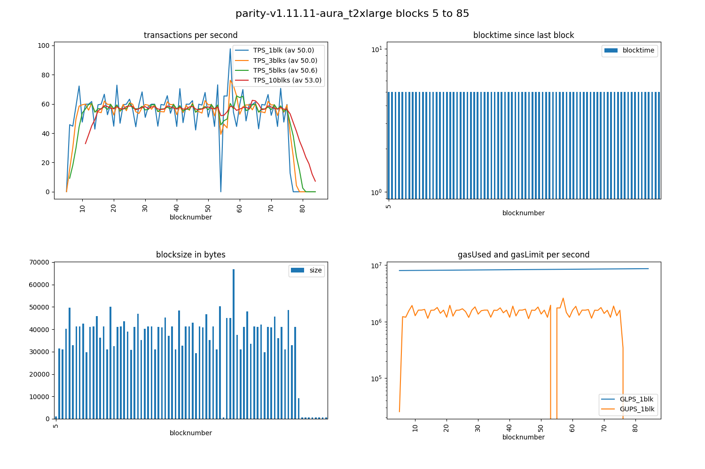

# parity PoA benchmarking

This is a long text because it is the almost complete log of what I tried to get `parity` as fast as `geth`. So far no success.

The most elaborate set of configuration switches is **--> [run 13](#run-13) <--** near the bottom of this file.

## TOC
1. parity docker: v1.11.8, configure, 
1. parity-deploy = docker-compose generator tool
1. orbita-center/parity-poa-playground; my fork of parity-poa-playground
1. [benchmarking](#benchmarking); chainhammer settings; ... 
1. initial run, unoptimized, > 60 TPS
1. run2 with altered settings
1. run3, omitting --scale-verifiers
1. run4, more jsonrpc-server-threads
1. run5, switching off 4 of the machines
1. run6; different network tool --> parity-deploy
1. run7; --gas-floor-target
1. run8: instantseal
1. run9: via web3 not via RPC
1. runs10: Amazon AWS runs
1. run11 on Amazon t2.large; faulty `parity:2.0.5-stable`; how to downgrade to a `stable stable` version; best suggested switches
1. run12: --force-sealing
1. run13: blocktimes 5 seconds
1. run14: without the `--geth` compatibility switch
1. run15: older parity 1.7.13 and instantseal
1. run16: old parity versions: 1.7.13 and aura
1. run 17: old parity versions: 1.8.11 and aura
1. Please *you* help
1. ... final verdict: `parity aura` 5-6 times slower than `geth clique`
1. runs 18: purpose: new diagrams; instantseal, aura
1. please help making parity faster
1. unittests scripts: with instantseal, with aura
1. other versions of parity
1. background info on Aura
1. [issues](#issues)


## parity docker
Following informative wiki page https://github.com/paritytech/wiki/blob/master/Docker.md

Initial -brutal- cleaning of my machine:
```
docker rm $(docker ps -a -q); docker rmi $(docker images -q)
```

### dockerized paritytech/parity-ethereum v1.11.8 

The newest stable [release](https://github.com/paritytech/parity-ethereum/releases) v1.11.8 does exist as a docker image on dockerhub:

```
curl -sS 'https://registry.hub.docker.com/v2/repositories/parity/parity/tags/'  | jq '."results"[]["name"]' | sort

"beta"
"gitlab-next"
"latest"
"nightly"
"stable"
"v1.11.8"
"v2.0.0"
"v2.0.1"
"v2.1.0-rc1"
"v2.1.0-rc2"
```

run

    docker run -ti parity/parity:v1.11.8


#### configure

    docker run -ti parity/parity:v1.11.8 --help


run with open ports

    docker run -ti -p 8180:8180 -p 8545:8545 -p 8546:8546 -p 30303:30303 -p 30303:30303/udp parity/parity:v1.11.8 --ui-interface all --jsonrpc-interface all

perhaps useful: [Parity Config Generator](https://paritytech.github.io/parity-config-generator/)

then 

    docker run -ti -v ~/.local/share/io.parity.ethereum/docker/:/root/.local/share/io.parity.ethereum/ parity/parity:v1.11.8 --config /root/.local/share/io.parity.ethereum/config.toml

### parity-deploy = docker-compose generator tool

https://github.com/paritytech/parity-deploy

example

    ./parity-deploy.sh --config aura --name parity_my-aura --nodes 4 --ethstats
    docker-compose up


that tool looks really promising. But it results in a non-functioning `docker-compose.yml` - see [PD#51](https://github.com/paritytech/parity-deploy/issues/51)

aborting this for now.

### orbita-center/parity-poa-playground
> Parity PoA network with 3 authorities and 3 members.

```
git clone https://github.com/orbita-center/parity-poa-playground orbita-center_parity-poa-playground
cd orbita-center_parity-poa-playground
docker-compose up
```
#### good first impression:
* http://localhost:3001/ comes up, with 3 authorities, and 3 members
* port 8545 is answering:

```
curl -X POST --data '{"jsonrpc":"2.0","method":"net_version","params":[],"id":67}' -H "Content-Type: application/json" localhost:8545
{"jsonrpc":"2.0","result":"8995","id":67}
```

#### modify 

only 1 change needed: Add geth compatibility mode (needed e.g. for timed unlocking of accounts)

    --geth

before line 13 in https://github.com/orbita-center/parity-poa-playground/blob/master/docker-compose.yml#L12-L13

more modifications = scroll further down

#### my fork of parity-poa-playground

https://github.com/drandreaskrueger/parity-poa-playground

## benchmarking

### chainhammer settings 

#### config.py

    RPCaddress, RPCaddress2 = 'http://localhost:8545', 'http://localhost:8545' 
    RAFT = False
    ROUTE = "RPC"  

#### account-passphrase.txt

empty file


### initial run, unoptimized

Before [PPP#14](https://github.com/orbita-center/parity-poa-playground/issues/14) was answered, with "out of the box" chain.json settings, and no tweaks ... we see mediocre results initially:

#### log of run 1

```
./tps.py 

versions: web3 4.3.0, py-solc: 2.1.0, solc 0.4.23+commit.124ca40d.Linux.gpp, testrpc 1.3.4, python 3.5.3 (default, Jan 19 2017, 14:11:04) [GCC 6.3.0 20170118]
web3 connection established, blockNumber = 106, node version string =  Parity//v1.11.8-stable-92776e4-20180728/x86_64-linux-gnu/rustc1.27.2
first account of node is 0x000a3702732843418D83A03E65A3d9f7aDd58864, balance is 10000000000 Ether
nodeName: Parity, nodeType: Parity, consensus: ???, chainName: parity-poa-playground

Block  106  - waiting for something to happen
(filedate 1534862035) last contract address: 0xBD45194215D595444c07A591A9D6E5a1fA53f169
(filedate 1534863468) new contract address: 0x02615cCb36C65E120C3598aba61eB455Cf18A578

starting timer, at block 108 which has  1  transactions; at timecode 24644.527843475
block 108 | new #TX 144 / 3000 ms =  48.0 TPS_current | total: #TX  145 /  2.8 s =  51.9 TPS_average
block 109 | new #TX 198 / 3000 ms =  66.0 TPS_current | total: #TX  343 /  5.8 s =  58.7 TPS_average
block 110 | new #TX 194 / 3000 ms =  64.7 TPS_current | total: #TX  537 /  8.9 s =  60.4 TPS_average
block 111 | new #TX 179 / 3000 ms =  59.7 TPS_current | total: #TX  716 / 11.9 s =  60.0 TPS_average
block 112 | new #TX 189 / 3000 ms =  63.0 TPS_current | total: #TX  905 / 14.7 s =  61.6 TPS_average
block 113 | new #TX 194 / 3000 ms =  64.7 TPS_current | total: #TX 1099 / 17.8 s =  61.9 TPS_average
block 114 | new #TX 194 / 3000 ms =  64.7 TPS_current | total: #TX 1293 / 20.8 s =  62.1 TPS_average
block 115 | new #TX 186 / 3000 ms =  62.0 TPS_current | total: #TX 1479 / 23.9 s =  62.0 TPS_average
block 116 | new #TX 196 / 3000 ms =  65.3 TPS_current | total: #TX 1675 / 26.9 s =  62.2 TPS_average
block 117 | new #TX 193 / 3000 ms =  64.3 TPS_current | total: #TX 1868 / 30.0 s =  62.3 TPS_average
block 118 | new #TX 196 / 3000 ms =  65.3 TPS_current | total: #TX 2064 / 33.0 s =  62.5 TPS_average
block 119 | new #TX 183 / 3000 ms =  61.0 TPS_current | total: #TX 2247 / 35.8 s =  62.8 TPS_average
block 120 | new #TX 198 / 3000 ms =  66.0 TPS_current | total: #TX 2445 / 38.8 s =  63.0 TPS_average
block 121 | new #TX 196 / 3000 ms =  65.3 TPS_current | total: #TX 2641 / 41.9 s =  63.0 TPS_average
block 122 | new #TX 184 / 3000 ms =  61.3 TPS_current | total: #TX 2825 / 45.0 s =  62.8 TPS_average
block 123 | new #TX  26 / 2000 ms =  13.0 TPS_current | total: #TX 2851 / 46.8 s =  60.9 TPS_average
block 124 | new #TX   5 / 2000 ms =   2.5 TPS_current | total: #TX 2856 / 48.9 s =  58.4 TPS_average
block 125 | new #TX 550 / 5000 ms = 110.0 TPS_current | total: #TX 3406 / 53.8 s =  63.3 TPS_average
block 126 | new #TX 184 / 3000 ms =  61.3 TPS_current | total: #TX 3590 / 56.9 s =  63.1 TPS_average
block 127 | new #TX   6 / 2000 ms =   3.0 TPS_current | total: #TX 3596 / 59.0 s =  60.9 TPS_average
block 128 | new #TX   3 / 3000 ms =   1.0 TPS_current | total: #TX 3599 / 62.0 s =  58.0 TPS_average
block 129 | new #TX  83 / 3000 ms =  27.7 TPS_current | total: #TX 3682 / 65.1 s =  56.6 TPS_average
block 130 | new #TX   2 / 5000 ms =   0.4 TPS_current | total: #TX 3684 / 69.9 s =  52.7 TPS_average
block 131 | new #TX 1086 / 5000 ms = 217.2 TPS_current | total: #TX 4770 / 75.1 s =  63.5 TPS_average
block 132 | new #TX 171 / 3000 ms =  57.0 TPS_current | total: #TX 4941 / 77.9 s =  63.4 TPS_average
block 133 | new #TX 197 / 3000 ms =  65.7 TPS_current | total: #TX 5138 / 81.0 s =  63.5 TPS_average
block 134 | new #TX 183 / 3000 ms =  61.0 TPS_current | total: #TX 5321 / 83.7 s =  63.6 TPS_average
block 135 | new #TX 191 / 3000 ms =  63.7 TPS_current | total: #TX 5512 / 86.8 s =  63.5 TPS_average
block 136 | new #TX 194 / 3000 ms =  64.7 TPS_current | total: #TX 5706 / 89.8 s =  63.5 TPS_average
block 137 | new #TX 184 / 3000 ms =  61.3 TPS_current | total: #TX 5890 / 92.9 s =  63.4 TPS_average
block 138 | new #TX 197 / 3000 ms =  65.7 TPS_current | total: #TX 6087 / 95.9 s =  63.4 TPS_average
block 139 | new #TX 191 / 3000 ms =  63.7 TPS_current | total: #TX 6278 / 99.0 s =  63.4 TPS_average
block 140 | new #TX 179 / 3000 ms =  59.7 TPS_current | total: #TX 6457 / 101.8 s =  63.5 TPS_average
block 141 | new #TX 186 / 3000 ms =  62.0 TPS_current | total: #TX 6643 / 104.8 s =  63.4 TPS_average
block 142 | new #TX 192 / 3000 ms =  64.0 TPS_current | total: #TX 6835 / 107.9 s =  63.3 TPS_average
block 143 | new #TX 171 / 3000 ms =  57.0 TPS_current | total: #TX 7006 / 110.9 s =  63.1 TPS_average
block 144 | new #TX 197 / 3000 ms =  65.7 TPS_current | total: #TX 7203 / 114.0 s =  63.2 TPS_average
block 145 | new #TX 197 / 3000 ms =  65.7 TPS_current | total: #TX 7400 / 117.0 s =  63.2 TPS_average
block 146 | new #TX 194 / 3000 ms =  64.7 TPS_current | total: #TX 7594 / 120.1 s =  63.2 TPS_average
block 147 | new #TX 191 / 3000 ms =  63.7 TPS_current | total: #TX 7785 / 122.9 s =  63.4 TPS_average
block 148 | new #TX 189 / 3000 ms =  63.0 TPS_current | total: #TX 7974 / 125.9 s =  63.3 TPS_average
block 149 | new #TX   1 / 2000 ms =   0.5 TPS_current | total: #TX 7975 / 128.1 s =  62.3 TPS_average
block 150 | new #TX   2 / 2000 ms =   1.0 TPS_current | total: #TX 7977 / 129.9 s =  61.4 TPS_average
block 151 | new #TX   3 / 3000 ms =   1.0 TPS_current | total: #TX 7980 / 132.9 s =  60.0 TPS_average
block 152 | new #TX   1 / 3000 ms =   0.3 TPS_current | total: #TX 7981 / 135.7 s =  58.8 TPS_average
block 153 | new #TX 784 / 2000 ms = 392.0 TPS_current | total: #TX 8765 / 137.9 s =  63.6 TPS_average
block 154 | new #TX 193 / 3000 ms =  64.3 TPS_current | total: #TX 8958 / 140.9 s =  63.6 TPS_average
block 155 | new #TX 186 / 3000 ms =  62.0 TPS_current | total: #TX 9144 / 144.0 s =  63.5 TPS_average
block 156 | new #TX 192 / 3000 ms =  64.0 TPS_current | total: #TX 9336 / 146.7 s =  63.6 TPS_average
block 157 | new #TX   2 / 2000 ms =   1.0 TPS_current | total: #TX 9338 / 148.8 s =  62.7 TPS_average
block 158 | new #TX  51 / 3000 ms =  17.0 TPS_current | total: #TX 9389 / 151.9 s =  61.8 TPS_average
block 159 | new #TX 103 / 3000 ms =  34.3 TPS_current | total: #TX 9492 / 154.9 s =  61.3 TPS_average
block 160 | new #TX   9 / 3000 ms =   3.0 TPS_current | total: #TX 9501 / 158.0 s =  60.1 TPS_average
block 161 | new #TX 163 / 3000 ms =  54.3 TPS_current | total: #TX 9664 / 161.0 s =  60.0 TPS_average
block 162 | new #TX 1064 / 7000 ms = 152.0 TPS_current | total: #TX 10728 / 168.0 s =  63.9 TPS_average
block 163 | new #TX 179 / 3000 ms =  59.7 TPS_current | total: #TX 10907 / 171.1 s =  63.8 TPS_average
block 164 | new #TX 201 / 3000 ms =  67.0 TPS_current | total: #TX 11108 / 174.1 s =  63.8 TPS_average
block 165 | new #TX 184 / 3000 ms =  61.3 TPS_current | total: #TX 11292 / 176.8 s =  63.9 TPS_average
block 166 | new #TX  60 / 2000 ms =  30.0 TPS_current | total: #TX 11352 / 179.0 s =  63.4 TPS_average
block 167 | new #TX   5 / 2000 ms =   2.5 TPS_current | total: #TX 11357 / 181.1 s =  62.7 TPS_average
block 168 | new #TX 524 / 5000 ms = 104.8 TPS_current | total: #TX 11881 / 186.0 s =  63.9 TPS_average
block 169 | new #TX 189 / 3000 ms =  63.0 TPS_current | total: #TX 12070 / 188.8 s =  63.9 TPS_average
block 170 | new #TX  45 / 2000 ms =  22.5 TPS_current | total: #TX 12115 / 190.9 s =  63.5 TPS_average
block 171 | new #TX   8 / 3000 ms =   2.7 TPS_current | total: #TX 12123 / 193.9 s =  62.5 TPS_average
block 172 | new #TX  12 / 3000 ms =   4.0 TPS_current | total: #TX 12135 / 197.0 s =  61.6 TPS_average
block 173 | new #TX  69 / 2000 ms =  34.5 TPS_current | total: #TX 12204 / 199.1 s =  61.3 TPS_average
block 174 | new #TX  14 / 3000 ms =   4.7 TPS_current | total: #TX 12218 / 202.1 s =  60.5 TPS_average
block 175 | new #TX  17 / 3000 ms =   5.7 TPS_current | total: #TX 12235 / 204.9 s =  59.7 TPS_average
block 176 | new #TX 163 / 3000 ms =  54.3 TPS_current | total: #TX 12398 / 207.9 s =  59.6 TPS_average
block 177 | new #TX 1253 / 5000 ms = 250.6 TPS_current | total: #TX 13651 / 213.1 s =  64.1 TPS_average
block 178 | new #TX 171 / 3000 ms =  57.0 TPS_current | total: #TX 13822 / 215.9 s =  64.0 TPS_average
block 179 | new #TX 200 / 3000 ms =  66.7 TPS_current | total: #TX 14022 / 218.9 s =  64.0 TPS_average
block 180 | new #TX 200 / 3000 ms =  66.7 TPS_current | total: #TX 14222 / 222.0 s =  64.1 TPS_average
block 181 | new #TX 189 / 3000 ms =  63.0 TPS_current | total: #TX 14411 / 225.0 s =  64.0 TPS_average
block 182 | new #TX 192 / 3000 ms =  64.0 TPS_current | total: #TX 14603 / 227.8 s =  64.1 TPS_average
block 183 | new #TX  46 / 2000 ms =  23.0 TPS_current | total: #TX 14649 / 229.9 s =  63.7 TPS_average
block 184 | new #TX 163 / 3000 ms =  54.3 TPS_current | total: #TX 14812 / 233.0 s =  63.6 TPS_average
block 185 | new #TX  81 / 3000 ms =  27.0 TPS_current | total: #TX 14893 / 236.0 s =  63.1 TPS_average
block 186 | new #TX   3 / 3000 ms =   1.0 TPS_current | total: #TX 14896 / 239.0 s =  62.3 TPS_average
block 187 | new #TX  78 / 3000 ms =  26.0 TPS_current | total: #TX 14974 / 241.8 s =  61.9 TPS_average
block 188 | new #TX  13 / 3000 ms =   4.3 TPS_current | total: #TX 14987 / 244.8 s =  61.2 TPS_average
block 189 | new #TX  69 / 3000 ms =  23.0 TPS_current | total: #TX 15056 / 247.9 s =  60.7 TPS_average
block 190 | new #TX   7 / 3000 ms =   2.3 TPS_current | total: #TX 15063 / 250.9 s =  60.0 TPS_average
block 191 | new #TX   1 / 3000 ms =   0.3 TPS_current | total: #TX 15064 / 253.9 s =  59.3 TPS_average
block 192 | new #TX 155 / 2000 ms =  77.5 TPS_current | total: #TX 15219 / 256.1 s =  59.4 TPS_average
block 193 | new #TX 1349 / 2000 ms = 674.5 TPS_current | total: #TX 16568 / 258.0 s =  64.2 TPS_average
block 194 | new #TX 177 / 3000 ms =  59.0 TPS_current | total: #TX 16745 / 261.1 s =  64.1 TPS_average
block 195 | new #TX 184 / 3000 ms =  61.3 TPS_current | total: #TX 16929 / 263.8 s =  64.2 TPS_average
block 196 | new #TX 201 / 3000 ms =  67.0 TPS_current | total: #TX 17130 / 266.9 s =  64.2 TPS_average
block 197 | new #TX  48 / 2000 ms =  24.0 TPS_current | total: #TX 17178 / 269.0 s =  63.9 TPS_average
block 198 | new #TX  28 / 5000 ms =   5.6 TPS_current | total: #TX 17206 / 273.8 s =  62.8 TPS_average
block 199 | new #TX 517 / 2000 ms = 258.5 TPS_current | total: #TX 17723 / 276.0 s =  64.2 TPS_average
block 200 | new #TX 187 / 3000 ms =  62.3 TPS_current | total: #TX 17910 / 279.1 s =  64.2 TPS_average
block 201 | new #TX 198 / 3000 ms =  66.0 TPS_current | total: #TX 18108 / 282.1 s =  64.2 TPS_average
block 202 | new #TX 196 / 3000 ms =  65.3 TPS_current | total: #TX 18304 / 284.9 s =  64.2 TPS_average
block 203 | new #TX 188 / 3000 ms =  62.7 TPS_current | total: #TX 18492 / 288.0 s =  64.2 TPS_average
block 204 | new #TX 197 / 3000 ms =  65.7 TPS_current | total: #TX 18689 / 291.0 s =  64.2 TPS_average
block 205 | new #TX 197 / 3000 ms =  65.7 TPS_current | total: #TX 18886 / 294.1 s =  64.2 TPS_average
block 206 | new #TX 183 / 3000 ms =  61.0 TPS_current | total: #TX 19069 / 296.8 s =  64.2 TPS_average
block 207 | new #TX  39 / 2000 ms =  19.5 TPS_current | total: #TX 19108 / 298.9 s =  63.9 TPS_average
block 208 | new #TX 549 / 7000 ms =  78.4 TPS_current | total: #TX 19657 / 305.9 s =  64.3 TPS_average
block 209 | new #TX 196 / 3000 ms =  65.3 TPS_current | total: #TX 19853 / 309.0 s =  64.3 TPS_average
block 210 | new #TX  11 / 2000 ms =   5.5 TPS_current | total: #TX 19864 / 311.1 s =  63.8 TPS_average
block 211 | new #TX 137 / 6000 ms =  22.8 TPS_current | total: #TX 20001 / 317.0 s =  63.1 TPS_average
block 212 | new #TX   0 / 77000 ms =   0.0 TPS_current | total: #TX 20001 / 393.9 s =  50.8 TPS_average
block 213 | new #TX   0 / 38000 ms =   0.0 TPS_current | total: #TX 20001 / 431.9 s =  46.3 TPS_average
block 214 | new #TX   0 / 11000 ms =   0.0 TPS_current | total: #TX 20001 / 442.9 s =  45.2 TPS_average
block 215 | new #TX   0 / 74000 ms =   0.0 TPS_current | total: #TX 20001 / 517.1 s =  38.7 TPS_average
```

#### result initial run1: > 60 TPS


### run2
With [these altered settings](https://github.com/drandreaskrueger/parity-poa-playground/commit/d4c1aa3fc504e940a5a2f56de62f8a62734b2f8d)

```
      --jsonrpc-server-threads 8
      --tx-queue-size 16536
      --scale-verifiers
```
it's worse:

```
./tps.py 
versions: web3 4.3.0, py-solc: 2.1.0, solc 0.4.23+commit.124ca40d.Linux.gpp, testrpc 1.3.4, python 3.5.3 (default, Jan 19 2017, 14:11:04) [GCC 6.3.0 20170118]
web3 connection established, blockNumber = 0, node version string =  Parity//v1.11.8-stable-92776e4-20180728/x86_64-linux-gnu/rustc1.27.2
first account of node is 0x000a3702732843418D83A03E65A3d9f7aDd58864, balance is 10000000000 Ether
nodeName: Parity, nodeType: Parity, consensus: ???, network: 8995, chainName: parity-poa-playground, chainId: 8995

Block  0  - waiting for something to happen
(filedate 1535544939) last contract address: 0x536A0b91265dE1Ce1Ba541e54874AC21eC0E63e6
(filedate 1535545118) new contract address: 0x536A0b91265dE1Ce1Ba541e54874AC21eC0E63e6

starting timer, at block 1 which has  1  transactions; at timecode 45801.661595177
block 1 | new #TX  12 / 3000 ms =   4.0 TPS_current | total: #TX   13 /  2.7 s =   4.7 TPS_average
block 2 | new #TX 385 / 4000 ms =  96.2 TPS_current | total: #TX  398 /  7.0 s =  56.9 TPS_average
block 3 | new #TX 182 / 3000 ms =  60.7 TPS_current | total: #TX  580 / 10.1 s =  57.7 TPS_average
block 4 | new #TX 192 / 3000 ms =  64.0 TPS_current | total: #TX  772 / 13.1 s =  58.9 TPS_average
block 5 | new #TX 186 / 3000 ms =  62.0 TPS_current | total: #TX  958 / 15.9 s =  60.4 TPS_average
block 6 | new #TX 187 / 3000 ms =  62.3 TPS_current | total: #TX 1145 / 18.9 s =  60.5 TPS_average
block 7 | new #TX 195 / 3000 ms =  65.0 TPS_current | total: #TX 1340 / 22.0 s =  61.0 TPS_average
block 8 | new #TX 181 / 3000 ms =  60.3 TPS_current | total: #TX 1521 / 24.7 s =  61.6 TPS_average
block 9 | new #TX  50 / 2000 ms =  25.0 TPS_current | total: #TX 1571 / 26.8 s =  58.5 TPS_average
block 10 | new #TX  86 / 3000 ms =  28.7 TPS_current | total: #TX 1657 / 29.9 s =  55.5 TPS_average
block 11 | new #TX   8 / 3000 ms =   2.7 TPS_current | total: #TX 1665 / 32.9 s =  50.6 TPS_average
block 12 | new #TX  73 / 2000 ms =  36.5 TPS_current | total: #TX 1738 / 35.1 s =  49.6 TPS_average
block 13 | new #TX 163 / 7000 ms =  23.3 TPS_current | total: #TX 1901 / 42.1 s =  45.2 TPS_average
block 14 | new #TX  81 / 3000 ms =  27.0 TPS_current | total: #TX 1982 / 44.8 s =  44.2 TPS_average
block 15 | new #TX  81 / 8000 ms =  10.1 TPS_current | total: #TX 2063 / 53.0 s =  38.9 TPS_average
block 16 | new #TX 1779 / 8000 ms = 222.4 TPS_current | total: #TX 3842 / 61.0 s =  63.0 TPS_average
block 17 | new #TX 163 / 3000 ms =  54.3 TPS_current | total: #TX 4005 / 63.8 s =  62.8 TPS_average
block 18 | new #TX 192 / 3000 ms =  64.0 TPS_current | total: #TX 4197 / 66.9 s =  62.8 TPS_average
block 19 | new #TX 183 / 3000 ms =  61.0 TPS_current | total: #TX 4380 / 69.9 s =  62.7 TPS_average
block 20 | new #TX 183 / 3000 ms =  61.0 TPS_current | total: #TX 4563 / 73.0 s =  62.5 TPS_average
block 21 | new #TX 182 / 3000 ms =  60.7 TPS_current | total: #TX 4745 / 75.7 s =  62.6 TPS_average
block 22 | new #TX 187 / 3000 ms =  62.3 TPS_current | total: #TX 4932 / 78.8 s =  62.6 TPS_average
block 23 | new #TX 192 / 3000 ms =  64.0 TPS_current | total: #TX 5124 / 81.9 s =  62.6 TPS_average
block 24 | new #TX 184 / 3000 ms =  61.3 TPS_current | total: #TX 5308 / 84.9 s =  62.5 TPS_average
block 25 | new #TX 180 / 3000 ms =  60.0 TPS_current | total: #TX 5488 / 87.7 s =  62.6 TPS_average
block 26 | new #TX  12 / 2000 ms =   6.0 TPS_current | total: #TX 5500 / 89.9 s =  61.2 TPS_average
block 27 | new #TX   4 / 3000 ms =   1.3 TPS_current | total: #TX 5504 / 92.9 s =  59.2 TPS_average
block 28 | new #TX 163 / 3000 ms =  54.3 TPS_current | total: #TX 5667 / 95.9 s =  59.1 TPS_average
block 29 | new #TX   3 / 3000 ms =   1.0 TPS_current | total: #TX 5670 / 98.7 s =  57.5 TPS_average
block 30 | new #TX 144 / 3000 ms =  48.0 TPS_current | total: #TX 5814 / 102.0 s =  57.0 TPS_average
block 31 | new #TX   0 / 74000 ms =   0.0 TPS_current | total: #TX 5814 / 175.6 s =  33.1 TPS_average
block 32 | new #TX   0 / 32000 ms =   0.0 TPS_current | total: #TX 5814 / 207.9 s =  28.0 TPS_average
block 33 | new #TX   0 / 17000 ms =   0.0 TPS_current | total: #TX 5814 / 224.9 s =  25.9 TPS_average
block 34 | new #TX   0 / 71000 ms =   0.0 TPS_current | total: #TX 5814 / 295.8 s =  19.7 TPS_average
block 35 | new #TX   0 / 35000 ms =   0.0 TPS_current | total: #TX 5814 / 331.1 s =  17.6 TPS_average
block 36 | new #TX   0 / 20000 ms =   0.0 TPS_current | total: #TX 5814 / 350.9 s =  16.6 TPS_average
block 37 | new #TX   0 / 68000 ms =   0.0 TPS_current | total: #TX 5814 / 418.7 s =  13.9 TPS_average
block 38 | new #TX   0 / 38000 ms =   0.0 TPS_current | total: #TX 5814 / 456.9 s =  12.7 TPS_average
block 39 | new #TX   0 / 17000 ms =   0.0 TPS_current | total: #TX 5814 / 474.0 s =  12.3 TPS_average
```
Speed is not higher, but over 14000 transactions are lost !!

### run3
When [omitting the](https://github.com/drandreaskrueger/parity-poa-playground/commit/788eba40acbbeb71c459bc4237b3004d3c4ff2a7)

          --scale-verifiers
          
it looks better.

Not fast - but at least not losing transactions anymore:

```
./tps.py 
versions: web3 4.3.0, py-solc: 2.1.0, solc 0.4.23+commit.124ca40d.Linux.gpp, testrpc 1.3.4, python 3.5.3 (default, Jan 19 2017, 14:11:04) [GCC 6.3.0 20170118]
web3 connection established, blockNumber = 0, node version string =  Parity//v1.11.8-stable-92776e4-20180728/x86_64-linux-gnu/rustc1.27.2
first account of node is 0x000a3702732843418D83A03E65A3d9f7aDd58864, balance is 10000000000 Ether
nodeName: Parity, nodeType: Parity, consensus: ???, network: 8995, chainName: parity-poa-playground, chainId: 8995

Block  0  - waiting for something to happen
(filedate 1535545118) last contract address: 0x536A0b91265dE1Ce1Ba541e54874AC21eC0E63e6
(filedate 1535545811) new contract address: 0x536A0b91265dE1Ce1Ba541e54874AC21eC0E63e6

starting timer, at block 1 which has  1  transactions; at timecode 46494.51728895
block 1 | new #TX  56 / 3000 ms =  18.7 TPS_current | total: #TX   57 /  3.1 s =  18.6 TPS_average
block 2 | new #TX  34 / 5000 ms =   6.8 TPS_current | total: #TX   91 /  7.9 s =  11.5 TPS_average
block 3 | new #TX 513 / 2000 ms = 256.5 TPS_current | total: #TX  604 / 10.1 s =  60.0 TPS_average
block 4 | new #TX 179 / 3000 ms =  59.7 TPS_current | total: #TX  783 / 12.8 s =  61.0 TPS_average
block 5 | new #TX 196 / 3000 ms =  65.3 TPS_current | total: #TX  979 / 15.9 s =  61.6 TPS_average
block 6 | new #TX 189 / 3000 ms =  63.0 TPS_current | total: #TX 1168 / 19.0 s =  61.6 TPS_average
block 7 | new #TX 197 / 3000 ms =  65.7 TPS_current | total: #TX 1365 / 22.0 s =  62.0 TPS_average
block 8 | new #TX 186 / 3000 ms =  62.0 TPS_current | total: #TX 1551 / 25.0 s =  61.9 TPS_average
block 9 | new #TX 194 / 3000 ms =  64.7 TPS_current | total: #TX 1745 / 28.1 s =  62.1 TPS_average
block 10 | new #TX 185 / 3000 ms =  61.7 TPS_current | total: #TX 1930 / 31.1 s =  62.0 TPS_average
block 11 | new #TX 195 / 3000 ms =  65.0 TPS_current | total: #TX 2125 / 33.9 s =  62.7 TPS_average
block 12 | new #TX 187 / 3000 ms =  62.3 TPS_current | total: #TX 2312 / 37.0 s =  62.5 TPS_average
block 13 | new #TX  59 / 2000 ms =  29.5 TPS_current | total: #TX 2371 / 39.1 s =  60.6 TPS_average
...
block 91 | new #TX 645 / 5000 ms = 129.0 TPS_current | total: #TX 18696 / 301.1 s =  62.1 TPS_average
block 92 | new #TX 172 / 3000 ms =  57.3 TPS_current | total: #TX 18868 / 304.1 s =  62.0 TPS_average
block 93 | new #TX  31 / 2000 ms =  15.5 TPS_current | total: #TX 18899 / 306.0 s =  61.8 TPS_average
block 94 | new #TX  81 / 3000 ms =  27.0 TPS_current | total: #TX 18980 / 309.0 s =  61.4 TPS_average
block 95 | new #TX   3 / 3000 ms =   1.0 TPS_current | total: #TX 18983 / 312.1 s =  60.8 TPS_average
block 96 | new #TX 160 / 2000 ms =  80.0 TPS_current | total: #TX 19143 / 314.2 s =  60.9 TPS_average
block 97 | new #TX 163 / 3000 ms =  54.3 TPS_current | total: #TX 19306 / 317.0 s =  60.9 TPS_average
block 98 | new #TX 470 / 2000 ms = 235.0 TPS_current | total: #TX 19776 / 319.1 s =  62.0 TPS_average
block 99 | new #TX 169 / 3000 ms =  56.3 TPS_current | total: #TX 19945 / 321.9 s =  62.0 TPS_average
block 100 | new #TX  56 / 3000 ms =  18.7 TPS_current | total: #TX 20001 / 325.0 s =  61.5 TPS_average
block 101 | new #TX   0 / 110000 ms =   0.0 TPS_current | total: #TX 20001 / 435.2 s =  46.0 TPS_average
block 102 | new #TX   0 / 5000 ms =   0.0 TPS_current | total: #TX 20001 / 440.1 s =  45.4 TPS_average
```

### run4

more  jsonrpc-server-threads

      --jsonrpc-server-threads 20

not better:

```
./tps.py 
...
starting timer, at block 1 which has  1  transactions; at timecode 47560.479835239
block 1 | new #TX 161 / 3000 ms =  53.7 TPS_current | total: #TX  162 /  3.1 s =  53.1 TPS_average
block 2 | new #TX 189 / 3000 ms =  63.0 TPS_current | total: #TX  351 /  6.1 s =  57.6 TPS_average
...
block 107 | new #TX 175 / 3000 ms =  58.3 TPS_current | total: #TX 19960 / 327.2 s =  61.0 TPS_average
block 108 | new #TX  41 / 3000 ms =  13.7 TPS_current | total: #TX 20001 / 330.3 s =  60.6 TPS_average
```

and the CPU was only between 50% and 70%.


### run5
[switching off 4 of the machines](https://github.com/drandreaskrueger/parity-poa-playground/commit/7728566e688b4ab910552d4f302c4621e135f105) (member1, member2, monitor, dashboard), to see whether that accelerates.

```
./tps.py 
...
starting timer, at block 9 which has  1  transactions; at timecode 48112.603595221
block 9 | new #TX 154 / 3000 ms =  51.3 TPS_current | total: #TX  155 /  3.1 s =  50.8 TPS_average
block 10 | new #TX 192 / 3000 ms =  64.0 TPS_current | total: #TX  347 /  6.1 s =  56.9 TPS_average
block 11 | new #TX 198 / 3000 ms =  66.0 TPS_current | total: #TX  545 /  9.1 s =  59.6 TPS_average
...
block 111 | new #TX 195 / 3000 ms =  65.0 TPS_current | total: #TX 19990 / 311.9 s =  64.1 TPS_average
block 112 | new #TX  11 / 3000 ms =   3.7 TPS_current | total: #TX 20001 / 315.0 s =  63.5 TPS_average

```

--> only 2-3 TPS faster.

### run6

With a different network tool, https://github.com/paritytech/parity-deploy/

New that we [had fixed this bug](https://github.com/paritytech/parity-deploy/issues/51#issuecomment-416971456), I could generate a 4 nodes network with the command:

    ./parity-deploy.sh --config aura --name myaura --nodes 4

and then manually edit the resulting `docker-compose.yml`, to remove the buggy line.

And add these parameters to the first `       command: ` line:

    --geth --jsonrpc-server-threads 100 --tx-queue-size 20000 --cache-size 4096 --tracing off --gas-floor-target 100000000000 --pruning fast --tx-queue-mem-limit 0 --no-dapps --no-secretstore-http

And then a 

    docker-compose up

to start the 4 nodes.

Copy the password `paritytech_parity-deploy/deployment/1/password` into `chainhammer/account-passphrase.txt`

Actually, ran the chainhammer now with 1000 multithreading workers:
```
./deploy.py notest; ./send.py threaded2 1000
```

Result log of run 6:

```
./tps.py 
versions: web3 4.3.0, py-solc: 2.1.0, solc 0.4.23+commit.124ca40d.Linux.gpp, testrpc 1.3.4, python 3.5.3 (default, Jan 19 2017, 14:11:04) [GCC 6.3.0 20170118]
web3 connection established, blockNumber = 6, node version string =  Parity//v1.11.8-stable-92776e4-20180728/x86_64-linux-gnu/rustc1.27.2
first account of node is 0xE22e4b61192055b68c65058Ffe1058380dF92769, balance is 0 Ether
nodeName: Parity, nodeType: Parity, consensus: ???, network: 17, chainName: myaura, chainId: 17

Block  6  - waiting for something to happen
(filedate 1535554586) last contract address: 0x977546199b869450d44C6dBCD33652fa36A1e88c
(filedate 1535554624) new contract address: 0x1cEF67D927f0dD94453fCde01dE9c59Eb64A1801

starting timer, at block 7 which has  1  transactions; at timecode 2678.780672846
block 7 | new #TX  56 / 4000 ms =  14.0 TPS_current | total: #TX   57 /  4.3 s =  13.4 TPS_average
block 8 | new #TX 427 / 4000 ms = 106.8 TPS_current | total: #TX  484 /  8.2 s =  59.0 TPS_average
block 9 | new #TX 534 / 8000 ms =  66.8 TPS_current | total: #TX 1018 / 16.1 s =  63.2 TPS_average
block 10 | new #TX  81 / 4000 ms =  20.2 TPS_current | total: #TX 1099 / 20.1 s =  54.8 TPS_average
block 11 | new #TX  81 / 2000 ms =  40.5 TPS_current | total: #TX 1180 / 22.2 s =  53.2 TPS_average
block 12 | new #TX 375 / 2000 ms = 187.5 TPS_current | total: #TX 1555 / 24.3 s =  63.9 TPS_average
block 13 | new #TX  66 / 4000 ms =  16.5 TPS_current | total: #TX 1621 / 28.0 s =  58.0 TPS_average
block 14 | new #TX  81 / 2000 ms =  40.5 TPS_current | total: #TX 1702 / 30.1 s =  56.6 TPS_average
block 15 | new #TX  81 / 4000 ms =  20.2 TPS_current | total: #TX 1783 / 34.0 s =  52.4 TPS_average
block 16 | new #TX  81 / 4000 ms =  20.2 TPS_current | total: #TX 1864 / 38.0 s =  49.1 TPS_average
block 17 | new #TX  48 / 4000 ms =  12.0 TPS_current | total: #TX 1912 / 41.9 s =  45.6 TPS_average
block 18 | new #TX  81 / 2000 ms =  40.5 TPS_current | total: #TX 1993 / 44.1 s =  45.2 TPS_average
block 19 | new #TX 741 / 4000 ms = 185.2 TPS_current | total: #TX 2734 / 48.0 s =  56.9 TPS_average
block 20 | new #TX  81 / 4000 ms =  20.2 TPS_current | total: #TX 2815 / 52.3 s =  53.8 TPS_average
block 21 | new #TX 741 / 4000 ms = 185.2 TPS_current | total: #TX 3556 / 56.0 s =  63.5 TPS_average
block 22 | new #TX  81 / 4000 ms =  20.2 TPS_current | total: #TX 3637 / 60.3 s =  60.3 TPS_average
block 23 | new #TX 579 / 4000 ms = 144.8 TPS_current | total: #TX 4216 / 64.2 s =  65.6 TPS_average
block 24 | new #TX 529 / 8000 ms =  66.1 TPS_current | total: #TX 4745 / 72.1 s =  65.8 TPS_average
block 25 | new #TX  81 / 4000 ms =  20.2 TPS_current | total: #TX 4826 / 76.1 s =  63.4 TPS_average
block 26 | new #TX 466 / 4000 ms = 116.5 TPS_current | total: #TX 5292 / 80.3 s =  65.9 TPS_average
block 27 | new #TX  53 / 4000 ms =  13.2 TPS_current | total: #TX 5345 / 84.3 s =  63.4 TPS_average
block 28 | new #TX 479 / 4000 ms = 119.8 TPS_current | total: #TX 5824 / 88.2 s =  66.0 TPS_average
block 29 | new #TX  44 / 4000 ms =  11.0 TPS_current | total: #TX 5868 / 92.2 s =  63.7 TPS_average
block 30 | new #TX  81 / 2000 ms =  40.5 TPS_current | total: #TX 5949 / 94.3 s =  63.1 TPS_average
block 31 | new #TX  81 / 4000 ms =  20.2 TPS_current | total: #TX 6030 / 98.2 s =  61.4 TPS_average
block 32 | new #TX  81 / 4000 ms =  20.2 TPS_current | total: #TX 6111 / 102.2 s =  59.8 TPS_average
block 33 | new #TX  81 / 4000 ms =  20.2 TPS_current | total: #TX 6192 / 106.1 s =  58.3 TPS_average
block 34 | new #TX 738 / 6000 ms = 123.0 TPS_current | total: #TX 6930 / 112.2 s =  61.8 TPS_average
block 35 | new #TX  81 / 4000 ms =  20.2 TPS_current | total: #TX 7011 / 116.1 s =  60.4 TPS_average
block 36 | new #TX  81 / 2000 ms =  40.5 TPS_current | total: #TX 7092 / 118.3 s =  60.0 TPS_average
block 37 | new #TX  81 / 4000 ms =  20.2 TPS_current | total: #TX 7173 / 122.2 s =  58.7 TPS_average
block 38 | new #TX  81 / 2000 ms =  40.5 TPS_current | total: #TX 7254 / 124.1 s =  58.5 TPS_average
block 39 | new #TX 736 / 4000 ms = 184.0 TPS_current | total: #TX 7990 / 128.1 s =  62.4 TPS_average
block 40 | new #TX  81 / 4000 ms =  20.2 TPS_current | total: #TX 8071 / 132.0 s =  61.1 TPS_average
block 41 | new #TX 736 / 4000 ms = 184.0 TPS_current | total: #TX 8807 / 136.0 s =  64.7 TPS_average
block 42 | new #TX  81 / 4000 ms =  20.2 TPS_current | total: #TX 8888 / 140.0 s =  63.5 TPS_average
block 43 | new #TX   7 / 2000 ms =   3.5 TPS_current | total: #TX 8895 / 142.1 s =  62.6 TPS_average
block 44 | new #TX  81 / 4000 ms =  20.2 TPS_current | total: #TX 8976 / 146.1 s =  61.4 TPS_average
block 45 | new #TX   2 / 2000 ms =   1.0 TPS_current | total: #TX 8978 / 148.2 s =  60.6 TPS_average
block 46 | new #TX 734 / 4000 ms = 183.5 TPS_current | total: #TX 9712 / 152.2 s =  63.8 TPS_average
block 47 | new #TX  81 / 4000 ms =  20.2 TPS_current | total: #TX 9793 / 156.1 s =  62.7 TPS_average
block 48 | new #TX  81 / 6000 ms =  13.5 TPS_current | total: #TX 9874 / 162.2 s =  60.9 TPS_average
block 49 | new #TX  81 / 2000 ms =  40.5 TPS_current | total: #TX 9955 / 164.3 s =  60.6 TPS_average
block 50 | new #TX 733 / 4000 ms = 183.2 TPS_current | total: #TX 10688 / 168.0 s =  63.6 TPS_average
block 51 | new #TX 733 / 8000 ms =  91.6 TPS_current | total: #TX 11421 / 176.2 s =  64.8 TPS_average
block 52 | new #TX  81 / 4000 ms =  20.2 TPS_current | total: #TX 11502 / 180.2 s =  63.8 TPS_average
block 53 | new #TX  81 / 2000 ms =  40.5 TPS_current | total: #TX 11583 / 182.0 s =  63.6 TPS_average
block 54 | new #TX  81 / 4000 ms =  20.2 TPS_current | total: #TX 11664 / 186.0 s =  62.7 TPS_average
block 55 | new #TX  81 / 4000 ms =  20.2 TPS_current | total: #TX 11745 / 190.2 s =  61.7 TPS_average
block 56 | new #TX  81 / 4000 ms =  20.2 TPS_current | total: #TX 11826 / 194.1 s =  60.9 TPS_average
block 57 | new #TX  81 / 2000 ms =  40.5 TPS_current | total: #TX 11907 / 196.3 s =  60.7 TPS_average
block 58 | new #TX 730 / 4000 ms = 182.5 TPS_current | total: #TX 12637 / 200.2 s =  63.1 TPS_average
block 59 | new #TX  81 / 4000 ms =  20.2 TPS_current | total: #TX 12718 / 204.2 s =  62.3 TPS_average
block 60 | new #TX 730 / 4000 ms = 182.5 TPS_current | total: #TX 13448 / 208.1 s =  64.6 TPS_average
block 61 | new #TX 730 / 8000 ms =  91.2 TPS_current | total: #TX 14178 / 216.1 s =  65.6 TPS_average
block 62 | new #TX  81 / 4000 ms =  20.2 TPS_current | total: #TX 14259 / 220.0 s =  64.8 TPS_average
block 63 | new #TX 620 / 4000 ms = 155.0 TPS_current | total: #TX 14879 / 224.3 s =  66.3 TPS_average
block 64 | new #TX  74 / 4000 ms =  18.5 TPS_current | total: #TX 14953 / 227.9 s =  65.6 TPS_average
block 65 | new #TX   9 / 2000 ms =   4.5 TPS_current | total: #TX 14962 / 230.1 s =  65.0 TPS_average
block 66 | new #TX  81 / 4000 ms =  20.2 TPS_current | total: #TX 15043 / 234.0 s =  64.3 TPS_average
block 67 | new #TX  81 / 2000 ms =  40.5 TPS_current | total: #TX 15124 / 236.1 s =  64.0 TPS_average
block 68 | new #TX 728 / 4000 ms = 182.0 TPS_current | total: #TX 15852 / 240.1 s =  66.0 TPS_average
block 69 | new #TX  81 / 4000 ms =  20.2 TPS_current | total: #TX 15933 / 244.1 s =  65.3 TPS_average
block 70 | new #TX 504 / 4000 ms = 126.0 TPS_current | total: #TX 16437 / 248.0 s =  66.3 TPS_average
block 71 | new #TX  30 / 4000 ms =   7.5 TPS_current | total: #TX 16467 / 252.3 s =  65.3 TPS_average
block 72 | new #TX 482 / 4000 ms = 120.5 TPS_current | total: #TX 16949 / 256.0 s =  66.2 TPS_average
block 73 | new #TX  12 / 4000 ms =   3.0 TPS_current | total: #TX 16961 / 260.2 s =  65.2 TPS_average
block 74 | new #TX 519 / 4000 ms = 129.8 TPS_current | total: #TX 17480 / 264.2 s =  66.2 TPS_average
block 75 | new #TX  81 / 4000 ms =  20.2 TPS_current | total: #TX 17561 / 268.1 s =  65.5 TPS_average
block 76 | new #TX 444 / 4000 ms = 111.0 TPS_current | total: #TX 18005 / 272.1 s =  66.2 TPS_average
block 77 | new #TX  68 / 4000 ms =  17.0 TPS_current | total: #TX 18073 / 276.1 s =  65.5 TPS_average
block 78 | new #TX 448 / 4000 ms = 112.0 TPS_current | total: #TX 18521 / 280.1 s =  66.1 TPS_average
block 79 | new #TX  51 / 4000 ms =  12.8 TPS_current | total: #TX 18572 / 284.1 s =  65.4 TPS_average
block 80 | new #TX 459 / 4000 ms = 114.8 TPS_current | total: #TX 19031 / 288.0 s =  66.1 TPS_average
block 81 | new #TX  46 / 4000 ms =  11.5 TPS_current | total: #TX 19077 / 292.3 s =  65.3 TPS_average
block 82 | new #TX 460 / 4000 ms = 115.0 TPS_current | total: #TX 19537 / 296.0 s =  66.0 TPS_average
block 83 | new #TX  30 / 4000 ms =   7.5 TPS_current | total: #TX 19567 / 300.2 s =  65.2 TPS_average
block 84 | new #TX  81 / 2000 ms =  40.5 TPS_current | total: #TX 19648 / 302.1 s =  65.0 TPS_average
block 85 | new #TX  81 / 4000 ms =  20.2 TPS_current | total: #TX 19729 / 306.1 s =  64.5 TPS_average
block 86 | new #TX  81 / 4000 ms =  20.2 TPS_current | total: #TX 19810 / 310.1 s =  63.9 TPS_average
block 87 | new #TX 191 / 2000 ms =  95.5 TPS_current | total: #TX 20001 / 312.3 s =  64.1 TPS_average
block 88 | new #TX   0 / 114000 ms =   0.0 TPS_current | total: #TX 20001 / 426.2 s =  46.9 TPS_average
```

again, **--> only 2-3 TPS faster.**


### run7

With inspiration from @ddorgan, see [issue#9393](https://github.com/paritytech/parity-ethereum/issues/9393#issuecomment-416995893):

> --gas-floor-target of something more realistic would be a good idea ... e.g. maybe 20m ...   

explanation:

> --gas-floor-target Amount of gas per block to target when sealing a new block (default: 4700000).  
> https://hudsonjameson.com/2017-06-27-accounts-transactions-gas-ethereum/  

New run with 40,000,000 gas-floor-target: 

First, add all our parameters to [the 5 template files, see this feature request](https://github.com/paritytech/parity-deploy/issues/55#issuecomment-418290906), then delete whatever was there:

```
docker-compose down -v
sudo rm -rf data/ deployment/ docker-compose.yml
```
and make a new deployment:
```
./parity-deploy.sh --config aura --name myaura --nodes 4 
cat deployment/1/password
docker-compose up
```

the password goes into `chainhammer/account-passphrase.txt`.

(Just as a test) **single threaded**, i.e. calling the chainhammer with:

```
 ./deploy.py notest; ./send.py
```
we see more than 50 TPS:

```
./tps.py 
[...]

starting timer, at block 1 which has  1  transactions; at timecode 7680.982321106
block 1 | new #TX  24 / 2000 ms =  12.0 TPS_current | total: #TX   25 /  2.1 s =  11.7 TPS_average
block 2 | new #TX 101 / 4000 ms =  25.2 TPS_current | total: #TX  126 /  6.1 s =  20.7 TPS_average
block 3 | new #TX 200 / 4000 ms =  50.0 TPS_current | total: #TX  326 / 10.0 s =  32.5 TPS_average
[...]
block 81 | new #TX 200 / 6000 ms =  33.3 TPS_current | total: #TX 16649 / 317.9 s =  52.4 TPS_average
block 82 | new #TX  39 / 4000 ms =   9.8 TPS_current | total: #TX 16688 / 321.9 s =  51.8 TPS_average
block 83 | new #TX 429 / 2000 ms = 214.5 TPS_current | total: #TX 17117 / 324.0 s =  52.8 TPS_average
block 84 | new #TX 151 / 4000 ms =  37.8 TPS_current | total: #TX 17268 / 327.9 s =  52.7 TPS_average
block 85 | new #TX  98 / 2000 ms =  49.0 TPS_current | total: #TX 17366 / 330.1 s =  52.6 TPS_average
block 86 | new #TX 200 / 4000 ms =  50.0 TPS_current | total: #TX 17566 / 334.0 s =  52.6 TPS_average
block 87 | new #TX   5 / 2000 ms =   2.5 TPS_current | total: #TX 17571 / 336.2 s =  52.3 TPS_average
block 88 | new #TX 314 / 4000 ms =  78.5 TPS_current | total: #TX 17885 / 340.1 s =  52.6 TPS_average
block 89 | new #TX 137 / 4000 ms =  34.2 TPS_current | total: #TX 18022 / 344.1 s =  52.4 TPS_average
block 90 | new #TX 125 / 2000 ms =  62.5 TPS_current | total: #TX 18147 / 346.2 s =  52.4 TPS_average
block 91 | new #TX 188 / 4000 ms =  47.0 TPS_current | total: #TX 18335 / 350.1 s =  52.4 TPS_average
block 92 | new #TX 187 / 4000 ms =  46.8 TPS_current | total: #TX 18522 / 354.1 s =  52.3 TPS_average
block 93 | new #TX 187 / 4000 ms =  46.8 TPS_current | total: #TX 18709 / 358.0 s =  52.3 TPS_average
block 94 | new #TX 167 / 4000 ms =  41.8 TPS_current | total: #TX 18876 / 362.0 s =  52.1 TPS_average
block 95 | new #TX 200 / 4000 ms =  50.0 TPS_current | total: #TX 19076 / 365.9 s =  52.1 TPS_average
block 96 | new #TX 200 / 4000 ms =  50.0 TPS_current | total: #TX 19276 / 370.2 s =  52.1 TPS_average
block 97 | new #TX  16 / 4000 ms =   4.0 TPS_current | total: #TX 19292 / 373.8 s =  51.6 TPS_average
block 98 | new #TX 187 / 2000 ms =  93.5 TPS_current | total: #TX 19479 / 376.0 s =  51.8 TPS_average
block 99 | new #TX 323 / 4000 ms =  80.8 TPS_current | total: #TX 19802 / 380.0 s =  52.1 TPS_average
block 100 | new #TX 138 / 4000 ms =  34.5 TPS_current | total: #TX 19940 / 383.9 s =  51.9 TPS_average
block 101 | new #TX  61 / 4000 ms =  15.2 TPS_current | total: #TX 20001 / 387.9 s =  51.6 TPS_average
```

and **multithreaded with e.g. 10 workers**: 
```
./deploy.py notest; ./send.py threaded2 10
```
we can push that (only) about 20% higher:

```
./tps.py 
versions: web3 4.3.0, py-solc: 2.1.0, solc 0.4.23+commit.124ca40d.Linux.gpp, testrpc 1.3.4, python 3.5.3 (default, Jan 19 2017, 14:11:04) [GCC 6.3.0 20170118]
web3 connection established, blockNumber = 2, node version string =  Parity//v1.11.8-stable-92776e4-20180728/x86_64-linux-gnu/rustc1.27.2
first account of node is 0x50fa19134E0789E9257dF8A3E9c3dEb66053F0c6, balance is 0 Ether
nodeName: Parity, nodeType: Parity, consensus: ???, network: 17, chainName: myaura, chainId: 17

Block  2  - waiting for something to happen
(filedate 1536057340) last contract address: 0x85f8A6629eA4C68Ea3BF106D3Ca135Edf96D4aD9
(filedate 1536057366) new contract address: 0x135fA586EC1aBe436A7a4677899947d3de522a35

starting timer, at block 3 which has  1  transactions; at timecode 10002.910648046
block 3 | new #TX  37 / 4000 ms =   9.2 TPS_current | total: #TX   38 /  3.9 s =   9.6 TPS_average
block 4 | new #TX   2 / 2000 ms =   1.0 TPS_current | total: #TX   40 /  6.1 s =   6.6 TPS_average
block 5 | new #TX 198 / 2000 ms =  99.0 TPS_current | total: #TX  238 /  8.2 s =  29.0 TPS_average
block 6 | new #TX 200 / 4000 ms =  50.0 TPS_current | total: #TX  438 / 12.1 s =  36.1 TPS_average
block 7 | new #TX 200 / 2000 ms = 100.0 TPS_current | total: #TX  638 / 14.3 s =  44.7 TPS_average
block 8 | new #TX 513 / 4000 ms = 128.2 TPS_current | total: #TX 1151 / 18.2 s =  63.1 TPS_average
block 9 | new #TX  61 / 4000 ms =  15.2 TPS_current | total: #TX 1212 / 21.9 s =  55.3 TPS_average
block 10 | new #TX 466 / 4000 ms = 116.5 TPS_current | total: #TX 1678 / 26.2 s =  64.2 TPS_average
block 11 | new #TX  40 / 4000 ms =  10.0 TPS_current | total: #TX 1718 / 30.1 s =  57.1 TPS_average
block 12 | new #TX 200 / 6000 ms =  33.3 TPS_current | total: #TX 1918 / 36.2 s =  53.0 TPS_average
block 13 | new #TX 200 / 2000 ms = 100.0 TPS_current | total: #TX 2118 / 38.0 s =  55.7 TPS_average
block 14 | new #TX 607 / 4000 ms = 151.8 TPS_current | total: #TX 2725 / 42.0 s =  64.9 TPS_average
block 15 | new #TX  22 / 4000 ms =   5.5 TPS_current | total: #TX 2747 / 45.9 s =  59.8 TPS_average
block 16 | new #TX 200 / 2000 ms = 100.0 TPS_current | total: #TX 2947 / 48.1 s =  61.3 TPS_average
block 17 | new #TX 200 / 4000 ms =  50.0 TPS_current | total: #TX 3147 / 52.3 s =  60.1 TPS_average
block 18 | new #TX 200 / 4000 ms =  50.0 TPS_current | total: #TX 3347 / 56.0 s =  59.8 TPS_average
block 19 | new #TX 200 / 4000 ms =  50.0 TPS_current | total: #TX 3547 / 60.2 s =  58.9 TPS_average
block 20 | new #TX 200 / 4000 ms =  50.0 TPS_current | total: #TX 3747 / 64.2 s =  58.4 TPS_average
block 21 | new #TX 557 / 2000 ms = 278.5 TPS_current | total: #TX 4304 / 66.0 s =  65.2 TPS_average
block 22 | new #TX  63 / 4000 ms =  15.8 TPS_current | total: #TX 4367 / 70.0 s =  62.4 TPS_average
block 23 | new #TX 460 / 4000 ms = 115.0 TPS_current | total: #TX 4827 / 74.2 s =  65.0 TPS_average
block 24 | new #TX  60 / 4000 ms =  15.0 TPS_current | total: #TX 4887 / 77.9 s =  62.7 TPS_average
block 25 | new #TX 200 / 2000 ms = 100.0 TPS_current | total: #TX 5087 / 80.0 s =  63.6 TPS_average
block 26 | new #TX 200 / 8000 ms =  25.0 TPS_current | total: #TX 5287 / 87.9 s =  60.1 TPS_average
block 27 | new #TX   6 / 4000 ms =   1.5 TPS_current | total: #TX 5293 / 92.2 s =  57.4 TPS_average
block 28 | new #TX 200 / 4000 ms =  50.0 TPS_current | total: #TX 5493 / 96.1 s =  57.2 TPS_average
block 29 | new #TX  27 / 4000 ms =   6.8 TPS_current | total: #TX 5520 / 100.1 s =  55.2 TPS_average
block 30 | new #TX 200 / 2000 ms = 100.0 TPS_current | total: #TX 5720 / 102.2 s =  56.0 TPS_average
block 31 | new #TX 1194 / 4000 ms = 298.5 TPS_current | total: #TX 6914 / 106.2 s =  65.1 TPS_average
block 32 | new #TX 532 / 8000 ms =  66.5 TPS_current | total: #TX 7446 / 114.1 s =  65.2 TPS_average
block 33 | new #TX  66 / 4000 ms =  16.5 TPS_current | total: #TX 7512 / 118.1 s =  63.6 TPS_average
block 34 | new #TX 200 / 6000 ms =  33.3 TPS_current | total: #TX 7712 / 124.2 s =  62.1 TPS_average
block 35 | new #TX   3 / 4000 ms =   0.8 TPS_current | total: #TX 7715 / 128.2 s =  60.2 TPS_average
block 36 | new #TX 770 / 2000 ms = 385.0 TPS_current | total: #TX 8485 / 130.3 s =  65.1 TPS_average
block 37 | new #TX  43 / 4000 ms =  10.8 TPS_current | total: #TX 8528 / 134.0 s =  63.7 TPS_average
block 38 | new #TX 470 / 4000 ms = 117.5 TPS_current | total: #TX 8998 / 137.9 s =  65.2 TPS_average
block 39 | new #TX  36 / 4000 ms =   9.0 TPS_current | total: #TX 9034 / 142.2 s =  63.5 TPS_average
block 40 | new #TX 489 / 4000 ms = 122.2 TPS_current | total: #TX 9523 / 146.1 s =  65.2 TPS_average
block 41 | new #TX  26 / 4000 ms =   6.5 TPS_current | total: #TX 9549 / 150.1 s =  63.6 TPS_average
block 42 | new #TX 200 / 6000 ms =  33.3 TPS_current | total: #TX 9749 / 156.2 s =  62.4 TPS_average
block 43 | new #TX 200 / 2000 ms = 100.0 TPS_current | total: #TX 9949 / 158.0 s =  63.0 TPS_average
block 44 | new #TX 605 / 4000 ms = 151.2 TPS_current | total: #TX 10554 / 162.0 s =  65.2 TPS_average
block 45 | new #TX 522 / 8000 ms =  65.2 TPS_current | total: #TX 11076 / 169.9 s =  65.2 TPS_average
block 46 | new #TX  84 / 4000 ms =  21.0 TPS_current | total: #TX 11160 / 174.2 s =  64.1 TPS_average
block 47 | new #TX 449 / 4000 ms = 112.2 TPS_current | total: #TX 11609 / 178.2 s =  65.2 TPS_average
block 48 | new #TX  61 / 4000 ms =  15.2 TPS_current | total: #TX 11670 / 182.1 s =  64.1 TPS_average
block 49 | new #TX 462 / 4000 ms = 115.5 TPS_current | total: #TX 12132 / 186.1 s =  65.2 TPS_average
block 50 | new #TX  47 / 4000 ms =  11.8 TPS_current | total: #TX 12179 / 190.0 s =  64.1 TPS_average
block 51 | new #TX 468 / 4000 ms = 117.0 TPS_current | total: #TX 12647 / 194.0 s =  65.2 TPS_average
block 52 | new #TX  48 / 4000 ms =  12.0 TPS_current | total: #TX 12695 / 197.9 s =  64.1 TPS_average
block 53 | new #TX 108 / 2000 ms =  54.0 TPS_current | total: #TX 12803 / 200.0 s =  64.0 TPS_average
block 54 | new #TX 374 / 2000 ms = 187.0 TPS_current | total: #TX 13177 / 202.2 s =  65.2 TPS_average
block 55 | new #TX  57 / 4000 ms =  14.2 TPS_current | total: #TX 13234 / 206.1 s =  64.2 TPS_average
block 56 | new #TX 457 / 4000 ms = 114.2 TPS_current | total: #TX 13691 / 210.1 s =  65.2 TPS_average
block 57 | new #TX   9 / 4000 ms =   2.2 TPS_current | total: #TX 13700 / 214.0 s =  64.0 TPS_average
block 58 | new #TX 516 / 4000 ms = 129.0 TPS_current | total: #TX 14216 / 218.1 s =  65.2 TPS_average
block 59 | new #TX  68 / 4000 ms =  17.0 TPS_current | total: #TX 14284 / 222.1 s =  64.3 TPS_average
block 60 | new #TX 447 / 4000 ms = 111.8 TPS_current | total: #TX 14731 / 226.1 s =  65.2 TPS_average
block 61 | new #TX  65 / 4000 ms =  16.2 TPS_current | total: #TX 14796 / 230.0 s =  64.3 TPS_average
block 62 | new #TX 200 / 6000 ms =  33.3 TPS_current | total: #TX 14996 / 236.1 s =  63.5 TPS_average
block 63 | new #TX 200 / 4000 ms =  50.0 TPS_current | total: #TX 15196 / 240.0 s =  63.3 TPS_average
block 64 | new #TX   5 / 4000 ms =   1.2 TPS_current | total: #TX 15201 / 244.0 s =  62.3 TPS_average
block 65 | new #TX 195 / 2000 ms =  97.5 TPS_current | total: #TX 15396 / 246.1 s =  62.6 TPS_average
block 66 | new #TX 897 / 4000 ms = 224.2 TPS_current | total: #TX 16293 / 250.1 s =  65.2 TPS_average
block 67 | new #TX  30 / 4000 ms =   7.5 TPS_current | total: #TX 16323 / 254.0 s =  64.3 TPS_average
block 68 | new #TX 503 / 4000 ms = 125.8 TPS_current | total: #TX 16826 / 258.0 s =  65.2 TPS_average
block 69 | new #TX  23 / 4000 ms =   5.8 TPS_current | total: #TX 16849 / 261.9 s =  64.3 TPS_average
block 70 | new #TX 200 / 2000 ms = 100.0 TPS_current | total: #TX 17049 / 264.1 s =  64.6 TPS_average
block 71 | new #TX 307 / 2000 ms = 153.5 TPS_current | total: #TX 17356 / 266.2 s =  65.2 TPS_average
block 72 | new #TX  20 / 4000 ms =   5.0 TPS_current | total: #TX 17376 / 270.1 s =  64.3 TPS_average
block 73 | new #TX 514 / 4000 ms = 128.5 TPS_current | total: #TX 17890 / 274.1 s =  65.3 TPS_average
block 74 | new #TX  74 / 4000 ms =  18.5 TPS_current | total: #TX 17964 / 278.1 s =  64.6 TPS_average
block 75 | new #TX 200 / 2000 ms = 100.0 TPS_current | total: #TX 18164 / 280.2 s =  64.8 TPS_average
block 76 | new #TX 152 / 4000 ms =  38.0 TPS_current | total: #TX 18316 / 284.2 s =  64.5 TPS_average
block 77 | new #TX 200 / 4000 ms =  50.0 TPS_current | total: #TX 18516 / 288.1 s =  64.3 TPS_average
block 78 | new #TX 426 / 2000 ms = 213.0 TPS_current | total: #TX 18942 / 290.2 s =  65.3 TPS_average
block 79 | new #TX  66 / 4000 ms =  16.5 TPS_current | total: #TX 19008 / 294.2 s =  64.6 TPS_average
block 80 | new #TX 454 / 4000 ms = 113.5 TPS_current | total: #TX 19462 / 298.1 s =  65.3 TPS_average
block 81 | new #TX  54 / 4000 ms =  13.5 TPS_current | total: #TX 19516 / 302.1 s =  64.6 TPS_average
block 82 | new #TX 481 / 4000 ms = 120.2 TPS_current | total: #TX 19997 / 306.0 s =  65.3 TPS_average
block 83 | new #TX   4 / 4000 ms =   1.0 TPS_current | total: #TX 20001 / 310.1 s =  64.5 TPS_average
```

#### result run 7


diagram https://github.com/drandreaskrueger/chainhammer/blob/master/chainreader/img/parity-aura_run7_tps-bt-bs-gas_blks3-90.png

N.B.: The CPU usage stays below 60%, so parity is not yet using all the computational resources available, even with `--jsonrpc-server-threads 100`. 


### run 8: instantseal

* only 1 node (not 4 or 7 like in the other benchmarks)
* `--config dev` = instantseal 
* password is empty, see issue [OD#58](https://github.com/paritytech/parity-deploy/issues/58)

created like this with `parity-deploy`:
```
sudo ./clean.sh 
./parity-deploy.sh --config dev --name instantseal
docker-compose up
```

log of run 8:  

(For the reason of all those `/    0 ms =   0.0 TPS_current`, see [this code comment](https://github.com/drandreaskrueger/chainhammer/commit/515033d42a0fab45cd53ae4e823501385344bf8f))

```
./tps.py 

versions: web3 4.3.0, py-solc: 2.1.0, solc 0.4.23+commit.124ca40d.Linux.gpp, testrpc 1.3.4, python 3.5.3 (default, Jan 19 2017, 14:11:04) [GCC 6.3.0 20170118]
web3 connection established, blockNumber = 0, node version string =  Parity//v1.11.10-stable-31720e6-20180830/x86_64-linux-gnu/rustc1.28.0
first account of node is 0x00a329c0648769A73afAc7F9381E08FB43dBEA72, balance is 1606938044258990275541962092341162602522202.993782792835301376 Ether
nodeName: Parity, nodeType: Parity, consensus: ???, network: 17, chainName: developmentchain, chainId: 17

Block  0  - waiting for something to happen
(filedate 1536066028) last contract address: 0xe1C4eFc0aa519745F929C0FE1744cce768CE6d87
(filedate 1536066259) new contract address: 0x731a10897d267e19B34503aD902d0A29173Ba4B1

starting timer, at block 1 which has  1  transactions; at timecode 18895.714550361
block 1 | new #TX  11 /    0 ms =   0.0 TPS_current | total: #TX   12 /  0.6 s =  18.8 TPS_average
block 12 | new #TX  23 /    0 ms =   0.0 TPS_current | total: #TX   35 /  1.0 s =  35.4 TPS_average
block 35 | new #TX  24 / 1000 ms =  24.0 TPS_current | total: #TX   59 /  1.3 s =  44.2 TPS_average
block 59 | new #TX  24 /    0 ms =   0.0 TPS_current | total: #TX   83 /  1.7 s =  49.2 TPS_average
block 83 | new #TX  25 / 1000 ms =  25.0 TPS_current | total: #TX  108 /  2.0 s =  53.0 TPS_average
block 108 | new #TX  24 /    0 ms =   0.0 TPS_current | total: #TX  132 /  2.4 s =  55.2 TPS_average
block 132 | new #TX  24 /    0 ms =   0.0 TPS_current | total: #TX  156 /  2.7 s =  56.8 TPS_average
block 156 | new #TX  25 / 1000 ms =  25.0 TPS_current | total: #TX  181 /  3.1 s =  58.4 TPS_average
block 181 | new #TX  24 /    0 ms =   0.0 TPS_current | total: #TX  205 /  3.4 s =  59.4 TPS_average
block 205 | new #TX  24 /    0 ms =   0.0 TPS_current | total: #TX  229 /  3.8 s =  60.3 TPS_average
block 229 | new #TX  24 / 1000 ms =  24.0 TPS_current | total: #TX  253 /  4.2 s =  61.0 TPS_average
block 253 | new #TX  24 /    0 ms =   0.0 TPS_current | total: #TX  277 /  4.5 s =  61.5 TPS_average
block 277 | new #TX  24 /    0 ms =   0.0 TPS_current | total: #TX  301 /  4.9 s =  62.0 TPS_average
block 301 | new #TX  24 / 1000 ms =  24.0 TPS_current | total: #TX  325 /  5.2 s =  62.4 TPS_average
block 325 | new #TX  24 /    0 ms =   0.0 TPS_current | total: #TX  349 /  5.6 s =  62.8 TPS_average
[...]
block 19719 | new #TX  24 /    0 ms =   0.0 TPS_current | total: #TX 19878 / 289.9 s =  68.6 TPS_average
block 19743 | new #TX  24 / 1000 ms =  24.0 TPS_current | total: #TX 19902 / 290.2 s =  68.6 TPS_average
block 19767 | new #TX  25 /    0 ms =   0.0 TPS_current | total: #TX 19927 / 290.6 s =  68.6 TPS_average
block 19792 | new #TX  25 /    0 ms =   0.0 TPS_current | total: #TX 19952 / 291.0 s =  68.6 TPS_average
block 19817 | new #TX  23 / 1000 ms =  23.0 TPS_current | total: #TX 19975 / 291.3 s =  68.6 TPS_average
block 19840 | new #TX  24 /    0 ms =   0.0 TPS_current | total: #TX 19999 / 291.7 s =  68.6 TPS_average
block 19864 | new #TX   2 /    0 ms =   0.0 TPS_current | total: #TX 20001 / 292.0 s =  68.5 TPS_average
```

--> 69 TPS

but with only 1 node, and simplemost block sealing. 

--> **We need new ideas what is slowing down parity so much.**

### run 9 
identical to above run 8 but sending the smart contract transactions [via web3 not via RPC](https://github.com/drandreaskrueger/chainhammer/blob/5fa31f2999627f9a3858f443240fcaa1a2dfd23d/config.py#L30-31) ... slows it down a little bit:

```
...
block 19668 | new #TX  24 / 1000 ms =  24.0 TPS_current | total: #TX 19970 / 294.8 s =  67.7 TPS_average
block 19692 | new #TX  24 /    0 ms =   0.0 TPS_current | total: #TX 19994 / 295.2 s =  67.7 TPS_average
block 19716 | new #TX   7 /    0 ms =   0.0 TPS_current | total: #TX 20001 / 295.6 s =  67.7 TPS_average
```
--> omitting web3 completely and instead submitting the transaction directly via RPC call ... gives only 1.2% speed up when using `parity`.  

(Compare that to the +70% speed up (of RPC over web3) for the better optimized client `geth quorum IBFT-consensus`).


### runs 10 = Amazon AWS runs
Because the [parity team was pressed with time](https://github.com/paritytech/parity-ethereum/issues/9393#issuecomment-418689243), I've created an Amazon AWS image that can be spun up and benchmarked in about 8 minutes. 

See [reproduce.md#results](../docs/reproduce.md#results) for measurements. Best TPS seen was 56 TPS (versus >300 TPS for geth).

### run 11 on Amazon t2.large
[tnpxu](https://github.com/paritytech/parity-ethereum/issues/9393#issuecomment-420268151) suggested this  (my only change is `--gasprice 0` - because parity-deploy can not prefund accounts yet?):

```
ARGS="--db-compaction ssd --tracing off --gasprice 0 --gas-floor-target 100000000000 "
ARGS=$ARGS"--pruning fast --tx-queue-size 32768 --tx-queue-mem-limit 0 --no-warp "
ARGS=$ARGS"--jsonrpc-threads 8 --no-hardware-wallets --no-dapps --no-secretstore-http "
ARGS=$ARGS"--cache-size 4096 --scale-verifiers --num-verifiers 16 "

./parity-deploy.sh --nodes 4 --config aura --name myaura --geth $ARGS
```

#### faulty `parity:2.0.5-stable`:

It's not working anymore after ~500 transactions:

```
./tps.py 
versions: web3 4.3.0, py-solc: 2.1.0, solc 0.4.24+commit.e67f0147.Linux.gpp, testrpc 1.3.4, python 3.5.3 (default, Jan 19 2017, 14:11:04) [GCC 6.3.0 20170118]
web3 connection established, blockNumber = 2, node version string =  Parity-Ethereum//v2.0.5-stable-7dc4d34-20180917/x86_64-linux-gnu/rustc1.29.0
first account of node is 0xEb86A4cfFab80f49BDFDaaf79A62B6758C33ec1F, balance is 0 Ether
nodeName: Parity, nodeType: Parity, consensus: ???, network: 17, chainName: myaura, chainId: 17

Block  2  - waiting for something to happen
(filedate 1537261258) last contract address: 0x03acc0f0E68eD6f18CF96fE5d1Db0471E26174e7
(filedate 1537261304) new contract address: 0x22212B7cE4d528E9B6989411D56b4E8Ff930B65D

blocknumber_start_here = 3
starting timer, at block 3 which has  1  transactions; at timecode 1878.234423932
block 3 | new #TX 153 / 2000 ms =  76.5 TPS_current | total: #TX  154 /  2.2 s =  71.0 TPS_average
block 4 | new #TX 327 / 4000 ms =  81.8 TPS_current | total: #TX  481 /  6.5 s =  74.5 TPS_average
block 5 | new #TX  25 / 4000 ms =   6.2 TPS_current | total: #TX  506 / 10.1 s =  50.0 TPS_average

block 6 | new #TX   0 / 42000 ms =   0.0 TPS_current | total: #TX  506 / 52.3 s =   9.7 TPS_average
block 7 | new #TX   0 / 68000 ms =   0.0 TPS_current | total: #TX  506 / 120.2 s =   4.2 TPS_average
block 8 | new #TX   0 / 6000 ms =   0.0 TPS_current | total: #TX  506 / 126.2 s =   4.0 TPS_average
block 9 | new #TX   0 / 12000 ms =   0.0 TPS_current | total: #TX  506 / 138.1 s =   3.7 TPS_average
block 10 | new #TX   0 / 42000 ms =   0.0 TPS_current | total: #TX  506 / 180.2 s =   2.8 TPS_average
```

That seems to be because they have made a *faulty parity version 2.0.5* into `stable` prematurely. 

---

EDIT: Also tried with 2.0.6 and 2.1.1:

* v2.0.6 https://github.com/paritytech/parity-ethereum/issues/9582#issuecomment-424314231  
* v2.1.1 https://github.com/paritytech/parity-ethereum/issues/9582#issuecomment-424315542  

Same results. Node stops accepting new transactions, before the experiment has ended.

---

So:

#### how to downgrade to a `stable stable` version

Fortunately, there is still an older version:

```
curl -s 'https://registry.hub.docker.com/v2/repositories/parity/parity/tags/' | jq -r '."results"[]["name"]'
v2.0.5
stable
v2.0.5-rc0
nightly
v2.0.4
v1.11.11
beta
v2.0.3
v2.0.3-rc0
v1.11.10
```

so AFTER running `parity-deploy.sh` I can downgrade to a functioning version v1.11.11:

```
sed -i 's/parity:stable/parity:v1.11.11/g' docker-compose.yml
```

#### best suggested switches:

All together that gives now:

```
cd paritytech_parity-deploy
sudo ./clean.sh

docker kill $(docker ps -q); docker rm $(docker ps -a -q); docker rmi $(docker images -q)

ARGS="--db-compaction ssd --tracing off --gasprice 0 --gas-floor-target 100000000000 "
ARGS=$ARGS"--pruning fast --tx-queue-size 32768 --tx-queue-mem-limit 0 --no-warp "
ARGS=$ARGS"--jsonrpc-threads 8 --no-hardware-wallets --no-dapps --no-secretstore-http "
ARGS=$ARGS"--cache-size 4096 --scale-verifiers --num-verifiers 16 "

./parity-deploy.sh --nodes 4 --config aura --name myaura --geth $ARGS

sed -i 's/parity:stable/parity:v1.11.11/g' docker-compose.yml

docker-compose up
```

now, with old version `v1.11.11` instead of new faulty `2.0.5` ("stable") ... it does run fine:

```
./tps.py 

versions: web3 4.3.0, py-solc: 2.1.0, solc 0.4.24+commit.e67f0147.Linux.gpp, testrpc 1.3.4, python 3.5.3 (default, Jan 19 2017, 14:11:04) [GCC 6.3.0 20170118]
web3 connection established, blockNumber = 0, node version string =  Parity//v1.11.11-stable-cb03f38-20180910/x86_64-linux-gnu/rustc1.28.0
first account of node is 0x6C57917e8E646Ac68C52C5e373d7895301FFfc7C, balance is 0 Ether
nodeName: Parity, nodeType: Parity, consensus: ???, network: 17, chainName: myaura, chainId: 17

Block  0  - waiting for something to happen
(filedate 1537261304) last contract address: 0x22212B7cE4d528E9B6989411D56b4E8Ff930B65D
(filedate 1537262538) new contract address: 0x25Af8348735f6395fb9eD330488f3c893515A1d3

blocknumber_start_here = 1
starting timer, at block 1 which has  1  transactions; at timecode 3112.341840626
block 1 | new #TX 129 / 4000 ms =  32.2 TPS_current | total: #TX  130 /  4.0 s =  32.5 TPS_average
block 2 | new #TX 215 / 4000 ms =  53.8 TPS_current | total: #TX  345 /  8.3 s =  41.8 TPS_average
block 3 | new #TX 213 / 4000 ms =  53.2 TPS_current | total: #TX  558 / 12.3 s =  45.5 TPS_average
block 4 | new #TX 214 / 4000 ms =  53.5 TPS_current | total: #TX  772 / 16.2 s =  47.6 TPS_average
block 5 | new #TX 215 / 4000 ms =  53.8 TPS_current | total: #TX  987 / 20.2 s =  48.9 TPS_average
block 6 | new #TX 284 / 4000 ms =  71.0 TPS_current | total: #TX 1271 / 24.2 s =  52.5 TPS_average
block 7 | new #TX 204 / 4000 ms =  51.0 TPS_current | total: #TX 1475 / 28.2 s =  52.4 TPS_average
block 8 | new #TX 210 / 4000 ms =  52.5 TPS_current | total: #TX 1685 / 32.1 s =  52.4 TPS_average
block 9 | new #TX 209 / 4000 ms =  52.2 TPS_current | total: #TX 1894 / 36.1 s =  52.5 TPS_average
block 10 | new #TX 210 / 4000 ms =  52.5 TPS_current | total: #TX 2104 / 40.1 s =  52.5 TPS_average
block 11 | new #TX 211 / 4000 ms =  52.8 TPS_current | total: #TX 2315 / 44.0 s =  52.6 TPS_average
block 12 | new #TX 142 / 2000 ms =  71.0 TPS_current | total: #TX 2457 / 46.2 s =  53.2 TPS_average
block 13 | new #TX 211 / 4000 ms =  52.8 TPS_current | total: #TX 2668 / 50.2 s =  53.2 TPS_average
block 14 | new #TX 222 / 4000 ms =  55.5 TPS_current | total: #TX 2890 / 54.1 s =  53.4 TPS_average
block 15 | new #TX 196 / 4000 ms =  49.0 TPS_current | total: #TX 3086 / 58.1 s =  53.1 TPS_average
block 16 | new #TX 226 / 4000 ms =  56.5 TPS_current | total: #TX 3312 / 62.0 s =  53.4 TPS_average
block 17 | new #TX 193 / 4000 ms =  48.2 TPS_current | total: #TX 3505 / 66.3 s =  52.8 TPS_average
block 18 | new #TX 237 / 4000 ms =  59.2 TPS_current | total: #TX 3742 / 70.0 s =  53.5 TPS_average
block 19 | new #TX 183 / 4000 ms =  45.8 TPS_current | total: #TX 3925 / 74.3 s =  52.9 TPS_average
block 20 | new #TX 243 / 4000 ms =  60.8 TPS_current | total: #TX 4168 / 77.9 s =  53.5 TPS_average
block 21 | new #TX  98 / 2000 ms =  49.0 TPS_current | total: #TX 4266 / 80.1 s =  53.3 TPS_average
block 22 | new #TX 211 / 4000 ms =  52.8 TPS_current | total: #TX 4477 / 84.0 s =  53.3 TPS_average
block 23 | new #TX 126 / 2000 ms =  63.0 TPS_current | total: #TX 4603 / 86.2 s =  53.4 TPS_average
block 24 | new #TX 152 / 4000 ms =  38.0 TPS_current | total: #TX 4755 / 90.1 s =  52.8 TPS_average
block 25 | new #TX 279 / 4000 ms =  69.8 TPS_current | total: #TX 5034 / 94.1 s =  53.5 TPS_average
block 26 | new #TX 420 / 8000 ms =  52.5 TPS_current | total: #TX 5454 / 102.1 s =  53.4 TPS_average
block 27 | new #TX 436 / 8000 ms =  54.5 TPS_current | total: #TX 5890 / 110.3 s =  53.4 TPS_average
block 28 | new #TX 186 / 4000 ms =  46.5 TPS_current | total: #TX 6076 / 114.3 s =  53.2 TPS_average
block 29 | new #TX 241 / 4000 ms =  60.2 TPS_current | total: #TX 6317 / 118.2 s =  53.4 TPS_average
block 30 | new #TX 179 / 4000 ms =  44.8 TPS_current | total: #TX 6496 / 122.2 s =  53.2 TPS_average
block 31 | new #TX 249 / 4000 ms =  62.2 TPS_current | total: #TX 6745 / 126.2 s =  53.5 TPS_average
block 32 | new #TX 170 / 4000 ms =  42.5 TPS_current | total: #TX 6915 / 130.1 s =  53.1 TPS_average
block 33 | new #TX 257 / 4000 ms =  64.2 TPS_current | total: #TX 7172 / 134.1 s =  53.5 TPS_average
block 34 | new #TX 161 / 4000 ms =  40.2 TPS_current | total: #TX 7333 / 138.1 s =  53.1 TPS_average
block 35 | new #TX 270 / 4000 ms =  67.5 TPS_current | total: #TX 7603 / 142.1 s =  53.5 TPS_average
block 36 | new #TX 431 / 8000 ms =  53.9 TPS_current | total: #TX 8034 / 150.3 s =  53.4 TPS_average
block 37 | new #TX 203 / 4000 ms =  50.8 TPS_current | total: #TX 8237 / 154.3 s =  53.4 TPS_average
block 38 | new #TX 217 / 4000 ms =  54.2 TPS_current | total: #TX 8454 / 158.0 s =  53.5 TPS_average
block 39 | new #TX 199 / 4000 ms =  49.8 TPS_current | total: #TX 8653 / 162.3 s =  53.3 TPS_average
block 40 | new #TX 230 / 4000 ms =  57.5 TPS_current | total: #TX 8883 / 166.2 s =  53.4 TPS_average
block 41 | new #TX 183 / 4000 ms =  45.8 TPS_current | total: #TX 9066 / 170.2 s =  53.3 TPS_average
block 42 | new #TX 235 / 4000 ms =  58.8 TPS_current | total: #TX 9301 / 174.0 s =  53.5 TPS_average
block 43 | new #TX 181 / 4000 ms =  45.2 TPS_current | total: #TX 9482 / 178.2 s =  53.2 TPS_average
block 44 | new #TX 243 / 4000 ms =  60.8 TPS_current | total: #TX 9725 / 182.0 s =  53.4 TPS_average
block 45 | new #TX 168 / 4000 ms =  42.0 TPS_current | total: #TX 9893 / 186.3 s =  53.1 TPS_average
block 46 | new #TX 258 / 4000 ms =  64.5 TPS_current | total: #TX 10151 / 189.9 s =  53.4 TPS_average
block 47 | new #TX 160 / 4000 ms =  40.0 TPS_current | total: #TX 10311 / 194.2 s =  53.1 TPS_average
block 48 | new #TX 268 / 4000 ms =  67.0 TPS_current | total: #TX 10579 / 197.9 s =  53.4 TPS_average
block 49 | new #TX 149 / 4000 ms =  37.2 TPS_current | total: #TX 10728 / 202.2 s =  53.1 TPS_average
block 50 | new #TX 284 / 4000 ms =  71.0 TPS_current | total: #TX 11012 / 206.2 s =  53.4 TPS_average
block 51 | new #TX 196 / 4000 ms =  49.0 TPS_current | total: #TX 11208 / 210.1 s =  53.3 TPS_average
block 52 | new #TX 227 / 4000 ms =  56.8 TPS_current | total: #TX 11435 / 214.1 s =  53.4 TPS_average
block 53 | new #TX 190 / 4000 ms =  47.5 TPS_current | total: #TX 11625 / 218.1 s =  53.3 TPS_average
block 54 | new #TX 232 / 4000 ms =  58.0 TPS_current | total: #TX 11857 / 222.1 s =  53.4 TPS_average
block 55 | new #TX 186 / 4000 ms =  46.5 TPS_current | total: #TX 12043 / 226.3 s =  53.2 TPS_average
block 56 | new #TX 242 / 4000 ms =  60.5 TPS_current | total: #TX 12285 / 230.0 s =  53.4 TPS_average
block 57 | new #TX 171 / 4000 ms =  42.8 TPS_current | total: #TX 12456 / 234.0 s =  53.2 TPS_average
block 58 | new #TX 255 / 4000 ms =  63.8 TPS_current | total: #TX 12711 / 238.0 s =  53.4 TPS_average
block 59 | new #TX 154 / 4000 ms =  38.5 TPS_current | total: #TX 12865 / 242.0 s =  53.2 TPS_average
block 60 | new #TX 274 / 4000 ms =  68.5 TPS_current | total: #TX 13139 / 246.3 s =  53.4 TPS_average
block 61 | new #TX 143 / 4000 ms =  35.8 TPS_current | total: #TX 13282 / 250.3 s =  53.1 TPS_average
block 62 | new #TX 272 / 4000 ms =  68.0 TPS_current | total: #TX 13554 / 254.0 s =  53.4 TPS_average
block 63 | new #TX   0 / 6000 ms =   0.0 TPS_current | total: #TX 13554 / 260.1 s =  52.1 TPS_average
block 64 | new #TX 327 / 4000 ms =  81.8 TPS_current | total: #TX 13881 / 264.4 s =  52.5 TPS_average
block 65 | new #TX 327 / 4000 ms =  81.8 TPS_current | total: #TX 14208 / 268.3 s =  52.9 TPS_average
block 66 | new #TX 241 / 4000 ms =  60.2 TPS_current | total: #TX 14449 / 272.3 s =  53.1 TPS_average
block 67 | new #TX 207 / 4000 ms =  51.8 TPS_current | total: #TX 14656 / 276.0 s =  53.1 TPS_average
block 68 | new #TX 208 / 4000 ms =  52.0 TPS_current | total: #TX 14864 / 280.3 s =  53.0 TPS_average
block 69 | new #TX 279 / 4000 ms =  69.8 TPS_current | total: #TX 15143 / 284.3 s =  53.3 TPS_average
block 70 | new #TX 207 / 4000 ms =  51.8 TPS_current | total: #TX 15350 / 288.0 s =  53.3 TPS_average
block 71 | new #TX 207 / 4000 ms =  51.8 TPS_current | total: #TX 15557 / 292.2 s =  53.2 TPS_average
block 72 | new #TX 204 / 4000 ms =  51.0 TPS_current | total: #TX 15761 / 296.2 s =  53.2 TPS_average
block 73 | new #TX 204 / 4000 ms =  51.0 TPS_current | total: #TX 15965 / 300.2 s =  53.2 TPS_average
block 74 | new #TX 206 / 4000 ms =  51.5 TPS_current | total: #TX 16171 / 304.2 s =  53.2 TPS_average
block 75 | new #TX 207 / 4000 ms =  51.8 TPS_current | total: #TX 16378 / 308.1 s =  53.2 TPS_average
block 76 | new #TX 206 / 4000 ms =  51.5 TPS_current | total: #TX 16584 / 312.1 s =  53.1 TPS_average
block 77 | new #TX 210 / 4000 ms =  52.5 TPS_current | total: #TX 16794 / 316.1 s =  53.1 TPS_average
block 78 | new #TX 200 / 4000 ms =  50.0 TPS_current | total: #TX 16994 / 320.0 s =  53.1 TPS_average
block 79 | new #TX 206 / 4000 ms =  51.5 TPS_current | total: #TX 17200 / 324.3 s =  53.0 TPS_average
block 80 | new #TX 208 / 4000 ms =  52.0 TPS_current | total: #TX 17408 / 328.3 s =  53.0 TPS_average
block 81 | new #TX 206 / 4000 ms =  51.5 TPS_current | total: #TX 17614 / 332.2 s =  53.0 TPS_average
block 82 | new #TX 207 / 4000 ms =  51.8 TPS_current | total: #TX 17821 / 336.2 s =  53.0 TPS_average
block 83 | new #TX 275 / 4000 ms =  68.8 TPS_current | total: #TX 18096 / 340.2 s =  53.2 TPS_average
block 84 | new #TX 203 / 4000 ms =  50.8 TPS_current | total: #TX 18299 / 344.2 s =  53.2 TPS_average
block 85 | new #TX 331 / 6000 ms =  55.2 TPS_current | total: #TX 18630 / 350.0 s =  53.2 TPS_average
block 86 | new #TX 149 / 4000 ms =  37.2 TPS_current | total: #TX 18779 / 354.2 s =  53.0 TPS_average
block 87 | new #TX 277 / 4000 ms =  69.2 TPS_current | total: #TX 19056 / 358.2 s =  53.2 TPS_average
block 88 | new #TX 204 / 4000 ms =  51.0 TPS_current | total: #TX 19260 / 362.2 s =  53.2 TPS_average
block 89 | new #TX 209 / 4000 ms =  52.2 TPS_current | total: #TX 19469 / 366.1 s =  53.2 TPS_average
block 90 | new #TX 197 / 4000 ms =  49.2 TPS_current | total: #TX 19666 / 370.1 s =  53.1 TPS_average
block 91 | new #TX 225 / 4000 ms =  56.2 TPS_current | total: #TX 19891 / 374.1 s =  53.2 TPS_average
block 92 | new #TX 110 / 4000 ms =  27.5 TPS_current | total: #TX 20001 / 378.0 s =  52.9 TPS_average

block 93 | new #TX   0 / 90000 ms =   0.0 TPS_current | total: #TX 20001 / 468.0 s =  42.7 TPS_average
block 94 | new #TX   0 / 4000 ms =   0.0 TPS_current | total: #TX 20001 / 471.9 s =  42.4 TPS_average
block 95 | new #TX   0 / 30000 ms =   0.0 TPS_current | total: #TX 20001 / 501.9 s =  39.8 TPS_average
block 96 | new #TX   0 / 4000 ms =   0.0 TPS_current | total: #TX 20001 / 506.2 s =  39.5 TPS_average
block 97 | new #TX   0 / 86000 ms =   0.0 TPS_current | total: #TX 20001 / 592.2 s =  33.8 TPS_average
block 98 | new #TX   0 / 4000 ms =   0.0 TPS_current | total: #TX 20001 / 595.9 s =  33.6 TPS_average
```

so now it works again - just as slow as always.

#### it is not a gas limit issue:
```
geth attach http://localhost:8545

> web3.eth.getBlock(50)["gasLimit"]
40000000
> web3.eth.getBlock(50)["gasUsed"]
7393407
```

### run 12

5chdn [suggested](https://github.com/paritytech/parity-ethereum/issues/9586#issuecomment-422717091) `--force-sealing` so added that to `ARGS`:

```
cd paritytech_parity-deploy
sudo ./clean.sh

docker kill $(docker ps -q); docker rm $(docker ps -a -q); docker rmi $(docker images -q)

ARGS="--db-compaction ssd --tracing off --gasprice 0 --gas-floor-target 100000000000 "
ARGS=$ARGS"--pruning fast --tx-queue-size 32768 --tx-queue-mem-limit 0 --no-warp "
ARGS=$ARGS"--jsonrpc-threads 8 --no-hardware-wallets --no-dapps --no-secretstore-http "
ARGS=$ARGS"--cache-size 4096 --scale-verifiers --num-verifiers 16 --force-sealing "

./parity-deploy.sh --nodes 4 --config aura --name myaura --geth $ARGS

sed -i 's/parity:stable/parity:v1.11.11/g' docker-compose.yml

docker-compose up
```

It does create a more steady tick of empty blocks:
```
... | grep host1
host1    | 2018-09-19 09:54:04 UTC Imported #21 0x5c6c…cec1 (0 txs, 0.00 Mgas, 1 ms, 0.56 KiB)
host1    | 2018-09-19 09:54:08 UTC Imported #22 0xe4eb…3f11 (0 txs, 0.00 Mgas, 0 ms, 0.56 KiB)
host1    | 2018-09-19 09:54:10 UTC Imported #23 0x9506…ee5a (0 txs, 0.00 Mgas, 0 ms, 0.56 KiB)
host1    | 2018-09-19 09:54:12 UTC Imported #24 0x8e9c…db99 (0 txs, 0.00 Mgas, 0 ms, 0.56 KiB)
host1    | 2018-09-19 09:54:16 UTC Imported #25 0xea86…bb77 (0 txs, 0.00 Mgas, 2 ms, 0.56 KiB)
host1    | 2018-09-19 09:54:18 UTC Imported #26 0x3e4e…5450 (0 txs, 0.00 Mgas, 0 ms, 0.56 KiB)
host1    | 2018-09-19 09:54:20 UTC Imported #27 0xf81c…8c8c (0 txs, 0.00 Mgas, 0 ms, 0.56 KiB)
host1    | 2018-09-19 09:54:24 UTC Imported #28 0x7c60…3606 (0 txs, 0.00 Mgas, 1 ms, 0.56 KiB)
host1    | 2018-09-19 09:54:26 UTC Imported #29 0xf7d2…9a8f (0 txs, 0.00 Mgas, 0 ms, 0.56 KiB)
```
blocktimes are 4s, 2s, 2s, 4s, 2s, 2s, 4s, 2s. 

So it is *not* regular - but *more regular*.

benchmarking result:

```
./tps.py 

versions: web3 4.3.0, py-solc: 2.1.0, solc 0.4.24+commit.e67f0147.Linux.gpp, testrpc 1.3.4, python 3.5.3 (default, Jan 19 2017, 14:11:04) [GCC 6.3.0 20170118]
web3 connection established, blockNumber = 86, node version string =  Parity//v1.11.11-stable-cb03f38-20180910/x86_64-linux-gnu/rustc1.28.0
first account of node is 0xeB07bbAc139F85De42BA628c3696f3e4DAfc8FA4, balance is 0 Ether
nodeName: Parity, nodeType: Parity, consensus: ???, network: 17, chainName: myaura, chainId: 17
Block  86  - waiting for something to happen
(filedate 1537351034) last contract address: 0x15B5Eaf9452D52C8796A628C772AAE346Db02Eb4
(filedate 1537351054) new contract address: 0xF4e45450F08cE688BFa4E87090B523e4a084f2ea

blocknumber_start_here = 91
starting timer, at block 91 which has  1  transactions; at timecode 1682.322105557
block 91 | new #TX 129 / 4000 ms =  32.2 TPS_current | total: #TX  130 /  4.0 s =  32.8 TPS_average
block 92 | new #TX 213 / 4000 ms =  53.2 TPS_current | total: #TX  343 /  8.2 s =  41.7 TPS_average
block 93 | new #TX 211 / 4000 ms =  52.8 TPS_current | total: #TX  554 / 12.2 s =  45.4 TPS_average
block 94 | new #TX 211 / 4000 ms =  52.8 TPS_current | total: #TX  765 / 16.2 s =  47.3 TPS_average
block 95 | new #TX 212 / 4000 ms =  53.0 TPS_current | total: #TX  977 / 20.1 s =  48.6 TPS_average
block 96 | new #TX 211 / 4000 ms =  52.8 TPS_current | total: #TX 1188 / 24.1 s =  49.3 TPS_average
block 97 | new #TX 210 / 4000 ms =  52.5 TPS_current | total: #TX 1398 / 28.1 s =  49.7 TPS_average
block 98 | new #TX 210 / 4000 ms =  52.5 TPS_current | total: #TX 1608 / 32.1 s =  50.1 TPS_average
block 99 | new #TX 181 / 2000 ms =  90.5 TPS_current | total: #TX 1789 / 34.2 s =  52.3 TPS_average
block 100 | new #TX 163 / 4000 ms =  40.8 TPS_current | total: #TX 1952 / 38.2 s =  51.1 TPS_average
block 101 | new #TX 258 / 4000 ms =  64.5 TPS_current | total: #TX 2210 / 41.9 s =  52.7 TPS_average
block 102 | new #TX 165 / 4000 ms =  41.2 TPS_current | total: #TX 2375 / 46.2 s =  51.4 TPS_average
block 103 | new #TX 265 / 4000 ms =  66.2 TPS_current | total: #TX 2640 / 49.9 s =  52.9 TPS_average
block 104 | new #TX 327 / 10000 ms =  32.7 TPS_current | total: #TX 2967 / 60.2 s =  49.3 TPS_average
block 105 | new #TX 327 / 4000 ms =  81.8 TPS_current | total: #TX 3294 / 64.2 s =  51.3 TPS_average
block 106 | new #TX 275 / 4000 ms =  68.8 TPS_current | total: #TX 3569 / 68.2 s =  52.3 TPS_average
block 107 | new #TX 206 / 4000 ms =  51.5 TPS_current | total: #TX 3775 / 72.2 s =  52.3 TPS_average
block 108 | new #TX 165 / 2000 ms =  82.5 TPS_current | total: #TX 3940 / 74.0 s =  53.2 TPS_average
block 109 | new #TX 183 / 4000 ms =  45.8 TPS_current | total: #TX 4123 / 78.3 s =  52.7 TPS_average
block 110 | new #TX 244 / 4000 ms =  61.0 TPS_current | total: #TX 4367 / 82.0 s =  53.3 TPS_average
block 111 | new #TX 178 / 4000 ms =  44.5 TPS_current | total: #TX 4545 / 86.3 s =  52.7 TPS_average
block 112 | new #TX 254 / 4000 ms =  63.5 TPS_current | total: #TX 4799 / 90.2 s =  53.2 TPS_average
block 113 | new #TX 165 / 4000 ms =  41.2 TPS_current | total: #TX 4964 / 94.2 s =  52.7 TPS_average
block 114 | new #TX 268 / 4000 ms =  67.0 TPS_current | total: #TX 5232 / 98.2 s =  53.3 TPS_average
block 115 | new #TX 150 / 4000 ms =  37.5 TPS_current | total: #TX 5382 / 102.1 s =  52.7 TPS_average
block 116 | new #TX 281 / 4000 ms =  70.2 TPS_current | total: #TX 5663 / 106.1 s =  53.4 TPS_average
block 117 | new #TX 136 / 4000 ms =  34.0 TPS_current | total: #TX 5799 / 110.1 s =  52.7 TPS_average
block 118 | new #TX 285 / 4000 ms =  71.2 TPS_current | total: #TX 6084 / 114.1 s =  53.3 TPS_average
block 119 | new #TX 210 / 4000 ms =  52.5 TPS_current | total: #TX 6294 / 118.3 s =  53.2 TPS_average
...
```

Looks a bit more steady than before - **but not faster**.

### run 13

Quorum can even do sub-second blocktimes for raft, and geth runs fine at 2 seconds - but ... 

... parity should be run with blocktimes at least 5 seconds, [5chdn says](https://github.com/paritytech/parity-ethereum/issues/9586#issuecomment-422717091)  - so:

```
cd ~/paritytech_parity-deploy
sudo ./clean.sh

docker kill $(docker ps -q); docker rm $(docker ps -a -q); docker rmi $(docker images -q)

ARGS="--db-compaction ssd --tracing off --gasprice 0 --gas-floor-target 100000000000 "
ARGS=$ARGS"--pruning fast --tx-queue-size 32768 --tx-queue-mem-limit 0 --no-warp "
ARGS=$ARGS"--jsonrpc-threads 8 --no-hardware-wallets --no-dapps --no-secretstore-http "
ARGS=$ARGS"--cache-size 4096 --scale-verifiers --num-verifiers 16 --force-sealing "

./parity-deploy.sh --nodes 4 --config aura --name myaura --geth $ARGS

sed -i 's/parity:stable/parity:v1.11.11/g' docker-compose.yml

sudo apt install jq
jq ".engine.authorityRound.params.stepDuration = 5" deployment/chain/spec.json > tmp; mv tmp deployment/chain/spec.json

docker-compose up
```

blocks come very regular now, exactly every 5 seconds:
```
... | grep host1
host1    | 2018-09-19 10:09:55 UTC Imported #2 0x246a…6f0d (0 txs, 0.00 Mgas, 0 ms, 0.56 KiB)
host1    | 2018-09-19 10:10:00 UTC Imported #3 0x275b…d3c0 (0 txs, 0.00 Mgas, 0 ms, 0.56 KiB)
host1    | 2018-09-19 10:10:05 UTC Imported #4 0x2278…d1a2 (0 txs, 0.00 Mgas, 0 ms, 0.56 KiB)
host1    | 2018-09-19 10:10:10 UTC Imported #5 0x3a68…faec (0 txs, 0.00 Mgas, 0 ms, 0.56 KiB)
host1    | 2018-09-19 10:10:15 UTC Imported #6 0x0adc…f94a (0 txs, 0.00 Mgas, 0 ms, 0.56 KiB)
host1    | 2018-09-19 10:10:17 UTC    3/25 peers      8 KiB chain    8 KiB db  0 bytes queue   11 KiB sync  RPC:  0 conn,  0 req/s,   0 µs
host1    | 2018-09-19 10:10:20 UTC Imported #7 0x89fe…9e11 (0 txs, 0.00 Mgas, 4 ms, 0.56 KiB)
host1    | 2018-09-19 10:10:25 UTC Imported #8 0x0fef…c91b (0 txs, 0.00 Mgas, 0 ms, 0.56 KiB)
host1    | 2018-09-19 10:10:30 UTC Imported #9 0x81da…9f23 (0 txs, 0.00 Mgas, 0 ms, 0.56 KiB)
host1    | 2018-09-19 10:10:35 UTC Imported #10 0x9d0c…a3d8 (0 txs, 0.00 Mgas, 0 ms, 0.56 KiB)
host1    | 2018-09-19 10:10:40 UTC Imported #11 0xebfd…fcd9 (0 txs, 0.00 Mgas, 0 ms, 0.56 KiB)
host1    | 2018-09-19 10:10:45 UTC Imported #12 0xba94…a0fa (0 txs, 0.00 Mgas, 1 ms, 0.56 KiB)
host1    | 2018-09-19 10:10:47 UTC    3/25 peers      9 KiB chain    8 KiB db  0 bytes queue   11 KiB sync  RPC:  0 conn,  0 req/s,  86 µs
host1    | 2018-09-19 10:10:50 UTC Imported #13 0x5a79…2007 (0 txs, 0.00 Mgas, 0 ms, 0.56 KiB)
host1    | 2018-09-19 10:10:55 UTC Imported #14 0xe887…d608 (0 txs, 0.00 Mgas, 1 ms, 0.56 KiB)
```

benchmarking results:
```
block 43 | new #TX 227 / 5000 ms =  45.4 TPS_current | total: #TX  228 /  5.2 s =  44.0 TPS_average
block 44 | new #TX 213 / 5000 ms =  42.6 TPS_current | total: #TX  441 / 10.1 s =  43.8 TPS_average
block 45 | new #TX   0 / 5000 ms =   0.0 TPS_current | total: #TX  441 / 15.3 s =  28.9 TPS_average
block 46 | new #TX 615 / 5000 ms = 123.0 TPS_current | total: #TX 1056 / 20.2 s =  52.4 TPS_average
block 47 | new #TX 233 / 5000 ms =  46.6 TPS_current | total: #TX 1289 / 25.4 s =  50.8 TPS_average
block 48 | new #TX 282 / 5000 ms =  56.4 TPS_current | total: #TX 1571 / 30.2 s =  51.9 TPS_average
block 49 | new #TX 279 / 5000 ms =  55.8 TPS_current | total: #TX 1850 / 35.4 s =  52.2 TPS_average
block 50 | new #TX 294 / 5000 ms =  58.8 TPS_current | total: #TX 2144 / 40.3 s =  53.2 TPS_average
block 51 | new #TX 200 / 5000 ms =  40.0 TPS_current | total: #TX 2344 / 45.2 s =  51.8 TPS_average
block 52 | new #TX 284 / 5000 ms =  56.8 TPS_current | total: #TX 2628 / 50.1 s =  52.5 TPS_average
block 53 | new #TX 284 / 5000 ms =  56.8 TPS_current | total: #TX 2912 / 55.3 s =  52.7 TPS_average
block 54 | new #TX 314 / 5000 ms =  62.8 TPS_current | total: #TX 3226 / 60.2 s =  53.6 TPS_average
block 55 | new #TX 250 / 5000 ms =  50.0 TPS_current | total: #TX 3476 / 65.4 s =  53.2 TPS_average
block 56 | new #TX 276 / 5000 ms =  55.2 TPS_current | total: #TX 3752 / 70.3 s =  53.4 TPS_average
block 57 | new #TX 210 / 5000 ms =  42.0 TPS_current | total: #TX 3962 / 75.1 s =  52.7 TPS_average
```

Again: now very steady blocktimes. But again **not faster**.

### run 14

#### without the `--geth` compatibility switch

*Summary: This is just another test, to make sure that the `--geth` switch doesn't slow everything down.*

When running my chainhammer scripts with a default parity, it gives me a 
```
ValueError: {'message': 'Time-unlocking is only supported in --geth compatibility mode.', 
             'data': 'Restart your client with --geth flag or use personal_sendTransaction instead.', 
             'code': -32000}
```

and [my code is using](https://github.com/drandreaskrueger/chainhammer/blob/b6fbbddf859009e68fbe2a620c3f1558988572df/clienttools.py#L67-94) 

```
w3.personal.unlockAccount(account=account, passphrase=passphrase,  
                          duration=duration)
```
with a long enough `duration` to keep the account open for the whole experiment. To save calls.

The alternative would be to *unlock for each of the 20,000 transactions* - 
which obviously looses a lot of time, because then there need 
to be 2 RPC calls for each smart contract call transaction.

As we want fast not slow, I opted instead for always using the compatibility mode, i.e. always calling `parity --geth ...`.

BUT:

To now be absolutely sure, that the parity coders have not (inadvertently)
created an artificially slow parity-client when using that `--geth` switch, 
I tested parity **without that `--geth` switch**.

It needed [a changes to my code in several places](https://github.com/drandreaskrueger/chainhammer/commit/47711cbce9def97d3b61ee8edd00107245de42fa), but now I provide a new switch `PARITY_UNLOCK_EACH_TRANSACTION` in [config.py](https://github.com/drandreaskrueger/chainhammer/blob/47711cbce9def97d3b61ee8edd00107245de42fa/config.py#L40-42) which allows to start parity without that `--geth` CLI argument.

Full log, new start:
```
sudo rm -rf paritytech_parity-deploy
git clone https://github.com/paritytech/parity-deploy.git paritytech_parity-deploy
cd paritytech_parity-deploy
sudo ./clean.sh
docker kill $(docker ps -q) ; docker rm $(docker ps -a -q) ; docker rmi $(docker images -q)

ARGS="--db-compaction ssd --tracing off --gasprice 0 --gas-floor-target 100000000000 "
ARGS=$ARGS"--pruning fast --tx-queue-size 32768 --tx-queue-mem-limit 0 --no-warp "
ARGS=$ARGS"--jsonrpc-threads 8 --no-hardware-wallets --no-dapps --no-secretstore-http "
ARGS=$ARGS"--cache-size 4096 --scale-verifiers --num-verifiers 16 --force-sealing "

./parity-deploy.sh --nodes 4 --config aura --name myaura $ARGS

sed -i 's/parity:stable/parity:v1.11.11/g' docker-compose.yml
sudo apt install jq
jq ".engine.authorityRound.params.stepDuration = 5" deployment/chain/spec.json > tmp; mv tmp deployment/chain/spec.json

docker-compose up
```

configure chainhammer in config.py
```
ROUTE = "web3"
PARITY_UNLOCK_EACH_TRANSACTION=True
```

then initialize & test:

```
cd drandreaskrueger_chainhammer && source env/bin/activate
./deploy.py
```

start block TPS viewer:
```
./tps.py
```

new terminal, send 20k transactions:

```
ssh chainhammer
cd drandreaskrueger_chainhammer && source env/bin/activate
./deploy.py notest ; ./send.py threaded2 23
```

#### results

```
 ./tps.py 
versions: web3 4.3.0, py-solc: 2.1.0, solc 0.4.24+commit.e67f0147.Linux.gpp, testrpc 1.3.4, python 3.5.3 (default, Jan 19 2017, 14:11:04) [GCC 6.3.0 20170118]
web3 connection established, blockNumber = 87, node version string =  Parity//v1.11.11-stable-cb03f38-20180910/x86_64-linux-gnu/rustc1.28.0
first account of node is 0xDD1d1B694f4a9618a80bCe246e7D7Bcaf3e2B20A, balance is 0 Ether
nodeName: Parity, nodeType: Parity, consensus: ???, network: 17, chainName: myaura, chainId: 17
Block  87  - waiting for something to happen
(filedate 1537358320) last contract address: 0xeD8Cca2A0d5a90C0a749750fF7155aeF5cd39EA0
(filedate 1537358635) new contract address: 0x0EC44725CeA5E6C84Bb358a3E5E876BCEf8F3706

blocknumber_start_here = 89
starting timer, at block 89 which has  1  transactions; at timecode 9263.415109053
block 89 | new #TX 124 / 5000 ms =  24.8 TPS_current | total: #TX  125 /  5.1 s =  24.6 TPS_average
block 90 | new #TX 113 / 5000 ms =  22.6 TPS_current | total: #TX  238 /  9.9 s =  23.9 TPS_average
block 91 | new #TX  91 / 5000 ms =  18.2 TPS_current | total: #TX  329 / 15.1 s =  21.8 TPS_average
block 92 | new #TX 120 / 5000 ms =  24.0 TPS_current | total: #TX  449 / 20.0 s =  22.5 TPS_average
block 93 | new #TX 140 / 5000 ms =  28.0 TPS_current | total: #TX  589 / 25.2 s =  23.4 TPS_average
block 94 | new #TX 101 / 5000 ms =  20.2 TPS_current | total: #TX  690 / 30.0 s =  23.0 TPS_average
block 95 | new #TX 121 / 5000 ms =  24.2 TPS_current | total: #TX  811 / 34.9 s =  23.2 TPS_average
...
block 105 | new #TX 144 / 5000 ms =  28.8 TPS_current | total: #TX 1974 / 85.1 s =  23.2 TPS_average
block 106 | new #TX  95 / 5000 ms =  19.0 TPS_current | total: #TX 2069 / 89.9 s =  23.0 TPS_average
block 107 | new #TX 119 / 5000 ms =  23.8 TPS_current | total: #TX 2188 / 95.1 s =  23.0 TPS_average
block 108 | new #TX 119 / 5000 ms =  23.8 TPS_current | total: #TX 2307 / 100.0 s =  23.1 TPS_average
block 109 | new #TX 122 / 5000 ms =  24.4 TPS_current | total: #TX 2429 / 104.9 s =  23.2 TPS_average
block 110 | new #TX  84 / 5000 ms =  16.8 TPS_current | total: #TX 2513 / 110.0 s =  22.8 TPS_average
block 111 | new #TX 118 / 5000 ms =  23.6 TPS_current | total: #TX 2631 / 115.2 s =  22.8 TPS_average
block 112 | new #TX 119 / 5000 ms =  23.8 TPS_current | total: #TX 2750 / 120.1 s =  22.9 TPS_average
...
block 146 | new #TX 101 / 5000 ms =  20.2 TPS_current | total: #TX 6618 / 289.8 s =  22.8 TPS_average
block 147 | new #TX 116 / 5000 ms =  23.2 TPS_current | total: #TX 6734 / 295.0 s =  22.8 TPS_average
block 148 | new #TX 116 / 5000 ms =  23.2 TPS_current | total: #TX 6850 / 300.2 s =  22.8 TPS_average
```

So ... starting parity without `--geth` switch does **not** suddenly turn it into a faster client.

And -as expected- needing 2 calls for 1 transaction (first `personal_unlockAccount`, then `eth_sendTransaction`)... roughly halves the TPS performance. 

Good that I tried - but this also did not help. No further idea what to do - apart from giving up, rewriting all our inhouse code which had been using `parity` - and turning to the much faster `geth`? Not what we hoped though. We would rather love a faster parity!

### run 15
#### older parity versions: 1.7.13 and instantseal


There was a hint in our parity github issue [#9393 "60 TPS ? (parity aura v1.11.11)"](https://github.com/paritytech/parity-ethereum/issues/9393#issuecomment-423364834):

> worth trying older version of parity (e.g. 1.8.x or 1.9.x or 1.10.x) and see if there is any difference at all.  
> There was some change in code signing in 1.10 or in 1.9 (not sure though).  

As I get errors about non-existing CLI switches, and a wrongly formatted authority.toml file, I am not repeating the same experiment as run 14 above. Instead I compare this to the one-node-instantseal runs  - which were also below 70 TPS on any newer version 1.11.xx.

Problems to solve:
```
Recreating host1 ... done
Attaching to host1
host1    | Loading config file from /parity/authority.toml
host1    | You might have supplied invalid parameters in config file.
host1    | invalid type: sequence, expected a string for key `rpc.cors`
host1 exited with code 2
```

```
sudo ./clean.sh
./parity-deploy.sh --config dev --name instantseal --geth

sed -i 's/parity:stable/parity:v1.7.13/g' docker-compose.yml
```
because there were changes in parameter type it needed "all" not ["all"] back then:
```
sed -i 's/cors = \[\"all\"\]/cors = \"all\"/g' ./deployment/is_authority/authority.toml 
```

and then it starts 1.7.13
```
docker-compose up

Starting host1 ... done
Attaching to host1
host1    | Loading config file from /parity/authority.toml
host1    | 2018-09-25 08:16:34 UTC Starting Parity/v1.7.13-stable-8b74936-20180122/x86_64-linux-gnu/rustc1.23.0
```
now benchmarking:

```
cd ~/drandreaskrueger_chainhammer && source env/bin/activate
./deploy.py
./tps.py
```

```
ssh chainhammer # new terminal
cd ~/drandreaskrueger_chainhammer && source env/bin/activate
./deploy.py notest; ./send.py threaded2 23
```

unfortunately, the viewer terminal (`./tps.py`) gets locked out during the whole experiment (as if the parity RPC server is unable to serve both, viewer `tps.py` and hammerer `send.py`), so I try with less transactions than 20,000:

```
nano config.py
NUMBER_OF_TRANSACTIONS = 1000
```

And these 1000 transactions ... are 18 seconds apart:

```
...
host1    | 2018-09-25 08:34:47 UTC Transaction mined (hash f286b9b6fc6f7f7b679890500cd43c33395ff300b83b9cbc254160bd74896da3)
...
host1    | 2018-09-25 08:35:05 UTC Transaction mined (hash cf5d38d180377b9716dc33aed2d289a306ccc2fc0b877793bb8e9d3d12294741)
host1    | 2018-09-25 08:35:05 UTC Transaction mined (hash 3eeb59e0833924e5267b07dfac3063cdef2912d93f9d5ee5c5c063057d871a5e)
```

1000 / 18 = 55 TPS.

So ... no improvement at all.

To be 100% sure, trying aura instead of instantseal.

### run 16
#### old parity versions: 1.7.13 and aura

changes:

* Had to take out: `--no-secretstore-http`
* and `cors = ["all"]` into  `cors = "all"` 

then using these slightly adapted 'run 13' settings ... worked with the old parity v1.7.13:

```
sudo ./clean.sh

docker kill $(docker ps -q); docker rm $(docker ps -a -q); docker rmi $(docker images -q)

ARGS="--db-compaction ssd --tracing off --gasprice 0 --gas-floor-target 100000000000 "
ARGS=$ARGS"--pruning fast --tx-queue-size 32768 --tx-queue-mem-limit 0 --no-warp "
ARGS=$ARGS"--jsonrpc-threads 8 --no-hardware-wallets --no-dapps  "
ARGS=$ARGS"--cache-size 4096 --scale-verifiers --num-verifiers 16 --force-sealing "

./parity-deploy.sh --nodes 4 --config aura --name myaura --geth $ARGS

sed -i 's/parity:stable/parity:v1.7.13/g' docker-compose.yml

jq ".engine.authorityRound.params.stepDuration = 5" deployment/chain/spec.json > tmp; mv tmp deployment/chain/spec.json

sed -i 's/cors = \[\"all\"\]/cors = \"all\"/g' ./deployment/1/authority.toml 
sed -i 's/cors = \[\"all\"\]/cors = \"all\"/g' ./deployment/2/authority.toml 
sed -i 's/cors = \[\"all\"\]/cors = \"all\"/g' ./deployment/3/authority.toml 
sed -i 's/cors = \[\"all\"\]/cors = \"all\"/g' ./deployment/4/authority.toml 

docker-compose up
```

there is some json structure change problem:
```
Exception in thread Thread-23:
Traceback (most recent call last):
  File "/usr/lib/python3.5/threading.py", line 914, in _bootstrap_inner
    self.run()
  File "/usr/lib/python3.5/threading.py", line 862, in run
    self._target(*self._args, **self._kwargs)
  File "./send.py", line 267, in worker
    contract_set(contract, item)
  File "./send.py", line 180, in contract_set_via_RPC
    tx = response.json()['result']
KeyError: 'result'
```
but the transactions do get accepted:
```
host1    | 2018-09-25 09:13:00 UTC Transaction mined (hash 78d51af0a013812211d0ebe5c70d1e942d571112cfc243be82c6d3af5d9f022c)
host1    | 2018-09-25 09:13:00 UTC Transaction mined (hash d4b92e4ee11679110e4a72021e0085e5539b8127770c02411e842b3d78e66ed7)
....
host1    | 2018-09-25 09:13:20 UTC Transaction mined (hash f7c02fc52c6bf9280ed4f78cd51031be2223d9498bf8a1a6161ded7af3786f97)
host1    | 2018-09-25 09:13:20 UTC Transaction mined (hash a6af3c90842e96460309a71c599c8314b80be27a4ece00029518549732bfba73)
```

the 1000 tx take ~20 seconds, so ... 50 TPS.


### run 17
#### old parity versions: 1.8.11 and aura

changes to run 13 settings:

* Had to change `cors = ["all"]` into  `cors = "all"` 

then using these slightly adapted 'run 13' settings ... worked with the old parity:

```
sudo ./clean.sh

docker kill $(docker ps -q); docker rm $(docker ps -a -q); docker rmi $(docker images -q)

ARGS="--db-compaction ssd --tracing off --gasprice 0 --gas-floor-target 100000000000 "
ARGS=$ARGS"--pruning fast --tx-queue-size 32768 --tx-queue-mem-limit 0 --no-warp "
ARGS=$ARGS"--jsonrpc-threads 8 --no-hardware-wallets --no-dapps --no-secretstore-http "
ARGS=$ARGS"--cache-size 4096 --scale-verifiers --num-verifiers 16 --force-sealing "

./parity-deploy.sh --nodes 4 --config aura --name myaura --geth $ARGS

jq ".engine.authorityRound.params.stepDuration = 5" deployment/chain/spec.json > tmp; mv tmp deployment/chain/spec.json
sed -i 's/parity:stable/parity:v1.8.11/g' docker-compose.yml

sed -i 's/cors = \[\"all\"\]/cors = \"all\"/g' ./deployment/1/authority.toml 
sed -i 's/cors = \[\"all\"\]/cors = \"all\"/g' ./deployment/2/authority.toml 
sed -i 's/cors = \[\"all\"\]/cors = \"all\"/g' ./deployment/3/authority.toml 
sed -i 's/cors = \[\"all\"\]/cors = \"all\"/g' ./deployment/4/authority.toml 

docker-compose up
```

It works, but not faster:

```
./tps.py 
versions: web3 4.3.0, py-solc: 2.1.0, solc 0.4.24+commit.e67f0147.Linux.gpp, testrpc 1.3.4, python 3.5.3 (default, Jan 19 2017, 14:11:04) [GCC 6.3.0 20170118]
web3 connection established, blockNumber = 13, node version string =  Parity//v1.8.11-stable-21522ff-20180227/x86_64-linux-gnu/rustc1.24.0
first account of node is 0x0210a773cf4aFbf633991F4D3d05111E2e3Aa4B2, balance is 0 Ether
nodeName: Parity, nodeType: Parity, consensus: ???, network: 17, chainName: myaura, chainId: 17
Block  13  - waiting for something to happen
(filedate 1537867240) last contract address: 0xeD4Abeb044bA775558446c0042413637b0a7F0FF
(filedate 1537867300) new contract address: 0xe842B89a126a2939A217Ae7606d86Bd3b4908FD7

blocknumber_start_here = 16
starting timer, at block 16 which has  1  transactions; at timecode 5101.436961324
block 16 | new #TX 181 / 5000 ms =  36.2 TPS_current | total: #TX  182 /  4.9 s =  37.2 TPS_average
block 17 | new #TX 249 / 5000 ms =  49.8 TPS_current | total: #TX  431 / 10.1 s =  42.8 TPS_average
block 18 | new #TX 249 / 5000 ms =  49.8 TPS_current | total: #TX  680 / 15.3 s =  44.6 TPS_average
block 19 | new #TX 274 / 5000 ms =  54.8 TPS_current | total: #TX  954 / 19.9 s =  48.0 TPS_average
block 20 | new #TX 218 / 5000 ms =  43.6 TPS_current | total: #TX 1172 / 25.1 s =  46.7 TPS_average
block 21 | new #TX 250 / 5000 ms =  50.0 TPS_current | total: #TX 1422 / 30.3 s =  47.0 TPS_average
block 22 | new #TX 249 / 5000 ms =  49.8 TPS_current | total: #TX 1671 / 35.1 s =  47.6 TPS_average
block 23 | new #TX 278 / 5000 ms =  55.6 TPS_current | total: #TX 1949 / 40.0 s =  48.7 TPS_average
block 24 | new #TX  52 / 5000 ms =  10.4 TPS_current | total: #TX 2001 / 44.9 s =  44.6 TPS_average
```

Less than 50 TPS.

## Please *you* help

Because I am running out of simple ( * ) ideas. 

**For a nonsimple ( * ) idea  = see [codyborn.md](../docs/codyborn.md).**

But his approach is exotic: bypassing nonce lookup, manual transaction signing, dropping tx verification, etc. 

We are probably better off switching from `parity` to `geth` instead, because `geth` (or `quorum`) can do (more than) 400 tps out of the box, without manual transaction signing etc ...

#### I am giving up now

If you still believe `parity` is faster - then try it yourself: See 

* [reproduce.md](../docs/reproduce.md) for how to get my scripts up and running *within less than half an hour*, or  
* [reproduce.md --> Amazon AMI](../docs/reproduce.md#readymade-amazon-ami) for launching my readymade Amazon image *in less than 10 minutes*!!!

And then 

* experiment with it,
* and report the CLI switches which help to accelerate it.


#### Why I ask for your help:

Compared to e.g. the >400 TPS of [quorum-IBFT](quorum-IBFT.md#result-400-tps-but-only-for-the-first-14k-tx), and the >300 TPS of [geth-Clique](https://github.com/drandreaskrueger/chainhammer/blob/master/geth.md#results-approx-350-tps-but-only-for-first-14k-transactions), this is slow. 

Calling all parity experts: How to improve this? See issue [PE#9393](https://github.com/paritytech/parity-ethereum/issues/9393). Thanks.

Here's a list of the (*few*) suggestions that I got from the parity team:

* `--jsonrpc-server-threads` and `--tx-queue-size` and `--scale-verifiers` suggested by [ddorgan](https://github.com/paritytech/parity-ethereum/issues/9393#issuecomment-415333434)
* "start with a lower block gas limit as it moves slowly up to the target" by [5chdn](https://github.com/paritytech/parity-ethereum/issues/9393#issuecomment-415594872)
* `--gas-floor-target 20000000` suggested by [ddorgan](https://github.com/paritytech/parity-ethereum/issues/9393#issuecomment-416995893)
* "can u try with this settings" suggested by [tnpxu](https://github.com/paritytech/parity-ethereum/issues/9393#issuecomment-420268151)
* "Please use `--force-sealing`. Also, block times less than 5 seconds are not recommended."by [5chdn](https://github.com/paritytech/parity-ethereum/issues/9586#issuecomment-422717091)

Other than that, the parity team seems a bit clueless how to accelerate their own client. Looks like ...

#### ... the final verdict for now is:

`parity aura` seems to be 5-6 times slower than `geth clique`. 


### run 18

* purpose: new diagrams
* Amazon t2.xlarge AWS machine = 4 vCPUs, 16 GB RAM
* chainhammer v38 with: `./send.py` (single-threaded!)
* parity-deploy commit `9f8bf874a6c947da61a4d495e3389f5ec9998fb1`
* parity version `v1.11.11`

Bug [PD#76](https://github.com/paritytech/parity-deploy/issues/76). Needs to be patched to not run with newest stable, but with v1.11.11:
```
git clone https://github.com/paritytech/parity-deploy.git paritytech_parity-deploy
cd paritytech_parity-deploy
./parity-deploy.sh --config dev --name instantseal --geth
sed -i 's/parity:stable/parity:v1.11.11/g' docker-compose.yml
docker-compose up
```

#### instantseal:

run log:
```
./tps.py 
versions: web3 4.7.2, py-solc: 3.1.0, solc 0.4.24+commit.e67f0147.Linux.gpp, testrpc 1.3.5, python 3.5.3 (default, Sep 27 2018, 17:25:39) [GCC 6.3.0 20170516]
web3 connection established, blockNumber = 2, node version string =  Parity//v1.11.11-stable-cb03f38-20180910/x86_64-linux-gnu/rustc1.28.0
...
```

**TPS_average: peak and final 48.1 TPS on Amazon t2.xlarge**

#### aura 

same as above but 

* `./send.py threaded2 23`
* **aura** (not *instantseal*) with supposedly optimal parameters (please you try your luck, finding a better=faster combination of parameters):
```
sudo ./clean.sh
ARGS="--db-compaction ssd --tracing off --gasprice 0 --gas-floor-target 100000000000 "
ARGS=$ARGS"--pruning fast --tx-queue-size 32768 --tx-queue-mem-limit 0 --no-warp "
ARGS=$ARGS"--jsonrpc-threads 8 --no-hardware-wallets --no-dapps --no-secretstore-http "
ARGS=$ARGS"--cache-size 4096 --scale-verifiers --num-verifiers 16 --force-sealing "
./parity-deploy.sh --nodes 4 --config aura --name myaura --geth $ARGS
sed -i 's/parity:stable/parity:v1.11.11/g' docker-compose.yml
jq ".engine.authorityRound.params.stepDuration = 5" deployment/chain/spec.json > tmp; mv tmp deployment/chain/spec.json
docker-compose up
```

run log:
```
./tps.py 
versions: web3 4.7.2, py-solc: 3.1.0, solc 0.4.24+commit.e67f0147.Linux.gpp, testrpc 1.3.5, python 3.5.3 (default, Sep 27 2018, 17:25:39) [GCC 6.3.0 20170516]
web3 connection established, blockNumber = 2, node version string =  Parity//v1.11.11-stable-cb03f38-20180910/x86_64-linux-gnu/rustc1.28.0
first account of node is 0x663F3eC218f5c2A19A4feE4206A68e05feD2a7EC, balance is 0 Ether
nodeName: Parity, nodeType: Parity, consensus: ???, network: 17, chainName: myaura, chainId: 17

Block  2  - waiting for something to happen
(filedate 1540079740) last contract address: 0x136EfA9B9f8982537D769EB8400E124af3A4Fb1F
(filedate 1540079760) new contract address: 0xEa0fb3A5066A1c627B07fA6146Fa304F7605cAE2

blocknumber_start_here = 5
starting timer, at block 5 which has  1  transactions; at timecode 4593.508166609
block 5 | new #TX 229 / 5000 ms =  45.8 TPS_current | total: #TX  230 /  5.2 s =  44.4 TPS_average
block 6 | new #TX 224 / 5000 ms =  44.8 TPS_current | total: #TX  454 / 10.1 s =  45.2 TPS_average
block 7 | new #TX 292 / 5000 ms =  58.4 TPS_current | total: #TX  746 / 14.9 s =  50.0 TPS_average
block 8 | new #TX 361 / 5000 ms =  72.2 TPS_current | total: #TX 1107 / 20.1 s =  55.0 TPS_average
block 9 | new #TX 238 / 5000 ms =  47.6 TPS_current | total: #TX 1345 / 25.0 s =  53.8 TPS_average
...
block 47 | new #TX 296 / 5000 ms =  59.2 TPS_current | total: #TX 12216 / 215.0 s =  56.8 TPS_average
block 48 | new #TX 339 / 5000 ms =  67.8 TPS_current | total: #TX 12555 / 219.9 s =  57.1 TPS_average
block 49 | new #TX 255 / 5000 ms =  51.0 TPS_current | total: #TX 12810 / 225.1 s =  56.9 TPS_average
block 50 | new #TX 299 / 5000 ms =  59.8 TPS_current | total: #TX 13109 / 230.0 s =  57.0 TPS_average
block 51 | new #TX 223 / 5000 ms =  44.6 TPS_current | total: #TX 13332 / 234.9 s =  56.8 TPS_average
block 52 | new #TX 365 / 5000 ms =  73.0 TPS_current | total: #TX 13697 / 240.0 s =  57.1 TPS_average
block 53 | new #TX   0 / 5000 ms =   0.0 TPS_current | total: #TX 13697 / 244.9 s =  55.9 TPS_average
block 54 | new #TX 327 / 5000 ms =  65.4 TPS_current | total: #TX 14024 / 250.1 s =  56.1 TPS_average
block 55 | new #TX 327 / 5000 ms =  65.4 TPS_current | total: #TX 14351 / 255.0 s =  56.3 TPS_average
block 56 | new #TX 488 / 5000 ms =  97.6 TPS_current | total: #TX 14839 / 259.9 s =  57.1 TPS_average
block 57 | new #TX 272 / 5000 ms =  54.4 TPS_current | total: #TX 15111 / 265.1 s =  57.0 TPS_average
block 58 | new #TX 223 / 5000 ms =  44.6 TPS_current | total: #TX 15334 / 270.0 s =  56.8 TPS_average
block 59 | new #TX 298 / 5000 ms =  59.6 TPS_current | total: #TX 15632 / 274.9 s =  56.9 TPS_average
block 60 | new #TX 349 / 5000 ms =  69.8 TPS_current | total: #TX 15981 / 280.1 s =  57.1 TPS_average
block 61 | new #TX 242 / 5000 ms =  48.4 TPS_current | total: #TX 16223 / 285.0 s =  56.9 TPS_average
block 62 | new #TX 299 / 5000 ms =  59.8 TPS_current | total: #TX 16522 / 290.1 s =  56.9 TPS_average
block 63 | new #TX 298 / 5000 ms =  59.6 TPS_current | total: #TX 16820 / 295.0 s =  57.0 TPS_average
...
block 69 | new #TX 261 / 5000 ms =  52.2 TPS_current | total: #TX 18528 / 324.9 s =  57.0 TPS_average
block 70 | new #TX 297 / 5000 ms =  59.4 TPS_current | total: #TX 18825 / 330.1 s =  57.0 TPS_average
block 71 | new #TX 223 / 5000 ms =  44.6 TPS_current | total: #TX 19048 / 335.0 s =  56.9 TPS_average
block 72 | new #TX 353 / 5000 ms =  70.6 TPS_current | total: #TX 19401 / 339.8 s =  57.1 TPS_average
block 73 | new #TX 238 / 5000 ms =  47.6 TPS_current | total: #TX 19639 / 345.0 s =  56.9 TPS_average
block 74 | new #TX 298 / 5000 ms =  59.6 TPS_current | total: #TX 19937 / 350.2 s =  56.9 TPS_average
block 75 | new #TX  64 / 5000 ms =  12.8 TPS_current | total: #TX 20001 / 354.8 s =  56.4 TPS_average
block 76 | new #TX   0 / 5000 ms =   0.0 TPS_current | total: #TX 20001 / 360.0 s =  55.6 TPS_average
```

**TPS_average: peak 57.1 TPS final 56.4 TPS on Amazon t2.xlarge**

with the new CLI tool, immediately make diagrams:
```
rm temp.db*
./blocksDB_create.py temp.db
./blocksDB_diagramming.py temp.db parity-v1.11.11-aura_t2xlarge 5 85
```

  
parity-v1.11.11-aura_t2xlarge_tps-bt-bs-gas_blks5-85.png

## please help making parity faster:

##### There is a [README.md --> quickstart](../README.md#quickstart), and a [reproduce.md](../docs/reproduce.md) ... 

... so if you have any intution or knowledge how to accelerate parity -or how I am using it wrong-, then please replicate my setup, and then start modifying the parameters of the network of parity nodes, with e.g. `parity-deploy.sh ...` - until you get to better TPS rates. 

Then please alert us how you did it. 

Thanks.

## unittests
now that there are unittests, let's try them also with parity (checkout old commit because of [PD#85](https://github.com/paritytech/parity-deploy/issues/85))

### unittests with instantseal
```
cd paritytech_parity-deploy
git checkout a76a2f1b7173ff5d138e0cb66efdb939bfe33aab 
sudo ./clean.sh
./parity-deploy.sh --config dev -r v1.11.11 --geth
sed -i 's/parity:stable/parity:v1.11.11/g' docker-compose.yml
docker-compose up
```

### unittests with aura
with gasprice 0 (as the default account has no balance), and 5 seconds blocktime
```
cd paritytech_parity-deploy
git checkout a76a2f1b7173ff5d138e0cb66efdb939bfe33aab 
sudo ./clean.sh
./parity-deploy.sh --nodes 4 --config aura --name myaura --geth --gasprice 0 --tx-queue-mem-limit 0
sed -i 's/parity:stable/parity:v1.11.11/g' docker-compose.yml
jq ".engine.authorityRound.params.stepDuration = 5" deployment/chain/spec.json > tmp; mv tmp deployment/chain/spec.json

cp deployment/1/password ../chainhammer/account-passphrase.txt 
docker-compose up
```

#### other versions of parity:
show all versions on dockerhub

    curl -s 'https://registry.hub.docker.com/v2/repositories/parity/parity/tags/?page_size=1000'  | jq -r '."results"[]["name"]' | sort -t. -k 1,1n -k 2,2n -k 3,3n

in the above, swap out two lines for:

```
./parity-deploy.sh -r v2.2.3 --nodes 4 --config aura --name myaura --geth --gasprice 0 --tx-queue-mem-limit 0
sed -i 's/parity:stable/parity:v2.2.3/g' docker-compose.yml
```


## background info on Aura
* https://wiki.parity.io/Aura
* https://wiki.parity.io/Permissioning
* https://github.com/blk-io/crux/issues/39#issuecomment-422835878
  * http://ceur-ws.org/Vol-2058/paper-06.pdf
  * https://github.com/poanetwork/wiki/wiki/Aura-Consensus-Protocol-Audit

## issues
* [PD#51](https://github.com/paritytech/parity-deploy/issues/51) libstdc++.so.6: version `GLIBCXX_3.4.22' not found
* [PE#9390](https://github.com/paritytech/parity-ethereum/issues/9390) (dockerized parity) libstdc++.so.6: version `GLIBCXX_3.4.22' not found
* [PD#52](https://github.com/paritytech/parity-deploy/issues/52) Invalid node address format given for a boot node
* [PPP#14](https://github.com/orbita-center/parity-poa-playground/issues/14) block interval?
* [PPP#15](https://github.com/orbita-center/parity-poa-playground/issues/15) (FR) script which only deletes the blockchains from all nodes
* [PE#9393](https://github.com/paritytech/parity-ethereum/issues/9393) 60 TPS ? (parity aura v1.11.8)
* [PE#9432](https://github.com/paritytech/parity-ethereum/issues/9432) (FR) new standardized RPC query with standardized answer
* [PPP#17](https://github.com/orbita-center/parity-poa-playground/issues/17) warnings and errors
* [PD#55](https://github.com/paritytech/parity-deploy/issues/55) (FR) user defined parameters
* [OD#58](https://github.com/paritytech/parity-deploy/issues/58) instantseal password empty
* [PE#9471](https://github.com/paritytech/parity-ethereum/issues/9471) `eth_sendTransactionAsync` to accelerate parity?
* [PE#9468](https://github.com/paritytech/parity-ethereum/issues/9468) finer time resolution please 
* [PD#60](https://github.com/paritytech/parity-deploy/issues/60) make config pieces JSON compliant / (FR) allow to change spec parameters
* [SE#58521](https://ethereum.stackexchange.com/questions/58521/parity-tps-optimization-please-help) parity TPS optimization - please help [not a github issue but **ethereum.stackexchange.com**]
* [PD#61](https://github.com/paritytech/parity-deploy/issues/61) (FR) fix a certain version 
* [PD#70](https://github.com/paritytech/parity-deploy/issues/70) deployment/chain/spec.json: Is a directory
* [PE#9582](https://github.com/paritytech/parity-ethereum/issues/9582) broken parity 2.0.5-stable - refuses to accept new transactions after ~500 tx
* [PD#71](https://github.com/paritytech/parity-deploy/issues/71) ethkey: error while loading shared libraries: libboost_filesystem.so.1.55.0: cannot open shared object file: No such file or directory
* [PE#9586](https://github.com/paritytech/parity-ethereum/issues/9586) parity aura almost always ignores the stepDuration=2 seconds, blocks come slower
* [PD#76](https://github.com/paritytech/parity-deploy/issues/76) Error upgrading parity data: CannotCreateConfigPath 
* [PD#85](https://github.com/paritytech/parity-deploy/issues/85) Invalid argument: generate
* [PD#86](https://github.com/paritytech/parity-deploy/issues/86) (FR) give account balance to default account 
* [PD#87](https://github.com/paritytech/parity-deploy/issues/87) (v2.2.3) Spec json is invalid: unknown field `gasLimitBoundDivisor`