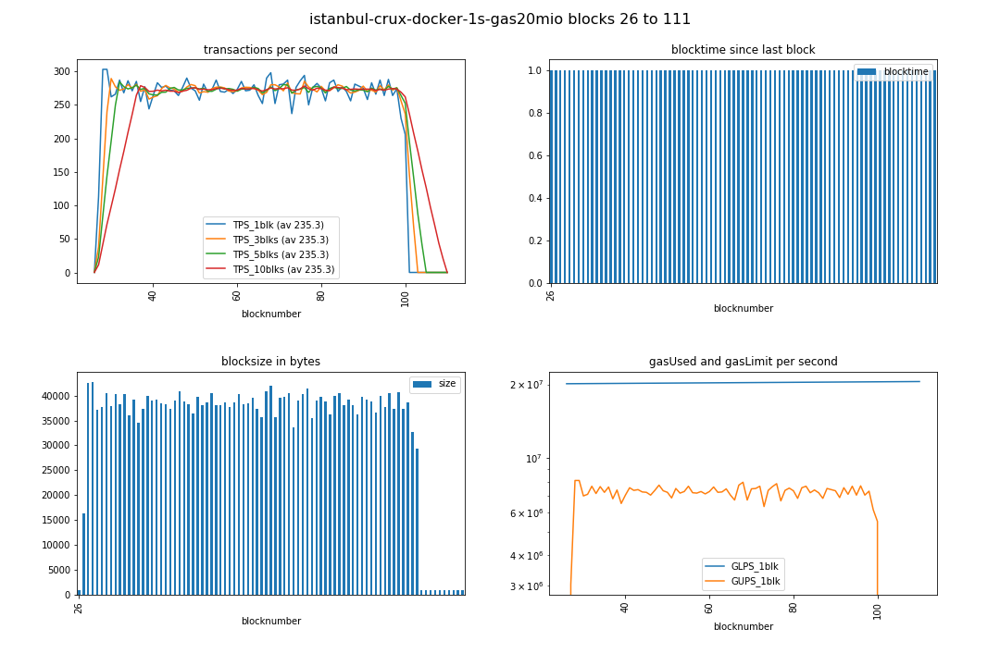
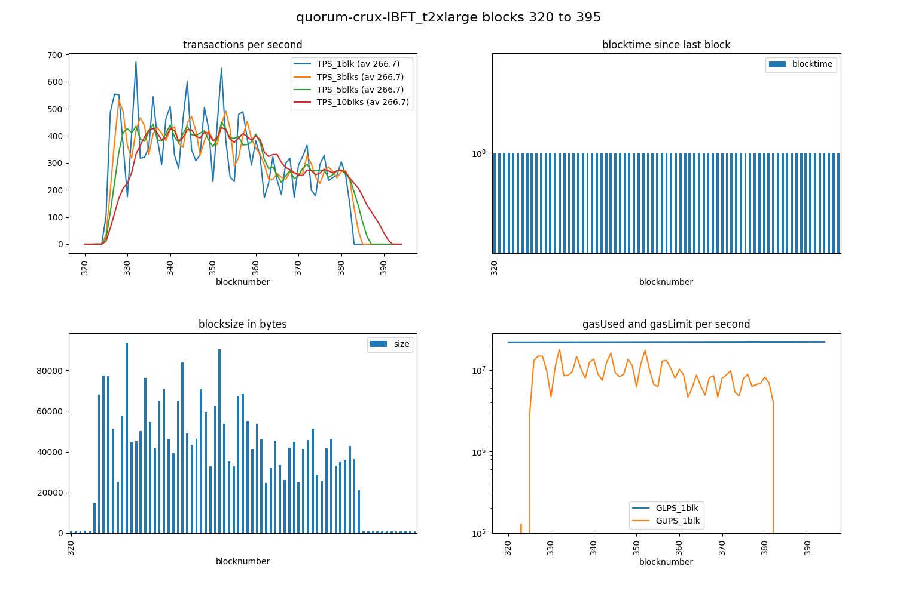

# quorum IBFT benchmarking

... *the other consensus algorithm* that is shipped with quorum.

Also see [general infos](quorum.md#general-infos) in previous document 
(which documents the initial raft consensus benchmarking).

## TOC
1. tweaking and benchmarking: environment used in this first part, mempool settings, faster blockperiod, higher gas Limit
1. [example runs](#example-runs)
1. 7nodes - istanbul.blockperiod 1sec, gasLimit 20 million
1. crux docker 4nodes
1. Direct RPC call instead of web3 call: result > 400 TPS but only for the first 14k tx
1. on Amazon AWS
1. run 11 - purpose: new diagrams
1. how to further increase the TPS?
1. [issues](#issues)

## tweaking and benchmarking

### environment used in this first part

[jpmorganchase/quorum-examples](https://github.com/jpmorganchase/quorum-examples) is 

* vagrant virtualbox
* 7 nodes
* using - see [bootstrap.sh L33 and L11](https://github.com/jpmorganchase/quorum-examples/blob/master/vagrant/bootstrap.sh#L11-L33):
  * jpmorganchase/quorum and 
  * jpmorganchase/constellation 

I have been trying to raise the TPS:

### mempool settings
20,000 transactions cannot be propagated without changing the txpool settings (see [quorum issue 467](https://github.com/jpmorganchase/quorum/issues/467#issuecomment-412536373)):

    --txpool.globalslots 20000 
    --txpool.globalqueue 20000

add to ARGS in [7nodes/istanbul-start.sh](https://github.com/jpmorganchase/quorum-examples/blob/32e7c8d98a6bcf55e4fd74f84192fd9c2cb69487/examples/7nodes/istanbul-start.sh#L20)
```
ARGS="--txpool.globalslots 20000 --txpool.globalqueue 20000 ...
```

### faster blockperiod
the default 7nodes example uses a 5 seconds istanbul.blockperiod, which can be changed with

    --istanbul.blockperiod 1

add to ARGS in [7nodes/istanbul-start.sh](https://github.com/jpmorganchase/quorum-examples/blob/32e7c8d98a6bcf55e4fd74f84192fd9c2cb69487/examples/7nodes/istanbul-start.sh#L20)
```
ARGS="... --istanbul.blockperiod 1 ...
```

### higher gas Limit
in default settings, but high hammering rate ... every block turns out to be full, so I also tried to raise the gaslimit (from the default 4.7 million):

change `istanbul-genesis.json` to 

--> 20 million gas (["gasLimit": "0x1312D00"](https://github.com/jpmorganchase/quorum-examples/blob/0ccd3eab85e65b73078ecc11ce85dea7459be7ca/examples/7nodes/istanbul-genesis.json#L51))

However, the effect is simply that then the blocktime is going up. So raising the gasLimit does not result in higher TPS yet:

* [10 mio gasLimit](https://github.com/drandreaskrueger/chainhammer/blob/master/chainreader/img/istanbul-1s-gas10mio_run2_tps-bt-bs-gas_blks20-90.png)
* [20 mio gasLimit](https://github.com/drandreaskrueger/chainhammer/blob/master/chainreader/img/istanbul-1s-gas20mio_run2_tps-bt-bs-gas_blks40-85.png)

both saturate around ~200 TPS.

## example runs 

### 7nodes - istanbul.blockperiod 1sec, gasLimit 20 million

```
./tps.py 

versions: web3 4.3.0, py-solc: 2.1.0, solc 0.4.23+commit.124ca40d.Linux.gpp, testrpc 1.3.4, python 3.5.3 (default, Jan 19 2017, 14:11:04) [GCC 6.3.0 20170118]
web3 connection established, blockNumber = 21, node version string =  Geth/v1.7.2-stable-159d813f/linux-amd64/go1.9.3
first account of node is 0xcA843569e3427144cEad5e4d5999a3D0cCF92B8e, balance is 1000000000 Ether
nodeName: Quorum, nodeType: Geth, consensus: istanbul, chainName: ???

Block  21  - waiting for something to happen
(filedate 1534170380) last contract address: 0x1932c48b2bF8102Ba33B4A6B545C32236e342f34
(filedate 1534171683) new contract address: 0x1932c48b2bF8102Ba33B4A6B545C32236e342f34

starting timer, at block 42 which has  1  transactions; at timecode 131887.871188314
block 42 | new #TX   0 / 1000 ms =   0.0 TPS_current | total: #TX    1 /  1.0 s =   1.0 TPS_average
block 43 | new #TX  88 / 1000 ms =  88.0 TPS_current | total: #TX   89 /  2.6 s =  33.8 TPS_average
block 44 | new #TX 277 / 1000 ms = 277.0 TPS_current | total: #TX  366 /  4.4 s =  83.6 TPS_average
block 45 | new #TX 527 / 1000 ms = 527.0 TPS_current | total: #TX  893 /  7.1 s = 126.6 TPS_average
block 46 | new #TX 600 / 3000 ms = 200.0 TPS_current | total: #TX 1493 / 11.0 s = 135.2 TPS_average
block 47 | new #TX 731 / 3000 ms = 243.7 TPS_current | total: #TX 2224 / 11.7 s = 190.5 TPS_average
block 48 | new #TX 755 / 4000 ms = 188.8 TPS_current | total: #TX 2979 / 18.5 s = 161.3 TPS_average
block 49 | new #TX 756 / 4000 ms = 189.0 TPS_current | total: #TX 3735 / 21.9 s = 170.6 TPS_average
block 50 | new #TX 756 / 4000 ms = 189.0 TPS_current | total: #TX 4491 / 26.4 s = 170.1 TPS_average
block 51 | new #TX 756 / 3000 ms = 252.0 TPS_current | total: #TX 5247 / 30.2 s = 173.8 TPS_average
block 52 | new #TX 756 / 4000 ms = 189.0 TPS_current | total: #TX 6003 / 34.2 s = 175.4 TPS_average
block 53 | new #TX 756 / 4000 ms = 189.0 TPS_current | total: #TX 6759 / 37.6 s = 179.8 TPS_average
block 54 | new #TX 757 / 4000 ms = 189.2 TPS_current | total: #TX 7516 / 38.8 s = 193.5 TPS_average
block 55 | new #TX 757 / 5000 ms = 151.4 TPS_current | total: #TX 8273 / 46.6 s = 177.7 TPS_average
block 56 | new #TX 757 / 4000 ms = 189.2 TPS_current | total: #TX 9030 / 49.3 s = 183.3 TPS_average
block 57 | new #TX 757 / 4000 ms = 189.2 TPS_current | total: #TX 9787 / 55.0 s = 177.8 TPS_average
block 58 | new #TX 757 / 4000 ms = 189.2 TPS_current | total: #TX 10544 / 59.1 s = 178.4 TPS_average
block 59 | new #TX 757 / 4000 ms = 189.2 TPS_current | total: #TX 11301 / 62.7 s = 180.2 TPS_average
block 60 | new #TX 758 / 5000 ms = 151.6 TPS_current | total: #TX 12059 / 67.4 s = 178.9 TPS_average
block 61 | new #TX 758 / 4000 ms = 189.5 TPS_current | total: #TX 12817 / 68.2 s = 187.9 TPS_average
block 62 | new #TX 758 / 4000 ms = 189.5 TPS_current | total: #TX 13575 / 75.8 s = 179.1 TPS_average
block 63 | new #TX 758 / 4000 ms = 189.5 TPS_current | total: #TX 14333 / 80.4 s = 178.3 TPS_average
block 64 | new #TX 758 / 4000 ms = 189.5 TPS_current | total: #TX 15091 / 83.6 s = 180.4 TPS_average
block 65 | new #TX 759 / 4000 ms = 189.8 TPS_current | total: #TX 15850 / 87.9 s = 180.4 TPS_average
block 66 | new #TX 759 / 4000 ms = 189.8 TPS_current | total: #TX 16609 / 91.5 s = 181.5 TPS_average
block 67 | new #TX 759 / 5000 ms = 151.8 TPS_current | total: #TX 17368 / 93.3 s = 186.1 TPS_average
block 68 | new #TX 759 / 1000 ms = 759.0 TPS_current | total: #TX 18127 / 93.7 s = 193.4 TPS_average
block 69 | new #TX 759 / 1000 ms = 759.0 TPS_current | total: #TX 18886 / 95.1 s = 198.6 TPS_average
block 70 | new #TX 760 / 1000 ms = 760.0 TPS_current | total: #TX 19646 / 96.2 s = 204.2 TPS_average
block 71 | new #TX 355 / 1000 ms = 355.0 TPS_current | total: #TX 20001 / 96.7 s = 206.9 TPS_average
block 72 | new #TX   0 / 1000 ms =   0.0 TPS_current | total: #TX 20001 / 97.1 s = 205.9 TPS_average
block 73 | new #TX   0 / 1000 ms =   0.0 TPS_current | total: #TX 20001 / 98.1 s = 203.8 TPS_average
block 74 | new #TX   0 / 1000 ms =   0.0 TPS_current | total: #TX 20001 / 99.2 s = 201.7 TPS_average
block 75 | new #TX   0 / 1000 ms =   0.0 TPS_current | total: #TX 20001 / 99.9 s = 200.2 TPS_average
block 76 | new #TX   0 / 1000 ms =   0.0 TPS_current | total: #TX 20001 / 100.9 s = 198.2 TPS_average
block 77 | new #TX   0 / 1000 ms =   0.0 TPS_current | total: #TX 20001 / 102.0 s = 196.2 TPS_average
block 78 | new #TX   0 / 1000 ms =   0.0 TPS_current | total: #TX 20001 / 103.0 s = 194.2 TPS_average
block 79 | new #TX   0 / 1000 ms =   0.0 TPS_current | total: #TX 20001 / 104.0 s = 192.3 TPS_average
block 80 | new #TX   0 / 1000 ms =   0.0 TPS_current | total: #TX 20001 / 105.0 s = 190.4 TPS_average
block 81 | new #TX   0 / 1000 ms =   0.0 TPS_current | total: #TX 20001 / 106.1 s = 188.6 TPS_average
```

  
https://github.com/drandreaskrueger/chainhammer/blob/master/chainreader/img/istanbul-1s-gas20mio_run2_tps-bt-bs-gas_blks40-85.png

### crux docker 4nodes
different from above:

* crux instead of constellation
* [consensys/quorum](https://github.com/blk-io/crux/blob/master/docker/quorum-crux/bootstrap.sh#L5) (instead of jpmc/quorum as above)
  * Conor: "It uses Google’s protobuf for communication instead of a hand-coded serialisation library."
  * me: "would that affect my benchmarking?"
  * Conor: "it may be more efficient. but the data serialisation overhead is a small part of it - the crypto operations are far heavier"
* docker instead of vagrant virtualbox
* 4 nodes instead of 7 nodes

For (txpool, blockspeed, gasLimit) parameter changes see [my fork of their repo](https://github.com/drandreaskrueger/crux/commits/master). For docker questions see [crux issue 27](https://github.com/blk-io/crux/issues/27).

N.B.: It can take many seconds until the chain actually starts moving, and without stuttering. So better wait a minute after starting with `docker-compose -f docker-compose-local.yaml up --build`.

log:
```
./tps.py 

versions: web3 4.3.0, py-solc: 2.1.0, solc 0.4.23+commit.124ca40d.Linux.gpp, testrpc 1.3.4, python 3.5.3 (default, Jan 19 2017, 14:11:04) [GCC 6.3.0 20170118]
web3 connection established, blockNumber = 17, node version string =  Geth/v1.7.2-stable-3f1817ea/linux-amd64/go1.10.1
first account of node is 0xcA843569e3427144cEad5e4d5999a3D0cCF92B8e, balance is 1000000000 Ether
nodeName: Quorum, nodeType: Geth, consensus: istanbul, chainName: ???

Block  17  - waiting for something to happen
(filedate 1534423209) last contract address: 0xc36C1118645ce456E0249562F44175953A076a7a
(filedate 1534423288) new contract address: 0x1932c48b2bF8102Ba33B4A6B545C32236e342f34

starting timer, at block 25 which has  1  transactions; at timecode 16826.132793952
block 25 | new #TX   0 / 1000 ms =   0.0 TPS_current | total: #TX    1 /  0.9 s =   1.1 TPS_average
block 26 | new #TX 113 / 1000 ms = 113.0 TPS_current | total: #TX  114 /  2.1 s =  53.2 TPS_average
block 27 | new #TX 303 / 1000 ms = 303.0 TPS_current | total: #TX  417 /  3.4 s = 123.8 TPS_average
block 28 | new #TX 303 / 1000 ms = 303.0 TPS_current | total: #TX  720 /  4.0 s = 178.9 TPS_average
block 29 | new #TX 262 / 1000 ms = 262.0 TPS_current | total: #TX  982 /  5.3 s = 186.6 TPS_average
block 30 | new #TX 266 / 1000 ms = 266.0 TPS_current | total: #TX 1248 /  6.2 s = 201.6 TPS_average
block 31 | new #TX 287 / 1000 ms = 287.0 TPS_current | total: #TX 1535 /  7.1 s = 215.7 TPS_average
block 32 | new #TX 268 / 1000 ms = 268.0 TPS_current | total: #TX 1803 /  8.1 s = 223.7 TPS_average
block 33 | new #TX 286 / 1000 ms = 286.0 TPS_current | total: #TX 2089 /  9.3 s = 224.8 TPS_average
block 34 | new #TX 271 / 1000 ms = 271.0 TPS_current | total: #TX 2360 / 10.2 s = 230.9 TPS_average
block 35 | new #TX 285 / 1000 ms = 285.0 TPS_current | total: #TX 2645 / 11.2 s = 237.2 TPS_average
block 36 | new #TX 255 / 1000 ms = 255.0 TPS_current | total: #TX 2900 / 12.1 s = 239.5 TPS_average
block 37 | new #TX 277 / 1000 ms = 277.0 TPS_current | total: #TX 3177 / 13.1 s = 243.4 TPS_average
block 38 | new #TX 244 / 1000 ms = 244.0 TPS_current | total: #TX 3421 / 14.3 s = 239.6 TPS_average
block 39 | new #TX 264 / 1000 ms = 264.0 TPS_current | total: #TX 3685 / 15.2 s = 242.2 TPS_average
block 40 | new #TX 283 / 1000 ms = 283.0 TPS_current | total: #TX 3968 / 16.1 s = 245.8 TPS_average
block 41 | new #TX 276 / 1000 ms = 276.0 TPS_current | total: #TX 4244 / 17.1 s = 248.5 TPS_average
block 42 | new #TX 278 / 1000 ms = 278.0 TPS_current | total: #TX 4522 / 18.3 s = 246.9 TPS_average
block 43 | new #TX 272 / 1000 ms = 272.0 TPS_current | total: #TX 4794 / 19.2 s = 249.1 TPS_average
block 44 | new #TX 271 / 1000 ms = 271.0 TPS_current | total: #TX 5065 / 20.2 s = 251.1 TPS_average
block 45 | new #TX 264 / 1000 ms = 264.0 TPS_current | total: #TX 5329 / 21.1 s = 252.5 TPS_average
block 46 | new #TX 276 / 1000 ms = 276.0 TPS_current | total: #TX 5605 / 22.4 s = 250.8 TPS_average
block 47 | new #TX 290 / 1000 ms = 290.0 TPS_current | total: #TX 5895 / 23.3 s = 253.2 TPS_average
block 48 | new #TX 275 / 1000 ms = 275.0 TPS_current | total: #TX 6170 / 24.0 s = 257.6 TPS_average
block 49 | new #TX 271 / 1000 ms = 271.0 TPS_current | total: #TX 6441 / 25.2 s = 255.7 TPS_average
block 50 | new #TX 257 / 1000 ms = 257.0 TPS_current | total: #TX 6698 / 26.1 s = 256.5 TPS_average
block 51 | new #TX 281 / 1000 ms = 281.0 TPS_current | total: #TX 6979 / 27.1 s = 258.0 TPS_average
block 52 | new #TX 269 / 1000 ms = 269.0 TPS_current | total: #TX 7248 / 28.0 s = 258.8 TPS_average
block 53 | new #TX 273 / 1000 ms = 273.0 TPS_current | total: #TX 7521 / 29.2 s = 257.3 TPS_average
block 54 | new #TX 287 / 1000 ms = 287.0 TPS_current | total: #TX 7808 / 30.2 s = 258.9 TPS_average
block 55 | new #TX 270 / 1000 ms = 270.0 TPS_current | total: #TX 8078 / 31.1 s = 259.8 TPS_average
block 56 | new #TX 269 / 1000 ms = 269.0 TPS_current | total: #TX 8347 / 32.0 s = 260.6 TPS_average
block 57 | new #TX 273 / 1000 ms = 273.0 TPS_current | total: #TX 8620 / 33.3 s = 259.2 TPS_average
block 58 | new #TX 267 / 1000 ms = 267.0 TPS_current | total: #TX 8887 / 34.2 s = 259.9 TPS_average
block 59 | new #TX 273 / 1000 ms = 273.0 TPS_current | total: #TX 9160 / 35.1 s = 260.8 TPS_average
block 60 | new #TX 285 / 1000 ms = 285.0 TPS_current | total: #TX 9445 / 36.1 s = 261.9 TPS_average
block 61 | new #TX 271 / 1000 ms = 271.0 TPS_current | total: #TX 9716 / 37.0 s = 262.5 TPS_average
block 62 | new #TX 272 / 1000 ms = 272.0 TPS_current | total: #TX 9988 / 38.3 s = 261.1 TPS_average
block 63 | new #TX 280 / 1000 ms = 280.0 TPS_current | total: #TX 10268 / 39.2 s = 262.0 TPS_average
block 64 | new #TX 264 / 1000 ms = 264.0 TPS_current | total: #TX 10532 / 40.1 s = 262.5 TPS_average
block 65 | new #TX 252 / 1000 ms = 252.0 TPS_current | total: #TX 10784 / 41.1 s = 262.7 TPS_average
block 66 | new #TX 290 / 1000 ms = 290.0 TPS_current | total: #TX 11074 / 42.3 s = 261.8 TPS_average
block 67 | new #TX 298 / 1000 ms = 298.0 TPS_current | total: #TX 11372 / 43.2 s = 263.1 TPS_average
block 68 | new #TX 252 / 1000 ms = 252.0 TPS_current | total: #TX 11624 / 44.2 s = 263.2 TPS_average
block 69 | new #TX 280 / 1000 ms = 280.0 TPS_current | total: #TX 11904 / 45.1 s = 263.9 TPS_average
block 70 | new #TX 281 / 1000 ms = 281.0 TPS_current | total: #TX 12185 / 46.3 s = 263.0 TPS_average
block 71 | new #TX 287 / 1000 ms = 287.0 TPS_current | total: #TX 12472 / 47.3 s = 263.8 TPS_average
block 72 | new #TX 237 / 1000 ms = 237.0 TPS_current | total: #TX 12709 / 48.2 s = 263.7 TPS_average
block 73 | new #TX 276 / 1000 ms = 276.0 TPS_current | total: #TX 12985 / 49.1 s = 264.3 TPS_average
block 74 | new #TX 286 / 1000 ms = 286.0 TPS_current | total: #TX 13271 / 50.1 s = 265.1 TPS_average
block 75 | new #TX 294 / 1000 ms = 294.0 TPS_current | total: #TX 13565 / 51.3 s = 264.4 TPS_average
block 76 | new #TX 250 / 1000 ms = 250.0 TPS_current | total: #TX 13815 / 51.9 s = 265.9 TPS_average
block 77 | new #TX 276 / 1000 ms = 276.0 TPS_current | total: #TX 14091 / 53.2 s = 265.0 TPS_average
block 78 | new #TX 282 / 1000 ms = 282.0 TPS_current | total: #TX 14373 / 54.1 s = 265.6 TPS_average
block 79 | new #TX 275 / 1000 ms = 275.0 TPS_current | total: #TX 14648 / 55.0 s = 266.1 TPS_average
block 80 | new #TX 256 / 1000 ms = 256.0 TPS_current | total: #TX 14904 / 56.0 s = 266.1 TPS_average
block 81 | new #TX 283 / 1000 ms = 283.0 TPS_current | total: #TX 15187 / 57.2 s = 265.3 TPS_average
block 82 | new #TX 287 / 1000 ms = 287.0 TPS_current | total: #TX 15474 / 58.2 s = 266.0 TPS_average
block 83 | new #TX 270 / 1000 ms = 270.0 TPS_current | total: #TX 15744 / 59.1 s = 266.4 TPS_average
block 84 | new #TX 277 / 1000 ms = 277.0 TPS_current | total: #TX 16021 / 60.1 s = 266.8 TPS_average
block 85 | new #TX 270 / 1000 ms = 270.0 TPS_current | total: #TX 16291 / 61.3 s = 265.8 TPS_average
block 86 | new #TX 256 / 1000 ms = 256.0 TPS_current | total: #TX 16547 / 62.2 s = 266.0 TPS_average
block 87 | new #TX 281 / 1000 ms = 281.0 TPS_current | total: #TX 16828 / 63.1 s = 266.5 TPS_average
block 88 | new #TX 278 / 1000 ms = 278.0 TPS_current | total: #TX 17106 / 64.1 s = 266.9 TPS_average
block 89 | new #TX 275 / 1000 ms = 275.0 TPS_current | total: #TX 17381 / 65.1 s = 267.1 TPS_average
block 90 | new #TX 258 / 1000 ms = 258.0 TPS_current | total: #TX 17639 / 66.0 s = 267.1 TPS_average
block 91 | new #TX 283 / 1000 ms = 283.0 TPS_current | total: #TX 17922 / 67.3 s = 266.4 TPS_average
block 92 | new #TX 266 / 1000 ms = 266.0 TPS_current | total: #TX 18188 / 68.2 s = 266.7 TPS_average
block 93 | new #TX 287 / 1000 ms = 287.0 TPS_current | total: #TX 18475 / 69.1 s = 267.2 TPS_average
block 94 | new #TX 264 / 1000 ms = 264.0 TPS_current | total: #TX 18739 / 70.1 s = 267.4 TPS_average
block 95 | new #TX 288 / 1000 ms = 288.0 TPS_current | total: #TX 19027 / 71.3 s = 266.9 TPS_average
block 96 | new #TX 264 / 1000 ms = 264.0 TPS_current | total: #TX 19291 / 71.9 s = 268.1 TPS_average
block 97 | new #TX 274 / 1000 ms = 274.0 TPS_current | total: #TX 19565 / 73.2 s = 267.3 TPS_average
block 98 | new #TX 230 / 1000 ms = 230.0 TPS_current | total: #TX 19795 / 74.2 s = 266.9 TPS_average
block 99 | new #TX 206 / 1000 ms = 206.0 TPS_current | total: #TX 20001 / 75.2 s = 266.1 TPS_average
block 100 | new #TX   0 / 1000 ms =   0.0 TPS_current | total: #TX 20001 / 76.1 s = 262.8 TPS_average
block 101 | new #TX   0 / 1000 ms =   0.0 TPS_current | total: #TX 20001 / 77.1 s = 259.6 TPS_average
block 102 | new #TX   0 / 1000 ms =   0.0 TPS_current | total: #TX 20001 / 78.0 s = 256.4 TPS_average
block 103 | new #TX   0 / 1000 ms =   0.0 TPS_current | total: #TX 20001 / 78.9 s = 253.4 TPS_average
block 104 | new #TX   0 / 1000 ms =   0.0 TPS_current | total: #TX 20001 / 80.2 s = 249.5 TPS_average
block 105 | new #TX   0 / 1000 ms =   0.0 TPS_current | total: #TX 20001 / 81.1 s = 246.6 TPS_average
block 106 | new #TX   0 / 1000 ms =   0.0 TPS_current | total: #TX 20001 / 82.0 s = 243.8 TPS_average
block 107 | new #TX   0 / 1000 ms =   0.0 TPS_current | total: #TX 20001 / 83.0 s = 241.0 TPS_average
block 108 | new #TX   0 / 1000 ms =   0.0 TPS_current | total: #TX 20001 / 84.2 s = 237.5 TPS_average
block 109 | new #TX   0 / 1000 ms =   0.0 TPS_current | total: #TX 20001 / 85.2 s = 234.8 TPS_average
block 110 | new #TX   0 / 1000 ms =   0.0 TPS_current | total: #TX 20001 / 86.1 s = 232.3 TPS_average
block 111 | new #TX   0 / 1000 ms =   0.0 TPS_current | total: #TX 20001 / 87.1 s = 229.7 TPS_average
block 112 | new #TX   0 / 1000 ms =   0.0 TPS_current | total: #TX 20001 / 88.0 s = 227.3 TPS_average
block 113 | new #TX   0 / 1000 ms =   0.0 TPS_current | total: #TX 20001 / 88.9 s = 224.9 TPS_average
block 114 | new #TX   0 / 1000 ms =   0.0 TPS_current | total: #TX 20001 / 90.2 s = 221.8 TPS_average
block 115 | new #TX   0 / 1000 ms =   0.0 TPS_current | total: #TX 20001 / 91.1 s = 219.5 TPS_average
```


https://github.com/drandreaskrueger/chainhammer/blob/master/chainreader/img/istanbul-crux-docker-1s-gas20mio_tps-bt-bs-gas_blks26-111.png

until now the best result - around 

**273 TPS**. 

No blocktime increase (as before with constellation 7 nodes) but a steady 1 second blocktime.  Blocks not are full in terms of gas, so: how to further increase the TPS? 

### Direct RPC call instead of web3 call

With [this config switch](https://github.com/drandreaskrueger/chainhammer/blob/509f2df05ebbddce969443849f8129ca66e26d9c/config.py#L29-30) change, all those 20k transactions are not each sent through the standard web3 call

    contract.functions.set( x=arg ).transact(txParameters)

but the transaction is manually compiled, and sent via a POST call directly to the RPC API of the node:

    requests.post(RPCaddress, json=payload, headers=headers)

(see [full code here](https://github.com/drandreaskrueger/chainhammer/blob/d00ea549928d9007a3f4fe051f275cb759bfebd2/send.py#L147-177)).

Quite surprising, but web3 seems to seriously harm the overall execution performance!

Now also a different number of multithreading workers is optimal, see run 8.


| run |workers |TPS_average peak                          |TPS_average at end                         |
|----|----------------|-------------------------------|-----------------------------|
|4|5|434            |356|
|3|10|439            |364|
|7|12|442            |363|
|8|**13**|**447**            |369|
|9|14|437            |363|
|5|15|435            |362|
|6|23|428            |362|
|2|100|437            |369|

run 8 --> 13 workers seem to result in the highest TPS rate.

log of best run 8:

```
./tps.py 

versions: web3 4.3.0, py-solc: 2.1.0, solc 0.4.23+commit.124ca40d.Linux.gpp, testrpc 1.3.4, python 3.5.3 (default, Jan 19 2017, 14:11:04) [GCC 6.3.0 20170118]
web3 connection established, blockNumber = 17, node version string =  Geth/v1.7.2-stable-3f1817ea/linux-amd64/go1.10.1
first account of node is 0xcA843569e3427144cEad5e4d5999a3D0cCF92B8e, balance is 1000000000 Ether
nodeName: Quorum, nodeType: Geth, consensus: istanbul, chainName: ???

Block  17  - waiting for something to happen
(filedate 1534430103) last contract address: 0x1932c48b2bF8102Ba33B4A6B545C32236e342f34
(filedate 1534430266) new contract address: 0x1932c48b2bF8102Ba33B4A6B545C32236e342f34

starting timer, at block 28 which has  1  transactions; at timecode 23804.15982982
block 28 | new #TX   0 / 1000 ms =   0.0 TPS_current | total: #TX    1 /  0.9 s =   1.1 TPS_average
block 29 | new #TX 213 / 1000 ms = 213.0 TPS_current | total: #TX  214 /  2.1 s =  99.7 TPS_average
block 30 | new #TX 563 / 1000 ms = 563.0 TPS_current | total: #TX  777 /  3.4 s = 229.3 TPS_average
block 31 | new #TX 509 / 1000 ms = 509.0 TPS_current | total: #TX 1286 /  4.4 s = 295.5 TPS_average
block 32 | new #TX 523 / 1000 ms = 523.0 TPS_current | total: #TX 1809 /  5.3 s = 341.3 TPS_average
block 33 | new #TX 393 / 1000 ms = 393.0 TPS_current | total: #TX 2202 /  5.9 s = 370.2 TPS_average
block 34 | new #TX 446 / 1000 ms = 446.0 TPS_current | total: #TX 2648 /  7.3 s = 365.0 TPS_average
block 35 | new #TX 467 / 1000 ms = 467.0 TPS_current | total: #TX 3115 /  8.2 s = 379.7 TPS_average
block 36 | new #TX 504 / 1000 ms = 504.0 TPS_current | total: #TX 3619 /  9.4 s = 383.1 TPS_average
block 37 | new #TX 464 / 1000 ms = 464.0 TPS_current | total: #TX 4083 / 10.1 s = 404.3 TPS_average
block 38 | new #TX 440 / 1000 ms = 440.0 TPS_current | total: #TX 4523 / 11.3 s = 398.8 TPS_average
block 39 | new #TX 487 / 1000 ms = 487.0 TPS_current | total: #TX 5010 / 12.3 s = 407.6 TPS_average
block 40 | new #TX 494 / 1000 ms = 494.0 TPS_current | total: #TX 5504 / 13.3 s = 414.5 TPS_average
block 41 | new #TX 459 / 1000 ms = 459.0 TPS_current | total: #TX 5963 / 14.0 s = 427.2 TPS_average
block 42 | new #TX 454 / 1000 ms = 454.0 TPS_current | total: #TX 6417 / 15.2 s = 421.6 TPS_average
block 43 | new #TX 435 / 1000 ms = 435.0 TPS_current | total: #TX 6852 / 16.5 s = 416.0 TPS_average
block 44 | new #TX 585 / 1000 ms = 585.0 TPS_current | total: #TX 7437 / 17.4 s = 426.8 TPS_average
block 45 | new #TX 451 / 1000 ms = 451.0 TPS_current | total: #TX 7888 / 18.1 s = 436.0 TPS_average
block 46 | new #TX 417 / 1000 ms = 417.0 TPS_current | total: #TX 8305 / 19.4 s = 427.5 TPS_average
block 47 | new #TX 473 / 1000 ms = 473.0 TPS_current | total: #TX 8778 / 20.4 s = 431.0 TPS_average
block 48 | new #TX 455 / 1000 ms = 455.0 TPS_current | total: #TX 9233 / 21.3 s = 433.2 TPS_average
block 49 | new #TX 460 / 1000 ms = 460.0 TPS_current | total: #TX 9693 / 22.0 s = 440.1 TPS_average
block 50 | new #TX 402 / 1000 ms = 402.0 TPS_current | total: #TX 10095 / 23.3 s = 433.6 TPS_average
block 51 | new #TX 504 / 1000 ms = 504.0 TPS_current | total: #TX 10599 / 24.3 s = 437.0 TPS_average
block 52 | new #TX 546 / 1000 ms = 546.0 TPS_current | total: #TX 11145 / 25.2 s = 442.0 TPS_average
block 53 | new #TX 386 / 1000 ms = 386.0 TPS_current | total: #TX 11531 / 26.2 s = 440.8 TPS_average
block 54 | new #TX 407 / 1000 ms = 407.0 TPS_current | total: #TX 11938 / 27.4 s = 435.7 TPS_average
block 55 | new #TX 475 / 1000 ms = 475.0 TPS_current | total: #TX 12413 / 28.3 s = 438.0 TPS_average
block 56 | new #TX 556 / 1000 ms = 556.0 TPS_current | total: #TX 12969 / 29.3 s = 442.6 TPS_average
block 57 | new #TX 408 / 1000 ms = 408.0 TPS_current | total: #TX 13377 / 29.9 s = 446.7 TPS_average
block 58 | new #TX 452 / 1000 ms = 452.0 TPS_current | total: #TX 13829 / 31.5 s = 438.8 TPS_average
block 59 | new #TX 402 / 1000 ms = 402.0 TPS_current | total: #TX 14231 / 32.2 s = 442.2 TPS_average
block 60 | new #TX 289 / 1000 ms = 289.0 TPS_current | total: #TX 14520 / 33.2 s = 437.8 TPS_average
block 61 | new #TX 185 / 1000 ms = 185.0 TPS_current | total: #TX 14705 / 34.1 s = 431.3 TPS_average
block 62 | new #TX 291 / 1000 ms = 291.0 TPS_current | total: #TX 14996 / 35.3 s = 424.4 TPS_average
block 63 | new #TX 298 / 1000 ms = 298.0 TPS_current | total: #TX 15294 / 36.3 s = 421.6 TPS_average
block 64 | new #TX 298 / 1000 ms = 298.0 TPS_current | total: #TX 15592 / 37.2 s = 418.9 TPS_average
block 65 | new #TX 256 / 1000 ms = 256.0 TPS_current | total: #TX 15848 / 38.2 s = 415.2 TPS_average
block 66 | new #TX 253 / 1000 ms = 253.0 TPS_current | total: #TX 16101 / 39.4 s = 408.6 TPS_average
block 67 | new #TX 268 / 1000 ms = 268.0 TPS_current | total: #TX 16369 / 40.4 s = 405.6 TPS_average
block 68 | new #TX 259 / 1000 ms = 259.0 TPS_current | total: #TX 16628 / 41.3 s = 402.6 TPS_average
block 69 | new #TX 294 / 1000 ms = 294.0 TPS_current | total: #TX 16922 / 42.0 s = 403.1 TPS_average
block 70 | new #TX 257 / 1000 ms = 257.0 TPS_current | total: #TX 17179 / 43.2 s = 397.5 TPS_average
block 71 | new #TX 283 / 1000 ms = 283.0 TPS_current | total: #TX 17462 / 44.2 s = 395.3 TPS_average
block 72 | new #TX 267 / 1000 ms = 267.0 TPS_current | total: #TX 17729 / 45.2 s = 392.6 TPS_average
block 73 | new #TX 260 / 1000 ms = 260.0 TPS_current | total: #TX 17989 / 46.1 s = 390.0 TPS_average
block 74 | new #TX 268 / 1000 ms = 268.0 TPS_current | total: #TX 18257 / 47.1 s = 387.4 TPS_average
block 75 | new #TX 281 / 1000 ms = 281.0 TPS_current | total: #TX 18538 / 48.1 s = 385.2 TPS_average
block 76 | new #TX 296 / 1000 ms = 296.0 TPS_current | total: #TX 18834 / 49.4 s = 381.3 TPS_average
block 77 | new #TX 235 / 1000 ms = 235.0 TPS_current | total: #TX 19069 / 50.0 s = 381.0 TPS_average
block 78 | new #TX 232 / 1000 ms = 232.0 TPS_current | total: #TX 19301 / 51.3 s = 376.2 TPS_average
block 79 | new #TX 281 / 1000 ms = 281.0 TPS_current | total: #TX 19582 / 52.3 s = 374.8 TPS_average
block 80 | new #TX 317 / 1000 ms = 317.0 TPS_current | total: #TX 19899 / 53.2 s = 373.7 TPS_average
block 81 | new #TX 102 / 1000 ms = 102.0 TPS_current | total: #TX 20001 / 54.2 s = 368.8 TPS_average
block 82 | new #TX   0 / 1000 ms =   0.0 TPS_current | total: #TX 20001 / 55.2 s = 362.5 TPS_average
block 83 | new #TX   0 / 1000 ms =   0.0 TPS_current | total: #TX 20001 / 56.1 s = 356.4 TPS_average
block 84 | new #TX   0 / 1000 ms =   0.0 TPS_current | total: #TX 20001 / 57.1 s = 350.5 TPS_average
block 85 | new #TX   0 / 1000 ms =   0.0 TPS_current | total: #TX 20001 / 58.0 s = 344.8 TPS_average
block 86 | new #TX   0 / 1000 ms =   0.0 TPS_current | total: #TX 20001 / 59.0 s = 339.3 TPS_average
block 87 | new #TX   0 / 1000 ms =   0.0 TPS_current | total: #TX 20001 / 60.2 s = 332.2 TPS_average
block 88 | new #TX   0 / 1000 ms =   0.0 TPS_current | total: #TX 20001 / 61.1 s = 327.1 TPS_average
block 89 | new #TX   0 / 1000 ms =   0.0 TPS_current | total: #TX 20001 / 62.1 s = 322.2 TPS_average
block 90 | new #TX   0 / 1000 ms =   0.0 TPS_current | total: #TX 20001 / 63.0 s = 317.3 TPS_average
block 91 | new #TX   0 / 1000 ms =   0.0 TPS_current | total: #TX 20001 / 63.9 s = 312.8 TPS_average
block 92 | new #TX   0 / 1000 ms =   0.0 TPS_current | total: #TX 20001 / 64.9 s = 308.3 TPS_average
```

#### result > 400 TPS but only for the first 14k tx

(diagram https://github.com/drandreaskrueger/chainhammer/blob/master/chainreader/img/istanbul-crux-docker-1s-gas20mio-RPC_run8_tps-bt-bs-gas_blks28-93.png) 

Surprising acceleration when not using web3 ... not 273 TPS but

**370 - 465 TPS** !

Following detailed averages are calculated at the bottom of 
notebook [reader/outdated/blocksDB_analyze_quorum-istanbul_RPC-call.ipynb](../reader/outdated/blocksDB_analyze_quorum-istanbul_RPC-call.ipynb)

Averaging over blocks 40 to 80, we see averages of **370 - 393 TPS**.  

Looking at blocks 40 to 60 only, we see averages of **~465 TPS**, but then it goes down considerably.  
Looking at the later blocks 64 to 80 only, we see averages of **~270 TPS**. 

Unclear what exactly makes the rate collapse here, and after already approx 13000 - 14000 transactions. I have done several repetitions, they all look similar. Any ideas where this might come from?  

(actually, [same behavior as in geth Clique PoA](https://github.com/drandreaskrueger/chainhammer/blob/master/geth.md#results-approx-350-tps-but-only-for-first-14k-transactions))


### on Amazon AWS
Ready-made AMI image - see [reproduce.md#readymade-amazon-ami](reproduce.md#readymade-amazon-ami) . Create such a machine, then:

```
cd ~
git clone  https://github.com/blk-io/crux blk-io_crux
cd ~/blk-io_crux/docker/quorum-crux

cp docker-compose.yaml docker-compose-local.yaml
nano docker-compose-local.yaml 
```


edit for local build "*to build the Docker images yourself*", so that the top of `docker-compose-local.yaml ` looks like this:

```
  node1: &quorum_crux_node
    # Pull image down from Docker Hub
    # image: blkio10/quorum-crux:v1.0.0
    # Uncomment the below, and comment out the above line to build the Docker images yourself
    image: blk.io/quorum/quorum-crux
    build:
      context: .
    container_name: quorum1
```


Edit the settings: Higher gas limit, larger txpool, blockperiod 1 second
```
sudo apt install jq
jq '.gasLimit = "0x1312D00"' istanbul-genesis.json > tmp && mv tmp istanbul-genesis.json

sed -i 's/PRIVATE_CONFIG/ARGS=$ARGS"--txpool.globalslots 20000 --txpool.globalqueue 20000 --istanbul.blockperiod 1 "\nPRIVATE_CONFIG/g' istanbul-start.sh 
```


start docker build & run network:

```
docker-compose -f docker-compose-local.yaml up 
```

#### Amazon AWS results

Exact same settings as above, running on a powerful `c5.4xlarge` machine:

```
./tps.py 

versions: web3 4.3.0, py-solc: 2.1.0, solc 0.4.24+commit.e67f0147.Linux.gpp, testrpc 1.3.4, python 3.5.3 (default, Jan 19 2017, 14:11:04) [GCC 6.3.0 20170118]
web3 connection established, blockNumber = 22, node version string =  Geth/v1.7.2-stable-3f1817ea/linux-amd64/go1.10.1
first account of node is 0xcA843569e3427144cEad5e4d5999a3D0cCF92B8e, balance is 1000000000 Ether
nodeName: Quorum, nodeType: Geth, consensus: istanbul, network: 1, chainName: ???, chainId: -1
Block  22  - waiting for something to happen
(filedate 1537882490) last contract address: 0x1932c48b2bF8102Ba33B4A6B545C32236e342f34
(filedate 1537882504) new contract address: 0x9d13C6D3aFE1721BEef56B55D303B09E021E27ab

blocknumber_start_here = 27
starting timer, at block 27 which has  1  transactions; at timecode 179.104554098
block 27 | new #TX   0 / 1000 ms =   0.0 TPS_current | total: #TX    1 /  1.2 s =   0.8 TPS_average
block 28 | new #TX 266 / 1000 ms = 266.0 TPS_current | total: #TX  267 /  2.1 s = 124.9 TPS_average
block 29 | new #TX 624 / 1000 ms = 624.0 TPS_current | total: #TX  891 /  3.4 s = 264.1 TPS_average
block 30 | new #TX 639 / 1000 ms = 639.0 TPS_current | total: #TX 1530 /  4.3 s = 354.3 TPS_average
block 31 | new #TX 571 / 1000 ms = 571.0 TPS_current | total: #TX 2101 /  5.3 s = 399.3 TPS_average
block 32 | new #TX 559 / 1000 ms = 559.0 TPS_current | total: #TX 2660 /  6.2 s = 428.8 TPS_average
block 33 | new #TX 572 / 1000 ms = 572.0 TPS_current | total: #TX 3232 /  7.4 s = 434.1 TPS_average
block 34 | new #TX 571 / 1000 ms = 571.0 TPS_current | total: #TX 3803 /  8.4 s = 453.5 TPS_average
block 35 | new #TX 574 / 1000 ms = 574.0 TPS_current | total: #TX 4377 /  9.3 s = 469.3 TPS_average
block 36 | new #TX 572 / 1000 ms = 572.0 TPS_current | total: #TX 4949 / 10.3 s = 481.9 TPS_average
block 37 | new #TX 560 / 1000 ms = 560.0 TPS_current | total: #TX 5509 / 11.2 s = 491.4 TPS_average
block 38 | new #TX 570 / 1000 ms = 570.0 TPS_current | total: #TX 6079 / 12.5 s = 488.1 TPS_average
block 39 | new #TX 569 / 1000 ms = 569.0 TPS_current | total: #TX 6648 / 13.4 s = 496.2 TPS_average
block 40 | new #TX 575 / 1000 ms = 575.0 TPS_current | total: #TX 7223 / 14.0 s = 514.4 TPS_average
block 41 | new #TX 556 / 1000 ms = 556.0 TPS_current | total: #TX 7779 / 15.3 s = 509.0 TPS_average
block 42 | new #TX 563 / 1000 ms = 563.0 TPS_current | total: #TX 8342 / 16.2 s = 514.1 TPS_average
block 43 | new #TX 579 / 1000 ms = 579.0 TPS_current | total: #TX 8921 / 17.5 s = 510.7 TPS_average
block 44 | new #TX 591 / 1000 ms = 591.0 TPS_current | total: #TX 9512 / 18.1 s = 525.2 TPS_average
block 45 | new #TX 548 / 1000 ms = 548.0 TPS_current | total: #TX 10060 / 19.4 s = 519.8 TPS_average
block 46 | new #TX 566 / 1000 ms = 566.0 TPS_current | total: #TX 10626 / 20.3 s = 523.6 TPS_average
block 47 | new #TX 588 / 1000 ms = 588.0 TPS_current | total: #TX 11214 / 21.2 s = 528.0 TPS_average
block 48 | new #TX 552 / 1000 ms = 552.0 TPS_current | total: #TX 11766 / 22.2 s = 530.4 TPS_average
block 49 | new #TX 561 / 1000 ms = 561.0 TPS_current | total: #TX 12327 / 23.4 s = 526.2 TPS_average
block 50 | new #TX 571 / 1000 ms = 571.0 TPS_current | total: #TX 12898 / 24.4 s = 529.3 TPS_average
block 51 | new #TX 562 / 1000 ms = 562.0 TPS_current | total: #TX 13460 / 25.3 s = 531.8 TPS_average
block 52 | new #TX 573 / 1000 ms = 573.0 TPS_current | total: #TX 14033 / 26.3 s = 534.5 TPS_average
block 53 | new #TX 526 / 1000 ms = 526.0 TPS_current | total: #TX 14559 / 27.2 s = 535.3 TPS_average
block 54 | new #TX 503 / 1000 ms = 503.0 TPS_current | total: #TX 15062 / 28.4 s = 529.6 TPS_average
block 55 | new #TX 509 / 1000 ms = 509.0 TPS_current | total: #TX 15571 / 29.4 s = 529.9 TPS_average
block 56 | new #TX 535 / 1000 ms = 535.0 TPS_current | total: #TX 16106 / 30.0 s = 536.4 TPS_average
block 57 | new #TX 507 / 1000 ms = 507.0 TPS_current | total: #TX 16613 / 31.3 s = 531.3 TPS_average
block 58 | new #TX 501 / 1000 ms = 501.0 TPS_current | total: #TX 17114 / 32.2 s = 531.4 TPS_average
block 59 | new #TX 510 / 1000 ms = 510.0 TPS_current | total: #TX 17624 / 33.4 s = 526.9 TPS_average
block 60 | new #TX 481 / 1000 ms = 481.0 TPS_current | total: #TX 18105 / 34.1 s = 531.0 TPS_average
block 61 | new #TX 474 / 1000 ms = 474.0 TPS_current | total: #TX 18579 / 35.3 s = 525.7 TPS_average
block 62 | new #TX 524 / 1000 ms = 524.0 TPS_current | total: #TX 19103 / 36.3 s = 526.6 TPS_average
block 63 | new #TX 541 / 1000 ms = 541.0 TPS_current | total: #TX 19644 / 37.2 s = 527.9 TPS_average
block 64 | new #TX 357 / 1000 ms = 357.0 TPS_current | total: #TX 20001 / 38.1 s = 524.3 TPS_average
block 65 | new #TX   0 / 1000 ms =   0.0 TPS_current | total: #TX 20001 / 39.1 s = 512.0 TPS_average
```

fastest seen so far:

**peak TPS_average is 536 TPS, final TPS_average is 524 TPS.**

See [reproduce.md#results](reproduce.md#results) for results on differently sized Amazon machines.


### run 11
* purpose: new diagrams
* Amazon t2.xlarge AWS machine = 4 vCPUs, 16 GB RAM
* chainhammer v38 with: `./send.py threaded2 23`
* quorum-crux commit `f39db2345cf9d82e76d3905468e6e5ea1469b09d`

```
./tps.py 
versions: web3 4.7.2, py-solc: 3.1.0, solc 0.4.24+commit.e67f0147.Linux.gpp, testrpc 1.3.5, python 3.5.3 (default, Sep 27 2018, 17:25:39) [GCC 6.3.0 20170516]
web3 connection established, blockNumber = 52, node version string =  Geth/v1.7.2-stable-3f1817ea/linux-amd64/go1.10.1
first account of node is 0xcA843569e3427144cEad5e4d5999a3D0cCF92B8e, balance is 1000000000 Ether
nodeName: Quorum, nodeType: Geth, consensus: istanbul, network: 1, chainName: ???, chainId: -1
Block  52  - waiting for something to happen
(filedate 1540076417) last contract address: 0x1932c48b2bF8102Ba33B4A6B545C32236e342f34
(filedate 1540076703) new contract address: 0x9d13C6D3aFE1721BEef56B55D303B09E021E27ab

blocknumber_start_here = 323
starting timer, at block 323 which has  1  transactions; at timecode 1536.297552707
block 323 | new #TX   0 / 1000 ms =   0.0 TPS_current | total: #TX    1 /  0.9 s =   1.1 TPS_average
block 324 | new #TX 103 / 1000 ms = 103.0 TPS_current | total: #TX  104 /  2.2 s =  47.8 TPS_average
block 325 | new #TX 487 / 1000 ms = 487.0 TPS_current | total: #TX  591 /  3.5 s = 170.2 TPS_average
block 326 | new #TX 554 / 1000 ms = 554.0 TPS_current | total: #TX 1145 /  4.5 s = 255.9 TPS_average
block 327 | new #TX 552 / 1000 ms = 552.0 TPS_current | total: #TX 1697 /  5.8 s = 292.6 TPS_average
block 328 | new #TX 365 / 1000 ms = 365.0 TPS_current | total: #TX 2062 /  6.2 s = 334.9 TPS_average
block 329 | new #TX 175 / 1000 ms = 175.0 TPS_current | total: #TX 2237 /  7.1 s = 313.4 TPS_average
block 330 | new #TX 412 / 1000 ms = 412.0 TPS_current | total: #TX 2649 /  8.4 s = 314.6 TPS_average
...
block 351 | new #TX 649 / 1000 ms = 649.0 TPS_current | total: #TX 11430 / 30.0 s = 381.3 TPS_average
block 352 | new #TX 383 / 1000 ms = 383.0 TPS_current | total: #TX 11813 / 30.4 s = 389.1 TPS_average
block 353 | new #TX 249 / 1000 ms = 249.0 TPS_current | total: #TX 12062 / 31.6 s = 381.5 TPS_average
block 354 | new #TX 231 / 1000 ms = 231.0 TPS_current | total: #TX 12293 / 32.2 s = 381.2 TPS_average
block 355 | new #TX 479 / 1000 ms = 479.0 TPS_current | total: #TX 12772 / 33.6 s = 380.0 TPS_average
block 356 | new #TX 489 / 1000 ms = 489.0 TPS_current | total: #TX 13261 / 34.3 s = 386.6 TPS_average
block 357 | new #TX 391 / 1000 ms = 391.0 TPS_current | total: #TX 13652 / 35.6 s = 383.0 TPS_average
block 358 | new #TX 292 / 1000 ms = 292.0 TPS_current | total: #TX 13944 / 36.4 s = 383.5 TPS_average
block 359 | new #TX 708 / 2000 ms = 354.0 TPS_current | total: #TX 14652 / 38.0 s = 385.8 TPS_average
block 361 | new #TX 172 / 1000 ms = 172.0 TPS_current | total: #TX 14824 / 39.3 s = 377.4 TPS_average
block 362 | new #TX 225 / 1000 ms = 225.0 TPS_current | total: #TX 15049 / 40.3 s = 373.7 TPS_average
block 363 | new #TX 322 / 1000 ms = 322.0 TPS_current | total: #TX 15371 / 41.5 s = 370.0 TPS_average
block 364 | new #TX 236 / 1000 ms = 236.0 TPS_current | total: #TX 15607 / 42.2 s = 369.8 TPS_average
block 365 | new #TX 183 / 1000 ms = 183.0 TPS_current | total: #TX 15790 / 43.5 s = 363.1 TPS_average
block 366 | new #TX 298 / 1000 ms = 298.0 TPS_current | total: #TX 16088 / 44.5 s = 361.8 TPS_average
block 367 | new #TX 318 / 1000 ms = 318.0 TPS_current | total: #TX 16406 / 45.5 s = 360.9 TPS_average
block 368 | new #TX 173 / 1000 ms = 173.0 TPS_current | total: #TX 16579 / 46.1 s = 359.3 TPS_average
block 369 | new #TX 292 / 1000 ms = 292.0 TPS_current | total: #TX 16871 / 47.7 s = 353.5 TPS_average
...
block 380 | new #TX 256 / 1000 ms = 256.0 TPS_current | total: #TX 19855 / 58.1 s = 341.8 TPS_average
block 381 | new #TX 146 / 1000 ms = 146.0 TPS_current | total: #TX 20001 / 59.0 s = 338.9 TPS_average
block 382 | new #TX   0 / 1000 ms =   0.0 TPS_current | total: #TX 20001 / 59.9 s = 333.7 TPS_average
```
**Amazon t2.xlarge - TPS_average: peak 389.1 TPS, final 338.9 TPS**

now with the new CLI tool, immediately create images:

```
./blocksDB_create.py temp.db
./blocksDB_diagramming.py temp.db quorum-crux-IBFT_t2xlarge 320 395
```




## how to further increase the TPS?

any ideas? Please tell us --> [quorum/issues/479](https://github.com/jpmorganchase/quorum/issues/479)

Actually, during the experiment my CPU is near 100% so I don't think this can be sped up *much* more.

Things to try:

* send tx not all to 1 node :22001, but round-robin to :22001, :22002, :22003, :22004 
* compare *dockerized* 4nodes (blk-io/crux) with *vagrant-virtualbox* 4nodes branch, to get a grip on which virtualisation is faster. Environment is almost ready, just some last tweaks missing, see [the comments below this one](https://github.com/blk-io/crux/issues/27#issuecomment-414627138).

what else?


## issues
* [IT#110](https://github.com/getamis/istanbul-tools/issues/110) IBFT in parity?
* [P#9298](https://github.com/paritytech/parity-ethereum/issues/9298) IBFT in parity?
* [IT#111](https://github.com/getamis/istanbul-tools/issues/111) istanbul API not accessible from JSRE console?
* [Q#466](https://github.com/jpmorganchase/quorum/issues/466) new release please
* [Q#467](https://github.com/jpmorganchase/quorum/issues/467) txpool overflow issue [solved]
* [Q#478](https://github.com/jpmorganchase/quorum/issues/478) please rename binary from `geth` to something else
* [Q#479](https://github.com/jpmorganchase/quorum/issues/479) IBFT - 200 TPS max ? renamed to:
* [Q#479](https://github.com/jpmorganchase/quorum/issues/479#issuecomment-413603316)  Sudden drop in TPS around 14k transactions (Quorum IBFT)
* [GE#17447](https://github.com/ethereum/go-ethereum/issues/17447) Sudden drop in TPS after total 14k transactions
* [BC#27](https://github.com/blk-io/crux/issues/27) 4nodes quorum-example ?  
* [Q#497](https://github.com/jpmorganchase/quorum/issues/497) Please consider to catch up with geth
* [BC#27](https://github.com/blk-io/crux/issues/27#issuecomment-414627138) 4nodes quorum-examples - how to? to compare vagrant with docker.
* [BC#37](https://github.com/blk-io/crux/issues/37) local docker build is failing: `Service 'node1' failed to build`
* [BC#39](https://github.com/blk-io/crux/issues/39) ERROR: Service 'node1' failed to build: The command '/bin/sh -c chmod +x start.sh ...' returned a non-zero code: 2
* [BC#48](https://github.com/blk-io/crux/issues/48) (feature request) quorum docker setup with 2-3 not 4 nodes (to run on small VPS)
* [BC#50](https://github.com/blk-io/crux/issues/50) local build fails to start geth s
* [BC#51](https://github.com/blk-io/crux/issues/51) (FR) dockerized with raft consensus not IBFT 

### TODO: 
try this out, to compare vagrant with docker: [BC#27](https://github.com/blk-io/crux/issues/27) 
