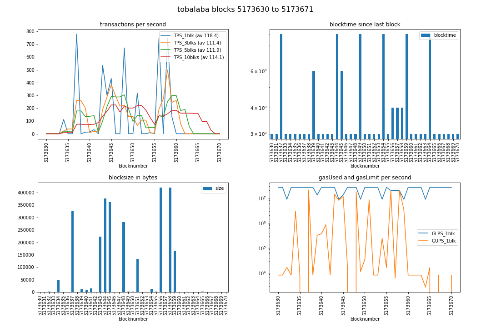

N.B.: No TOC yet for this file; it is going to be redone, or dropped, as tobalaba-PoA = parity-aura anyways, right?
# [chainhammer](../README.md): Tobalaba
Purpose: Extending the quorum benchmarking to other Ethereum-type chains. 

Here: *Toabalaba chain of the EnergyWebFoundation*, a fork of parity.

## shortcuts:
directly jump to 

* script outputs --> [#results](#results)
* **benchmarking result --> [#tps](#tps)**
* 5 TPS ? --> [#conclusion](#conclusion)

## useful sites for Tobalaba:

* [netstats](http://netstats.energyweb.org/) about the authority nodes
* block explorer e.g. --> [pending transactions](https://tobalaba.etherscan.com/txsPending)
* [faucet](https://energyweb.atlassian.net/wiki/spaces/EWF/pages/126517249) to get Tobalaba-ETH 
* EWF [website](https://energyweb.org/blockchain/) 

## quickstart

* sync your energyweb client, with some special switches: `./tobalaba-node-start.sh`
* put Tobalaba-Ether onto the first address of that node; and its passphrase into `account-passphrase.txt`
* clone this repo (and checkout e.g. commit cd844ea7 because that definitely contains [the correct](#config) `config.py`)
* install the [virtualenv & dependencies](../README.md#dependencies) - each of the following terminals needs to start that venv first, with `source env/bin/activate`
* first terminal:   `./tps.py`
* second terminal: `./deploy.py notest && ./send.py threaded2 23`

more infos:

## preparations 

### start node
    
#### initial problems:

```
Traceback (most recent call last):
...
  File "...python3.5/site-packages/web3/contract.py", line 1311, in transact_with_contract_function
    txn_hash = web3.eth.sendTransaction(transact_transaction)
...
ValueError: {'message': 'There are too many transactions in the queue. 
                         Your transaction was dropped due to limit. Try increasing the fee.', 'code': -32010}
```

solved by enlarging the *transaction queue*, with additional startup parameters

    --tx-queue-mem-limit=0
    --tx-queue-per-sender=2000 
    --tx-queue-gas=off 

I now start the node with these parameters

    ./target/release/parity --chain tobalaba --pruning=archive --geth --rpcapi "web3,eth,personal,net,parity" \
                            --db-compaction=ssd --cache-size=2048 --no-persistent-txqueue \
                            --tx-queue-mem-limit=0 --tx-queue-per-sender=10001 --tx-queue-gas=off \
                            --reserved-peers <PATH>/tobalaba-peers.txt

(See [tobalaba-node-start.sh](../networks/tobalaba-node-start.sh) - in it, just change your path)


Then it accepted 10000 transactions.
    
### account, password

By default, the [deploy.py](../hammer/deploy.py) uses the first address `web3.eth.accounts[0]`.    

Put your `unlockAccount` passphrase into the file `account-passphrase.txt` (the passphrase must not have whitespaces at the beginning or end).  

### make sure not overflooded already

see Tobalaba pending transactions: https://tobalaba.etherscan.com/txsPending

If there are many already, then just wait a while.

### virtualenv
In each terminal start the virtualenv (before the following python scripts):

    source env/bin/activate

See [quorum.md#virtualenv](quorum.md#virtualenv) for which dependencies to install.

## benchmark

### config
in [config.py](../hammer/config.py) manually set:
```
RPCaddress, RPCaddress2 = 'http://localhost:8545', 'http://localhost:8545'
RAFT=False
```

### start listener

    ./tps.py

It will start counting as soon as it sees a new `contract-address.json` file generated by:

### deploy, start sending
Deploys new contract (saves contract address to `contract-address.json`), and then immediately starts sending:

    ./deploy.py notest; ./send.py threaded2 23

or single-threaded:

    ./deploy.py notest; ./send.py 

after each experiment, **restart the listener** `tps.py`, and redeploy the contract.


# results

## 1000 transactions - but bad connectivity
* multi-threaded with 23 workers threads
* submitted via web3 `Web3(HTTPProvider('http://localhost:8545'))` = RPC --> perhaps [IPC](https://github.com/energywebfoundation/energyweb-client/issues/26) would be faster?
* with background of only 1-2 unrelated transactions per block
* to local (non-authority) node
  * which had very few peers, often 0/25 - see issue [#24](https://github.com/energywebfoundation/energyweb-client/issues/24)

--> **3 - 5 TPS on average**:

### logs

chainhammer `deploy.py` (contract), then to it `send.py` many transactions:
```
./deploy.py notest; ./send.py threaded2 23

versions: web3 4.2.0, py-solc: 2.1.0, solc 0.4.23+commit.124ca40d.Linux.gpp, testrpc 1.3.4, python 3.5.3 (default, Jan 19 2017, 14:11:04) [GCC 6.3.0 20170118]
web3 connection established, blockNumber = 4428720, node version string =  Energy Web//v1.12.0-unstable-a7d13fb69-20180509/x86_64-linux-gnu/rustc1.25.0
first account of node is 0x0056D95f4c3F1f0B32B538E3BdD393D8e4850857, balance is 59.999651857753848754 Ether
unlock:  True
tx_hash =  0xb752e0028d4189fb9124ab05c8a587d49112f61c745382f2f72fa2fb35b98838 --> waiting for receipt ...
Deployed. gasUsed=127173 contractAddress=0x167cD7474FB996f346029131E766d87b93195c43

BlockNumber =  4428721
send 1000 transactions, via multi-threading queue with 23 workers:
.......................23 worker threads created.
.............................[sent via web3] 
(... more ...)
all items - done.
```

parity client log

```
./target/release/parity --pruning=archive --geth --chain tobalaba --rpcapi "web3,eth,personal" --db-compaction=ssd --cache-size=2048 --tx-queue-mem-limit=0 --tx-queue-per-sender=2000 --tx-queue-gas=off --no-persistent-txqueue

2018-05-21 10:54:30  Starting Energy Web/v1.12.0-unstable-a7d13fb69-20180509/x86_64-linux-gnu/rustc1.25.0
2018-05-21 10:54:30  Keys path ~/.local/share/io.parity.ethereum/keys/Tobalaba
2018-05-21 10:54:30  DB path ~/.local/share/io.parity.ethereum/chains/Tobalaba/db/5b5adf025532f2b0
2018-05-21 10:54:30  Path to dapps ~/.local/share/io.parity.ethereum/dapps
2018-05-21 10:54:30  State DB configuration: archive
2018-05-21 10:54:30  Operating mode: active
2018-05-21 10:54:30  Warning: Warp Sync is disabled because of non-default pruning mode.
2018-05-21 10:54:30  Configured for Tobalaba using AuthorityRound engine
2018-05-21 10:54:31  Running without a persistent transaction queue.
...
2018-05-21 10:54:57  Imported #4428720 0xfecf…6df0 (1 txs, 0.03 Mgas, 12 ms, 0.73 KiB)
2018-05-21 10:55:06     5/25 peers   70 MiB chain 11 KiB db 0 bytes queue 21 KiB sync  RPC:  0 conn,  2 req/s, 192 µs
2018-05-21 10:55:30  Transaction mined (hash 0xb752e0028d4189fb9124ab05c8a587d49112f61c745382f2f72fa2fb35b98838)
2018-05-21 10:55:30  Imported #4428721 0x3af9…2946 (3 txs, 0.18 Mgas, 4 ms, 1.49 KiB)
2018-05-21 10:55:36  Transaction mined (hash 0x502448bec8dfabae55baea76b62c5c694b99d77573672c325dc8891a74230775)
... (999 more) ...
2018-05-21 11:00:00  Transaction mined (hash 0xa22d389be30425c3fb8d1d9c36fdd16fe0b8125d0a4f7556e6214554ab4a725c)
2018-05-21 11:00:00  Imported #4428739 0x3d87…eb6b (74 txs, 1.97 Mgas, 5 ms, 10.87 KiB)
...
```

TPS results:

```
./tps.py 

versions: web3 4.2.0, py-solc: 2.1.0, solc 0.4.23+commit.124ca40d.Linux.gpp, testrpc 1.3.4, python 3.5.3 (default, Jan 19 2017, 14:11:04) [GCC 6.3.0 20170118]

Block  4428720  - waiting for something to happen

starting timer, at block 4428721 which has  3  transactions; at timecode 6712.221304137
block 4428721 | new #TX  81 / 6000 ms =  13.5 TPS_current | total: #TX   84 /  6.1 s =  13.8 TPS_average
block 4428722 | new #TX   4 / 6000 ms =   0.7 TPS_current | total: #TX   88 / 12.2 s =   7.2 TPS_average
block 4428723 | new #TX  84 / 33000 ms =   2.5 TPS_current | total: #TX  172 / 45.0 s =   3.8 TPS_average
block 4428724 | new #TX  81 / 6000 ms =  13.5 TPS_current | total: #TX  253 / 51.1 s =   4.9 TPS_average
block 4428725 | new #TX  30 / 6000 ms =   5.0 TPS_current | total: #TX  283 / 57.3 s =   4.9 TPS_average
block 4428726 | new #TX  82 / 33000 ms =   2.5 TPS_current | total: #TX  365 / 90.0 s =   4.1 TPS_average
block 4428727 | new #TX   0 / 6000 ms =   0.0 TPS_current | total: #TX  365 / 96.2 s =   3.8 TPS_average
block 4428728 | new #TX   6 / 6000 ms =   1.0 TPS_current | total: #TX  371 / 102.3 s =   3.6 TPS_average
block 4428729 | new #TX  85 / 33000 ms =   2.6 TPS_current | total: #TX  456 / 135.1 s =   3.4 TPS_average
block 4428730 | new #TX   1 / 5000 ms =   0.2 TPS_current | total: #TX  457 / 141.2 s =   3.2 TPS_average
block 4428731 | new #TX  83 / 7000 ms =  11.9 TPS_current | total: #TX  540 / 147.4 s =   3.7 TPS_average
block 4428732 | new #TX  83 / 33000 ms =   2.5 TPS_current | total: #TX  623 / 180.1 s =   3.5 TPS_average
block 4428733 | new #TX  81 / 6000 ms =  13.5 TPS_current | total: #TX  704 / 186.3 s =   3.8 TPS_average
block 4428734 | new #TX   2 / 6000 ms =   0.3 TPS_current | total: #TX  706 / 192.1 s =   3.7 TPS_average
block 4428735 | new #TX  82 / 33000 ms =   2.5 TPS_current | total: #TX  788 / 225.2 s =   3.5 TPS_average
block 4428736 | new #TX  81 / 5000 ms =  16.2 TPS_current | total: #TX  869 / 231.0 s =   3.8 TPS_average
block 4428737 | new #TX  82 / 7000 ms =  11.7 TPS_current | total: #TX  951 / 237.2 s =   4.0 TPS_average
block 4428738 | new #TX  74 / 33000 ms =   2.2 TPS_current | total: #TX 1025 / 270.3 s =   3.8 TPS_average
block 4428739 | new #TX   0 / 6000 ms =   0.0 TPS_current | total: #TX 1025 / 276.1 s =   3.7 TPS_average
```

### Sample transaction and block:

* [transaction](https://tobalaba.etherscan.com/tx/0x34b844767a0b9fa4bbee69dece85e26bccd648166b8ac072059abed6e8993d5a): 26691 gas
* [block 4428722](https://tobalaba.etherscan.com/block/4428722): 81 transactions, gas used 2.72%

### chainreader visualisation:

```
cd chainreader
source env/bin/activate
blocksDB_create.py
jupyter notebook --ip=127.0.0.1
```

#### bad connectivity results: < 5 TPS
(for better results, scroll down)

--> chainreader / [blocksDB_analyze.ipynb](../reader/outdated/blocksDB_analyze.ipynb)


## 20,000 transactions, better connectivity

See issue [EWC#24](https://github.com/energywebfoundation/energyweb-client/issues/24) = previously (above), my client often had only 1/25 peers and sometimes even 0/25 peers. That had decreased the transaction speed when hammering, as we found out when hardcoding 5 nodes with their enodes, see [tobalaba-peers.txt](../networks/tobalaba-peers.txt) and [tobalaba-node-start.sh](../networks/tobalaba-node-start.sh). 

Why don't more nodes get added automatically? Was the [peer discovery broken](https://github.com/energywebfoundation/energyweb-client/issues/24#issuecomment-399896244) in this old parity fork? Even with the hardcoded nodes now, the highest number of peers I ever see is 4/25 (but there are e.g. 12 authority nodes).

Nevertheless, now with more peers, the TPS benchmarking gets to higher results! -->

### logs

```
./tps.py 
```
```
versions: web3 4.3.0, py-solc: 2.1.0, solc 0.4.23+commit.124ca40d.Linux.gpp, testrpc 1.3.4, python 3.5.3 (default, Jan 19 2017, 14:11:04) [GCC 6.3.0 20170118]
web3 connection established, blockNumber = 5173628, node version string =  Energy Web//v1.12.0-unstable-a7d13fb69-20180509/x86_64-linux-gnu/rustc1.25.0
first account of node is 0x0056D95f4c3F1f0B32B538E3BdD393D8e4850857, balance is 59.999602805398779277 Ether
nodeName: Energy Web, nodeType: Parity, consensus: PoA, chainName: tobalaba

Block  5173628  - waiting for something to happen

starting timer, at block 5173632 which has  2  transactions; at timecode 15443.405352627
block 5173632 | new #TX   1 / 3000 ms =   0.3 TPS_current | total: #TX    3 /  2.7 s =   1.1 TPS_average
block 5173633 | new #TX 335 / 3000 ms = 111.7 TPS_current | total: #TX  338 /  6.1 s =  55.6 TPS_average
block 5173634 | new #TX   1 / 3000 ms =   0.3 TPS_current | total: #TX  339 /  9.4 s =  36.0 TPS_average
block 5173635 | new #TX   0 / 3000 ms =   0.0 TPS_current | total: #TX  339 / 12.2 s =  27.9 TPS_average
block 5173636 | new #TX 2338 / 3000 ms = 779.3 TPS_current | total: #TX 2677 / 17.1 s = 156.8 TPS_average
block 5173637 | new #TX   1 / 3000 ms =   0.3 TPS_current | total: #TX 2678 / 18.1 s = 148.3 TPS_average
block 5173638 | new #TX  73 / 6000 ms =  12.2 TPS_current | total: #TX 2751 / 24.1 s = 114.0 TPS_average
block 5173639 | new #TX  42 / 3000 ms =  14.0 TPS_current | total: #TX 2793 / 27.5 s = 101.6 TPS_average
block 5173640 | new #TX  97 / 3000 ms =  32.3 TPS_current | total: #TX 2890 / 31.4 s =  92.0 TPS_average
block 5173641 | new #TX   1 / 3000 ms =   0.3 TPS_current | total: #TX 2891 / 33.3 s =  86.9 TPS_average
block 5173642 | new #TX 1602 / 3000 ms = 534.0 TPS_current | total: #TX 4493 / 39.7 s = 113.1 TPS_average
block 5173643 | new #TX 2709 / 9000 ms = 301.0 TPS_current | total: #TX 7202 / 48.0 s = 149.9 TPS_average
block 5173644 | new #TX 2595 / 12000 ms = 216.2 TPS_current | total: #TX 9797 / 56.9 s = 172.1 TPS_average
block 5173647 | new #TX 2014 / 3000 ms = 671.3 TPS_current | total: #TX 11811 / 60.6 s = 194.7 TPS_average
block 5173648 | new #TX   4 / 9000 ms =   0.4 TPS_current | total: #TX 11815 / 69.5 s = 169.9 TPS_average
block 5173649 | new #TX   4 / 3000 ms =   1.3 TPS_current | total: #TX 11819 / 72.0 s = 164.2 TPS_average
block 5173650 | new #TX 955 / 3000 ms = 318.3 TPS_current | total: #TX 12774 / 76.3 s = 167.4 TPS_average
block 5173651 | new #TX   1 / 3000 ms =   0.3 TPS_current | total: #TX 12775 / 78.5 s = 162.8 TPS_average
block 5173652 | new #TX   1 / 3000 ms =   0.3 TPS_current | total: #TX 12776 / 82.1 s = 155.6 TPS_average
block 5173653 | new #TX  83 / 9000 ms =   9.2 TPS_current | total: #TX 12859 / 90.3 s = 142.3 TPS_average
block 5173654 | new #TX   2 / 3000 ms =   0.7 TPS_current | total: #TX 12861 / 93.1 s = 138.2 TPS_average
block 5173655 | new #TX 2994 / 4000 ms = 748.5 TPS_current | total: #TX 15855 / 99.9 s = 158.7 TPS_average
block 5173656 | new #TX   1 / 4000 ms =   0.2 TPS_current | total: #TX 15856 / 103.3 s = 153.4 TPS_average
block 5173657 | new #TX 2994 / 4000 ms = 748.5 TPS_current | total: #TX 18850 / 108.0 s = 174.5 TPS_average
block 5173658 | new #TX 1177 / 9000 ms = 130.8 TPS_current | total: #TX 20027 / 115.5 s = 173.4 TPS_average
block 5173659 | new #TX   1 / 3000 ms =   0.3 TPS_current | total: #TX 20028 / 117.1 s = 171.1 TPS_average
block 5173660 | new #TX   1 / 3000 ms =   0.3 TPS_current | total: #TX 20029 / 120.1 s = 166.7 TPS_average
block 5173661 | new #TX   1 / 3000 ms =   0.3 TPS_current | total: #TX 20030 / 122.9 s = 162.9 TPS_average
block 5173662 | new #TX   1 / 3000 ms =   0.3 TPS_current | total: #TX 20031 / 128.1 s = 156.3 TPS_average
block 5173663 | new #TX   1 / 9000 ms =   0.1 TPS_current | total: #TX 20032 / 134.9 s = 148.5 TPS_average
```

The TPS numbers in the right column are only an estimate (using unix time), and summing over the whole experiment since the first block.  For more accurate views on the same range on blocks (and using the blocktime), see chainreader:


### better connectivity results: > 150 TPS

--> chainreader / [blocksDB_analyze_tobalaba-better.ipynb](../reader/outdated/blocksDB_analyze_tobalaba-better.ipynb)




## Conclusion

* **3 - 5 TPS** on average during 1000 transactions if the local client is badly connected
* **more than 150 TPS** if the local client has 2-3 peers

Hello energywebfoundation: Any additional ideas how to make this faster? Please you yourself try these benchmarking scripts. 

Thanks.

---

## issues
that I raised while developing this, and testing it on the Tobalaba client

* [EWC #17](https://github.com/energywebfoundation/energyweb-client/issues/17) git checkout tags/(some reasonably stable release version)
* [SOF #50117762]() commit history diff of Parity vs EnergyWebClient (question removed from stackoverflow) ( * )
* [EWC #18](https://github.com/energywebfoundation/energyweb-client/issues/18) faucet broken?
* [W3PY #808](https://github.com/ethereum/web3.py/issues/808) deploy contract example is broken
* [PS #51](https://github.com/ethereum/py-solc/issues/51) (feature request) from solc import version 
* [EWC #20](https://github.com/energywebfoundation/energyweb-client/issues/20) 5 TPS?
* [GL #46558](https://gitlab.com/gitlab-org/gitlab-ce/issues/46558) gitlab not rendering HTML correctly in markdown cells 
* [EWC#24](https://github.com/energywebfoundation/energyweb-client/issues/24) 0/25 peers
* [EWC#25](https://github.com/energywebfoundation/energyweb-client/issues/25) 1.12 client may be unstable. Please use the 1.9.3 client ...
* [EWC#26](https://github.com/energywebfoundation/energyweb-client/issues/26) IPC: jsonrpc.ipc ?


## solution for ( * )

### ewfclient == fork of parity 1.8.0 (?)

get commit hashes of both repos, and compare them:
```
git clone https://github.com/paritytech/parity.git paritytech_parity
cd paritytech_parity/
git log --oneline > ../commit_hashes_paritytech.txt
cd ../energywebfoundation_energyweb-client/
git log --oneline > ../commit_hashes_ewf.txt

# all commits since the fork, and of that - only the first differing one:
diff commit_hashes_ewf.txt commit_hashes_paritytech.txt  | grep \< | tail -n 1
```
result:
```
< 976cf4182 tobalaba default chain
```
That first commit was done Sep 7, 2017 --> https://github.com/energywebfoundation/energyweb-client/commit/976cf4182

The parent of that commit was Aug 31, 2017   
https://github.com/energywebfoundation/energyweb-client/commit/47f7366a5c6a34dd4a587916296e0869475c15de  
= https://github.com/paritytech/parity/commit/47f7366a5c6a34dd4a587916296e0869475c15de

now, which parity version number was that?

```
cd paritytech_parity
git reset --hard  47f7366a5c6a34dd4a587916296e0869475c15de
grep Cargo.toml -e 'version'
```
results in:

```
version = "1.8.0"
clippy = { version = "0.0.103", optional = true}
rustc_version = "0.2"
```

so ... I guess they have forked from **parity version 1.8.0**.