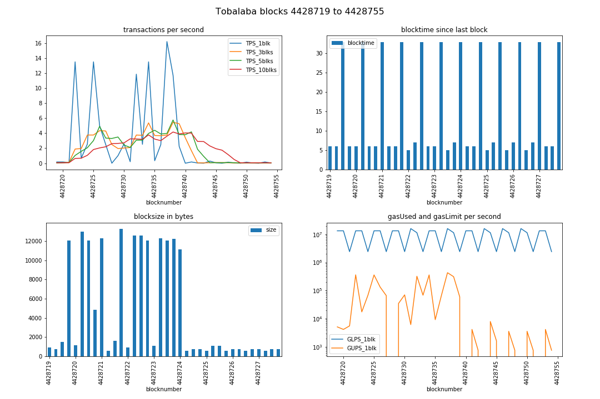

# [chainhammer](README.md): Tobalaba
Purpose: Extending the quorum benchmarking to other Ethereum-type chains. 

Here: *Toabalaba chain of the EnergyWebFoundation*, a fork of parity.

## quick shortcut:
directly jump to 

* script outputs --> [#results](#results)
* **benchmarking result --> [#tps](#tps)**
* 5 TPS ? --> [#conclusion](#conclusion)

## useful sites for Tobalaba:

* [netstats](http://netstats.energyweb.org/) about the authority nodes
* block explorer e.g. --> [pending transactions](https://tobalaba.etherscan.com/txsPending)
* [faucet](https://energyweb.atlassian.net/wiki/spaces/EWF/pages/126517249) to get Tobalaba-ETH 
* EWF [website](https://energyweb.org/blockchain/) 

## preparations 

### start node
    
#### initial problems:

```
Traceback (most recent call last):
...
  File "...python3.5/site-packages/web3/contract.py", line 1311, in transact_with_contract_function
    txn_hash = web3.eth.sendTransaction(transact_transaction)
  File "...python3.5/site-packages/web3/eth.py", line 244, in sendTransaction
    [transaction],
  File "...python3.5/site-packages/web3/manager.py", line 106, in request_blocking
    raise ValueError(response["error"])
    
ValueError: {'message': 'There are too many transactions in the queue. 
                         Your transaction was dropped due to limit. Try increasing the fee.', 'code': -32010}
```

solved by enlarging the *transaction queue*, with additional startup parameters

    --tx-queue-mem-limit=0
    --tx-queue-per-sender=2000 
    --tx-queue-gas=off 

I now start the node with these parameters

    ./target/release/parity --chain tobalaba --pruning=archive --geth --rpcapi "web3,eth,personal" \
                            --db-compaction=ssd --cache-size=2048 --no-persistent-txqueue \
                            --tx-queue-mem-limit=0 --tx-queue-per-sender=2001 --tx-queue-gas=off 

Then it accepted 1000 transactions.
    
### account, password

By default, the [deploy.py](deploy.py) uses the first address `web3.eth.accounts[0]`.    

Put your `unlockAccount` passphrase into the file `account-passphrase.txt` (the passphrase must not have whitespaces at the beginning or end).  

### make sure not overflooded already

see Tobalaba pending transactions: https://tobalaba.etherscan.com/txsPending

If there are many already, then just wait a while.

### virtualenv
In each terminal start the virtualenv (before the following python scripts):

    source py3eth/bin/activate

See [quorum.md#virtualenv](quorum.md#virtualenv) for which dependencies to install.

## benchmark
in [config.py](config.py) manually set:
```
RPCaddress, RPCaddress2 = 'http://localhost:8545', 'http://localhost:8545'
RAFT=False
```

### start listener

    ./tps.py

It will start counting as soon as it sees a new `contract-address.json` file generated by:

### deploy, start sending
Deploys new contract (saves contract address to `contract-address.json`), and then immediately starts sending:

    ./deploy.py notest; ./send.py threaded2 23

or single-threaded:

    ./deploy.py notest; ./send.py 

after each experiment, **restart the listener** `tps.py`, and redeploy the contract.


## results

### 1000 transactions
* multi-threaded with 23 workers threads
* submitted via web3 `Web3(HTTPProvider('http://localhost:8545'))`
* to local (non-authority) node
* with background of only 1-2 unrelated transactions per block

--> **3 - 5 TPS on average**, more details following:

### logs

chainhammer `send.py`
```
./deploy.py notest; ./send.py threaded2 23

versions: web3 4.2.0, py-solc: 2.1.0, solc 0.4.23+commit.124ca40d.Linux.gpp, testrpc 1.3.4, python 3.5.3 (default, Jan 19 2017, 14:11:04) [GCC 6.3.0 20170118]
web3 connection established, blockNumber = 4428720, node version string =  Energy Web//v1.12.0-unstable-a7d13fb69-20180509/x86_64-linux-gnu/rustc1.25.0
first account of node is 0x0056D95f4c3F1f0B32B538E3BdD393D8e4850857, balance is 59.999651857753848754 Ether
unlock:  True
tx_hash =  0xb752e0028d4189fb9124ab05c8a587d49112f61c745382f2f72fa2fb35b98838 --> waiting for receipt ...
Deployed. gasUsed=127173 contractAddress=0x167cD7474FB996f346029131E766d87b93195c43

BlockNumber =  4428721
send 1000 transactions, via multi-threading queue with 23 workers:
.......................23 worker threads created.
.............................[sent via web3] 
(... more ...)
all items - done.
```

parity client log

```
./target/release/parity --pruning=archive --geth --chain tobalaba --rpcapi "web3,eth,personal" --db-compaction=ssd --cache-size=2048 --tx-queue-mem-limit=0 --tx-queue-per-sender=2000 --tx-queue-gas=off --no-persistent-txqueue

2018-05-21 10:54:30  Starting Energy Web/v1.12.0-unstable-a7d13fb69-20180509/x86_64-linux-gnu/rustc1.25.0
2018-05-21 10:54:30  Keys path ~/.local/share/io.parity.ethereum/keys/Tobalaba
2018-05-21 10:54:30  DB path ~/.local/share/io.parity.ethereum/chains/Tobalaba/db/5b5adf025532f2b0
2018-05-21 10:54:30  Path to dapps ~/.local/share/io.parity.ethereum/dapps
2018-05-21 10:54:30  State DB configuration: archive
2018-05-21 10:54:30  Operating mode: active
2018-05-21 10:54:30  Warning: Warp Sync is disabled because of non-default pruning mode.
2018-05-21 10:54:30  Configured for Tobalaba using AuthorityRound engine
2018-05-21 10:54:31  Running without a persistent transaction queue.
...
2018-05-21 10:54:57  Imported #4428720 0xfecf…6df0 (1 txs, 0.03 Mgas, 12 ms, 0.73 KiB)
2018-05-21 10:55:06     5/25 peers   70 MiB chain 11 KiB db 0 bytes queue 21 KiB sync  RPC:  0 conn,  2 req/s, 192 µs
2018-05-21 10:55:30  Transaction mined (hash 0xb752e0028d4189fb9124ab05c8a587d49112f61c745382f2f72fa2fb35b98838)
2018-05-21 10:55:30  Imported #4428721 0x3af9…2946 (3 txs, 0.18 Mgas, 4 ms, 1.49 KiB)
2018-05-21 10:55:36  Transaction mined (hash 0x502448bec8dfabae55baea76b62c5c694b99d77573672c325dc8891a74230775)
... (999 more) ...
2018-05-21 11:00:00  Transaction mined (hash 0xa22d389be30425c3fb8d1d9c36fdd16fe0b8125d0a4f7556e6214554ab4a725c)
2018-05-21 11:00:00  Imported #4428739 0x3d87…eb6b (74 txs, 1.97 Mgas, 5 ms, 10.87 KiB)
...
```

TPS results:

```
./tps.py 

versions: web3 4.2.0, py-solc: 2.1.0, solc 0.4.23+commit.124ca40d.Linux.gpp, testrpc 1.3.4, python 3.5.3 (default, Jan 19 2017, 14:11:04) [GCC 6.3.0 20170118]

Block  4428720  - waiting for something to happen

starting timer, at block 4428721 which has  3  transactions; at timecode 6712.221304137
block 4428721 | new #TX  81 / 6000 ms =  13.5 TPS_current | total: #TX   84 /  6.1 s =  13.8 TPS_average
block 4428722 | new #TX   4 / 6000 ms =   0.7 TPS_current | total: #TX   88 / 12.2 s =   7.2 TPS_average
block 4428723 | new #TX  84 / 33000 ms =   2.5 TPS_current | total: #TX  172 / 45.0 s =   3.8 TPS_average
block 4428724 | new #TX  81 / 6000 ms =  13.5 TPS_current | total: #TX  253 / 51.1 s =   4.9 TPS_average
block 4428725 | new #TX  30 / 6000 ms =   5.0 TPS_current | total: #TX  283 / 57.3 s =   4.9 TPS_average
block 4428726 | new #TX  82 / 33000 ms =   2.5 TPS_current | total: #TX  365 / 90.0 s =   4.1 TPS_average
block 4428727 | new #TX   0 / 6000 ms =   0.0 TPS_current | total: #TX  365 / 96.2 s =   3.8 TPS_average
block 4428728 | new #TX   6 / 6000 ms =   1.0 TPS_current | total: #TX  371 / 102.3 s =   3.6 TPS_average
block 4428729 | new #TX  85 / 33000 ms =   2.6 TPS_current | total: #TX  456 / 135.1 s =   3.4 TPS_average
block 4428730 | new #TX   1 / 5000 ms =   0.2 TPS_current | total: #TX  457 / 141.2 s =   3.2 TPS_average
block 4428731 | new #TX  83 / 7000 ms =  11.9 TPS_current | total: #TX  540 / 147.4 s =   3.7 TPS_average
block 4428732 | new #TX  83 / 33000 ms =   2.5 TPS_current | total: #TX  623 / 180.1 s =   3.5 TPS_average
block 4428733 | new #TX  81 / 6000 ms =  13.5 TPS_current | total: #TX  704 / 186.3 s =   3.8 TPS_average
block 4428734 | new #TX   2 / 6000 ms =   0.3 TPS_current | total: #TX  706 / 192.1 s =   3.7 TPS_average
block 4428735 | new #TX  82 / 33000 ms =   2.5 TPS_current | total: #TX  788 / 225.2 s =   3.5 TPS_average
block 4428736 | new #TX  81 / 5000 ms =  16.2 TPS_current | total: #TX  869 / 231.0 s =   3.8 TPS_average
block 4428737 | new #TX  82 / 7000 ms =  11.7 TPS_current | total: #TX  951 / 237.2 s =   4.0 TPS_average
block 4428738 | new #TX  74 / 33000 ms =   2.2 TPS_current | total: #TX 1025 / 270.3 s =   3.8 TPS_average
block 4428739 | new #TX   0 / 6000 ms =   0.0 TPS_current | total: #TX 1025 / 276.1 s =   3.7 TPS_average
```

## TPS

Sample transaction and block:

* [transaction](https://tobalaba.etherscan.com/tx/0x34b844767a0b9fa4bbee69dece85e26bccd648166b8ac072059abed6e8993d5a): 26691 gas
* [block 4428722](https://tobalaba.etherscan.com/block/4428722): 81 transactions, gas used 2.72%


chainreader visualisation:

```
cd chainreader
source py3eth/bin/activate
blocksDB_create.py
jupyter notebook
```
--> chainreader / [blocksDB_analyze.ipynb](chainreader/blocksDB_analyze.ipynb)



## Conclusion

* **3 - 5 TPS** on average during 1000 transactions   
* --> only as fast (slow) as the *Ethereum PoW* chain?

Hello energywebfoundation: How to make this faster? How did you get higher rates? Please you yourself try these benchmarking scripts. 

Thanks.

---

## issues
that I raised while developing this

* [EWC #17](https://github.com/energywebfoundation/energyweb-client/issues/17) git checkout tags/(some reasonably stable release version)
* [EWC #18](https://github.com/energywebfoundation/energyweb-client/issues/18) faucet broken?
* [W3PY #808](https://github.com/ethereum/web3.py/issues/808) deploy contract example is broken
* [PS #51](https://github.com/ethereum/py-solc/issues/51) (feature request) from solc import version 
* [EWC #20](https://github.com/energywebfoundation/energyweb-client/issues/20) 5 TPS?
* [GL #46558](https://gitlab.com/gitlab-org/gitlab-ce/issues/46558) gitlab not rendering HTML correctly in markdown cells 

